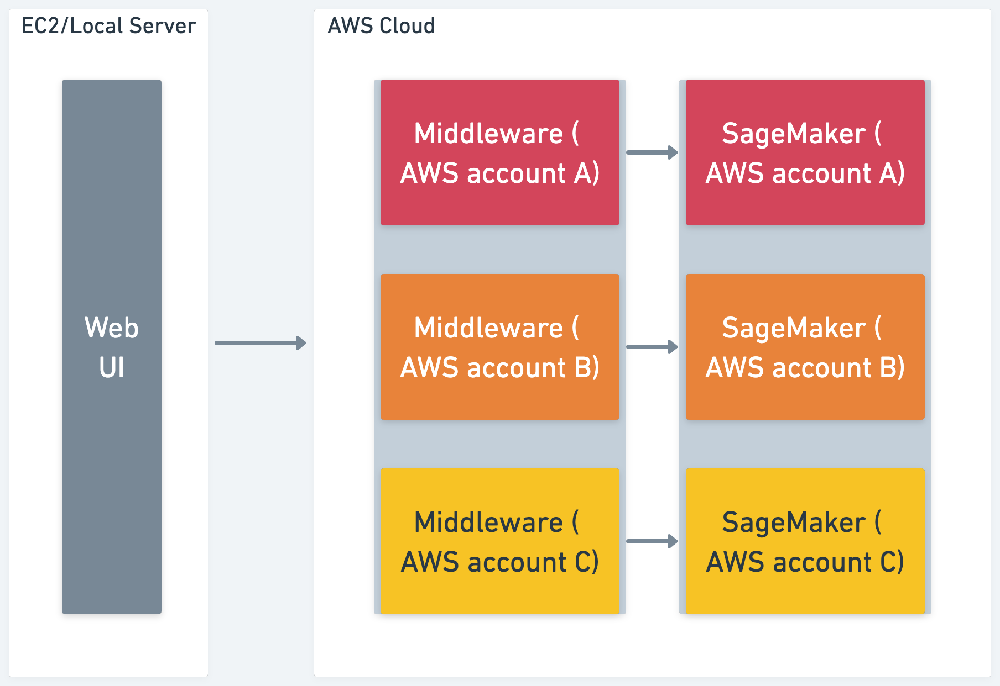
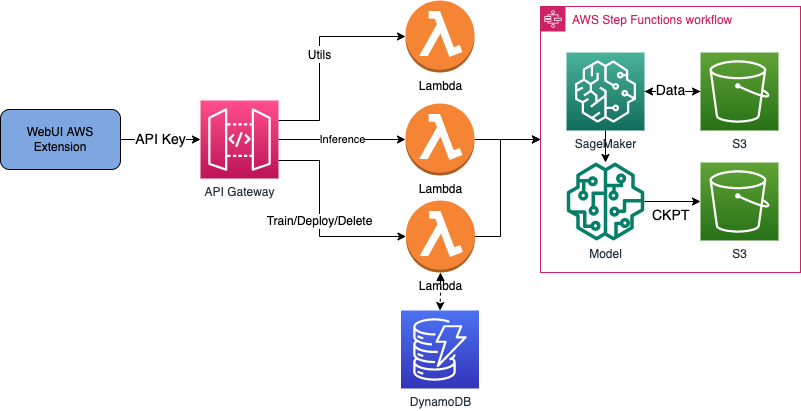
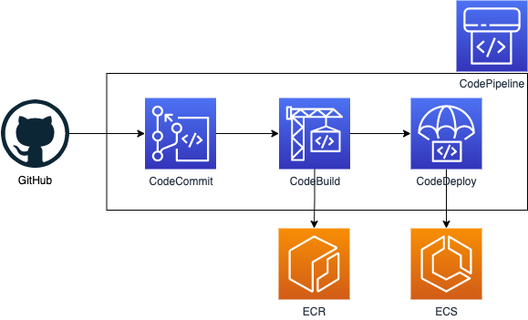

Diagram below is the brief view of internal workflow between offered extension and middleware, user will keep launching community WebUI onto standalone EC2/local server with our extension installed, while the ckpt merge, training and inference workload will be migrate onto AWS cloud through the RESTful API provided by middleware installed on user’s AWS account. Note the middleware is per AWS account, means it could be installed separately as work node to communicate with WebUI as control node, user only need to input endpoint URL and API key per account to decide which specific AWS account will be used for successive jobs.

Overall Workflow

The middleware provides a RESTful API externally to comply with the OpenAPI specification to help WebUI extension to interact with AWS (Amazon SageMaker, S3, etc.). The main functions include request authentication, request distribution (such as SageMaker.jumpstart/model/predictor/estimator/tuner /utils, etc.), model training, model inference and other life cycle management work. The following figure shows the overall architecture of the middleware:

Middleware Architecture

- Users in the WebUI console will use the assigned API token to trigger a request to API Gateway while being authenticated. (Note: AWS credentials are not required in AWS WebUI)
- API Gateway will route requests to Lambda with different functions according to URL prefixes to implement corresponding tasks (for example, model uploading, checkpoint merging), model training, and model inference. At the same time, the Lambda function records operational metadata into DynamoDB (eg, inferred parameters, model name) for subsequent query and correlation.
- During the training process, the Step Function will be called to orchestrate the training process, which includes using Amazon SageMaker for training and SNS for training status notification. During the inference process, the Lambda function will call Amazon SageMaker for asynchronous inference. Training data, models and checkpoints will be stored in S3 buckets separated by different prefixes.

To keep container image of extension in sync with community, additional CI/CD pipeline (fig shown below) may needed to auto track community commits and pack & build new container image, then user can easily launch latest extension without any manual operation.

Image CI/CD Workflow
