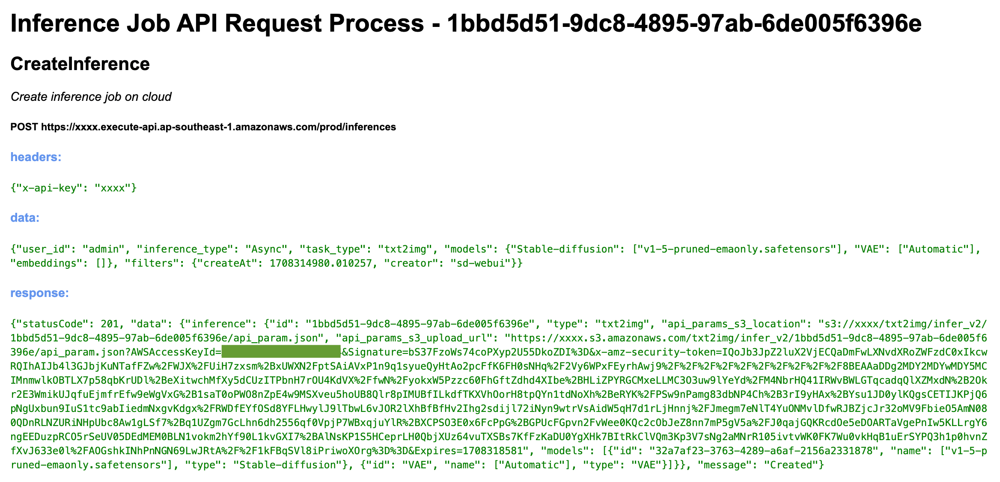

Due to the numerous argument variables involved,
it is recommended to use `API Inference Debugger` to assist with the development of inference tasks.
The `API Inference Debugger` will fully record the actual inference process and parameters.
You only need to copy the relevant data structures and make minor modifications.

## Enable API Inference Debugger

If your WebUI interface does not display the API debugger button shown in the figure below,
you may need to update the WebUI plugin code.
Please switch to the plugin directory and execute the following command:

```Bash
cd /home/ubuntu/stable-diffusion-webui/extensions/stable-diffusion-aws-extension
git checkout main
git pull
sudo systemctl restart sd-webui
```
Wait for the WebUI to restart and complete within approximately 3 minutes.

## Use API Inference Debugger

After completing an inference job, open the API request record in the following order:

1. Click the button to refresh the inference history job list
2. Pull down the inference job list, find and select the job
3. Click the `API` button on the right


## API Inference Debugger Log



> **Note**: Due to Postman sending requests with its own information, it may result in signature errors. It is recommended to directly use code for requests or refer to the API information provided on the UI.