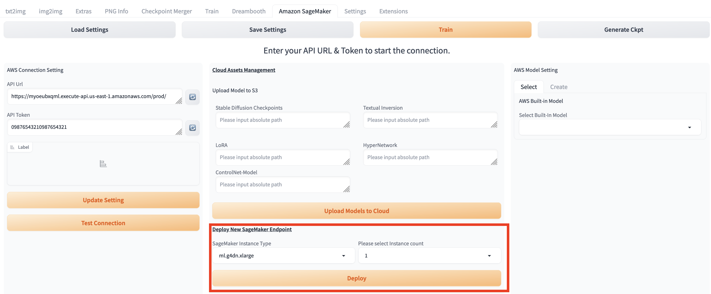
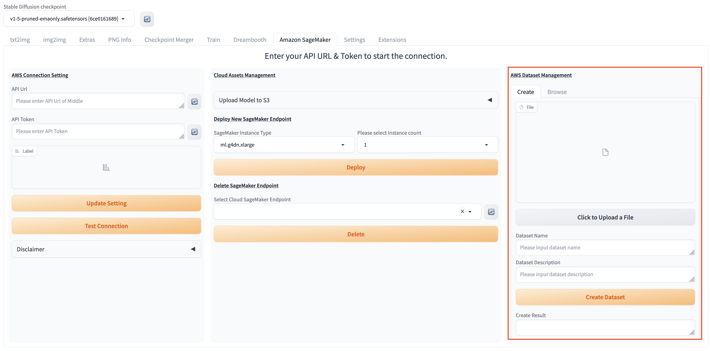

# Main Tab
This chapter will provide a detailed overview of the convenient cloud-based resource management approach offered by this solution.

## Upload Model
To use extra models for inference, you could upload model through steps below in two ways, and follow steps in [txt2img](txt2img-guide.md) or [img2img](img2img-guide.md)to inference with extra models as need.

Method One:
1. Within Stable Diffusion WebUI, navigate to solution main tab **Amazon SageMaker**, find session **Cloud Models Management**.

2. Select the **from WebUI** tab, which means to upload the model from the models file path where the WebUI service is deployed.
3. Enter the model path where the WebUI service is deployed under corresponding model text box.
> **Note**: You can upload multiple kinds of models by entering multiple local model paths in text box.
4. Click **Upload Models to Cloud** to start uploading process.
5.Message will appear on left right once uploading completes.

Method Two:
1. Within Stable Diffusion WebUI, navigate to solution main tab **Amazon SageMaker** main tab, find session **Cloud Models Management**.

2. Select the **from Laptop** tab, which means to upload the model from the local path to access the WebUI.
3. Select the type of model to upload, currently supports six types: SD Checkpoints, Textual Inversion, LoRA model, ControlNet model, Hypernetwork, VAE
3. Select the model file to be uploaded locally.
> **Note**: You can select models multiple, but subject to browser restrictions, it is best to select no more than 10 files, and the total size should not exceed 8g.
4. Click **Upload Models to Cloud** to start uploading process.
5. The upload will be uploaded in pieces asynchronously based on the file size and quantity. After each piece is uploaded, you will see a prompt under the **Choose File** button

Method Three:
1. Within Stable Diffusion WebUI, navigate to the **Amazon SageMaker** main tab and find session **Cloud Models Management**.
2. Select the **from URL** tab. This option allows you to upload models to S3 from URLs where the models are downloaded.

3. Choose the type of model you want to upload. Currently, six types are supported: SD Checkpoints, Textual Inversion, LoRA model, ControlNet model, Hypernetwork, VAE.
4. In the **URL list (Comma-separated in English)** input box, enter the URL list of model downloads, separated by commas.
5. In the **Models Description (Optional)** input box, provide a JSON-formatted description (optional).
> **Note**: You can select multiple model files, but it's advisable not to exceed 5 files in your selection, with a total size not exceeding 12 GB, as constrained by Lambda memory and concurrent thread limits.
6. Click **Upload Models to Cloud** to start the model upload process.
7. You will see a prompt in the **Label** section below indicating the progress of the upload request.

## Amazon SageMaker Endpoint Management
### Deploy new endpoint
1. Navigate to the **Amazon SageMaker** main tab of the solution. In the **Cloud Assets Management** module, locate the **Deploy New SageMaker Endpoint** section.
2. The default deployment type for the solution is ml.g5.2xlarge, with 1 instance. The endpoint autoscaling feature is enabled by default. Simply click the **Deploy** button to initiate the deployment of the Sagemaker endpoint.
3. If users wish to specify the endpoint name, instance type, and maximum instance count for the endpoint's instances, they can check the **Advanced Endpoint Configuration** checkbox. This will display additional parameters for user input. The following table lists the names and descriptions of these parameters:

   | Parameter Name    | Description                                                                                                                                                                                                                                                                                   |
                |-------------------|-----------------------------------------------------------------------------------------------------------------------------------------------------------------------------------------------------------------------------------------------------------------------------------------------|
   | Endpoint Name (Optional) | If you need to specify a name for the Sagemaker endpoint, enter it in this input box. If not modified, the default endpoint name will be esd-type-XXXXX.                                                                                                                                      |
   | Endpoint Type | Select the inference type Async/Real time for the deployed Endpoint                                                                                                                                                                                                                           |
   | Instance Type     | Select the instance type for the deployed endpoint from the dropdown list.                                                                                                                                                                                                                    |
   | Max Instance Number | Choose the maximum number of instances for the deployed endpoint from the dropdown list. If Autoscaling is selected, Sagemaker will elastically scale between 0 and the Max Instance Number based on average CPU usage.                                                                       |
   | Enable Autoscaling | If this checkbox is selected, Async inference will scale elastically between 0 and Max Instance Numbers based on the average backlog of each instance, while Real-time inference will scale elastically between 1 and Max Instance Numbers based on the average number of calls per instance. |
   | Min Instance Number | If Enable Autoscaling is true, This value will be the minimum number of Endpoint instances                                                                                                                                                                                                    |

4. After selecting the default endpoint configuration or setting up the advanced endpoint configuration, click **Deploy**. You'll see a message indicating **Endpoint deployment started** under **Label**.
   

5. You can navigate to tab **txt2img**, session **Amazon SageMaker Inference**, refresh and select drop down list **Select Cloud SageMaker Endpoint** to check all the deployment status of endpoints.

    > **Note:** The format of the drop down list is：endpoint name+ deployment status (including Creating/Failed/InService)+deployment completing time.

6. It will take around 3 minutes for endpoint deployment status changing to *InService*, which indicates that the endpoint has been successfully deployed.

### Delete deployed endpoints
1. Refresh and select endpoint(s) under the dropdown list of **Select Cloud SageMaker Endpoint**.
2. Click **Delete**, message *Endpoint delete completed* will appear on the left side, which indicates that the selected endpoint(s) has been successfully deleted.

# AWS Dataset Management

## Create Dataset
In functions such as model fine-tuning, it is necessary to provide a file of images for fine-tuning work. This functional module helps users quickly upload images to the cloud.

1. Navigate to main tab **Amazon SageMaker**, section **AWS Dataset Management**，sub-tab **Create**.

2. Click **Click to Upload a File**, in the local file browser that pops up, confirm to select all the images required for one model fine-tuning.
3. Enter file name in **Dataset Name**, enter file description in **Dataset Description**, click **Create Dataset**.
4. The message **Complete Dataset XXXX creation** will be displayed on the right side once the process completes.

## Explore Dataset
After the dataset has been successfully uploaded, this feature module allows users to quickly obtain the corresponding cloud-based address of the dataset. Users can copy this address and paste it into the location where the collection of images needs to be uploaded.

1. Navigate to **Amazon SageMaker**，**AWS Dataset Management** session，**Browse** tab, refresh the list **Dataset From Cloud** and select desired dataset.
2. Field **dataset s3 location** will display the corresponding S3 path on the cloud. User can copy to use as need.

