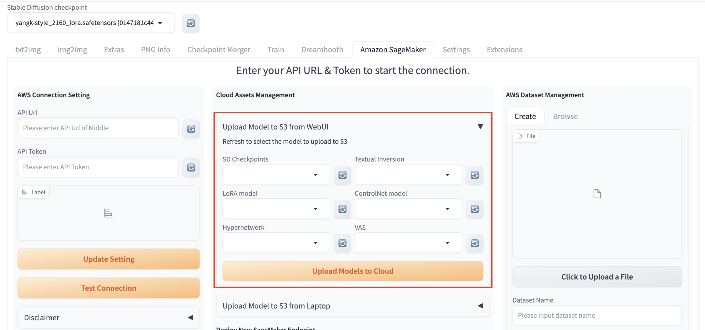
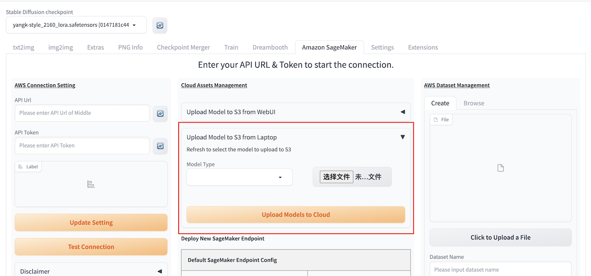

# Main Tab
This chapter will provide a detailed overview of the convenient cloud-based resource management approach offered by this solution.

## Upload Model
To use extra models for inference, you could upload model through steps below in two ways, and follow steps in [txt2img](txt2img-guide.md) or [img2img](img2img-guide.md)to inference with extra models as need.

Method One:
1. Within Stable Diffusion WebUI, navigate to solution main tab **Amazon SageMaker**, find session **Cloud Assets Management**.

2. Select the Upload Model to S3 from WebUI drop-down box, which means to upload the model from the models file path where the WebUI service is deployed.
3. Enter the model path where the WebUI service is deployed under corresponding model text box.
> **Note**: You can upload multiple kinds of models by entering multiple local model paths in text box.
4. Click **Upload Models to Cloud** to start uploading process.
5.Message will appear on left right once uploading completes.

Method Two:
1. Within Stable Diffusion WebUI, navigate to solution main tab **Amazon SageMaker**, find session **Cloud Assets Management**.

2. Select the Upload Model to S3 from Laptop drop-down box, which means to upload the model from the local path to access the WebUI.
3. Select the type of model to upload, currently supports six types: SD Checkpoints, Textual Inversion, LoRA model, ControlNet model, Hypernetwork, VAE
3. Select the model file to be uploaded locally.
> **Note**: You can select models multiple, but subject to browser restrictions, it is best to select no more than 10 files, and the total size should not exceed 8g.
4. Click **Upload Models to Cloud** to start uploading process.
5. The upload will be uploaded in pieces asynchronously based on the file size and quantity. After each piece is uploaded, you will see a prompt under the **Choose File** button

## Amazon SageMaker Endpoint Management
### Deploy new endpoint
1. Navigate to the **Amazon SageMaker** main tab of the solution. In the **Cloud Assets Management** module, locate the **Deploy New SageMaker Endpoint** section.
2. The default deployment type for the solution is ml.g5.2xlarge, with 1 instance. The endpoint autoscaling feature is enabled by default. Simply click the **Deploy** button to initiate the deployment of the Sagemaker endpoint.
3. If users wish to specify the endpoint name, instance type, and maximum instance count for the endpoint's instances, they can check the **Advanced Endpoint Configuration** checkbox. This will display additional parameters for user input. The following table lists the names and descriptions of these parameters:

   | Parameter Name    | Description                                                                                                  |
       |-------------------|--------------------------------------------------------------------------------------------------------------|
   | Endpoint Name (Optional) | If you need to specify a name for the Sagemaker endpoint, enter it in this input box. If not modified, the default endpoint name will be infer-endpoint-XXXXX. |
   | Instance Type     | Select the instance type for the deployed endpoint from the dropdown list.                                 |
   | Max Instance Count | Choose the maximum number of instances for the deployed endpoint from the dropdown list. If Autoscaling is selected, Sagemaker will elastically scale between 0 and the Max Instance Count based on average CPU usage. |
   | Enable Autoscaling | If this checkbox is selected, Sagemaker will elastically scale between 0 and the Max Instance Count based on average CPU usage. Otherwise, the instance count for the endpoint will remain fixed at the Max Instance Count. |

4. After selecting the default endpoint configuration or setting up the advanced endpoint configuration, click **Deploy**. You'll see a message indicating **Endpoint deployment started** on the left side under **Label**.
   

5. You can navigate to tab **txt2img**, session **Amazon SageMaker Inference**, refresh and select drop down list **Select Cloud SageMaker Endpoint** to check all the deployment status of endpoints.

    > **Note:** The format of the drop down list is：endpoint name+ deployment status (including Creating/Failed/InService)+deployment completing time.

6. It will take around 10 mins for endpoint deployment status changing to *InService*, which indicates that the endpoint has been successfully deployed.

### Delete deployed endpoints
1. Refresh and select endpoint(s) under dropdown list of **Select Cloud SageMaker Endpoint**.
2. Click **Delete**, message *Endpoint delete completed* will appear on left side, which indicates that the selected endpoint(s) havs been successfully deleted.

# AWS Dataset Management

## Create Dataset
In functions such as model fine-tuning, it is necessary to provide a file of images for fine-tuning work. This functional module helps users quickly upload images to the cloud.

1. Navigate to main tab **Amazon SageMaker**, section **AWS Dataset Management**，sub-tab **Create**.

2. Click **Click to Upload a File**, in the local file browser that pops up, confirm to select all the images required for one model fine-tuning.
3. Enter file name in **Dataset Name**, enter file description in **Dataset Description**, click **Create Dataset**.
4. Once the message **Complete Dataset XXXX creation**，即表示该数据集已经成功上传到云上。

## 数据集浏览
数据集上传完成后，通过此功能模块，能够帮助用户快速得到数据集对应的云上地址。用户可以复制此地址，粘贴到对应需要上传图片集的地址位置。

1. 进入解决方案主标签页**Amazon SageMaker**，**AWS Dataset Management**区块，**Browse**标签页。
2. 刷新**Dataset From Cloud**列表，选择需要浏览的图片集名称。
3. 等待几秒，**dataset s3 location**区域即会显示该数据集的云上S3地址，复制粘贴即可取用，做后续步骤。

