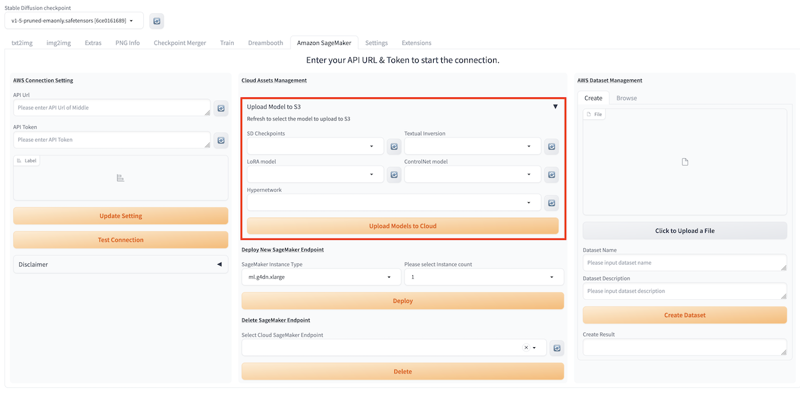

本章节将详细介绍本解决方案提供的便捷云上资源管理方式。

## 上传训练模型
如需在txt2img使用非云端推理模型，您只需按下列步骤完成推理模型上传，即可按[这里]()步骤完成模型调用及推理。

1. 进入解决方案主标签页**Amazon SageMaker**，找到**Cloud Assents Management**模块。

2. 在对应的模型输入本地文件地址。
3. 点击**Upload Models to Cloud**，启动模型上传。
4. 上传完成后，会在 XXX 看到提示。

## Amazon SageMaker推理节点管理

### 部署推理节点

1. 进入解决方案主标签页**Amazon SageMaker**，找到**Cloud Assents Management**模块的**Deploy New SageMaker Endpoint**区域。
2. 选择推理实例类型**SageMaker Instance Type**和数目**Please select Instance count**，点击**Deploy**, 可以在XXX看到**Endpoint deployment started. Please wait...**的提示信息。

3. 您可进入**txt2img**的**Amazon SageMaker Inference**模块的下拉菜单**Select Cloud SageMaker Endpoint**，刷新并看到当前所有推理节点的部署状态。
> **补充：** 推理节点列表的名字的格式是：推理节点名字+部署状态：Creating/Failed/InService+部署结束时间。
4. 等待大约10分钟，即可看到最新推理节点的状态变成**InService**，表明推理节点部署成功。

### 删除已部署推理节点
1. 点击**Select Cloud SageMaker Endpoint**列表右侧刷新按钮，刷新下拉列表，选择需要删除的推理节点。
2. 点击**Delete**，XXX处显示XXX提示信息，完成推理节点删除。

