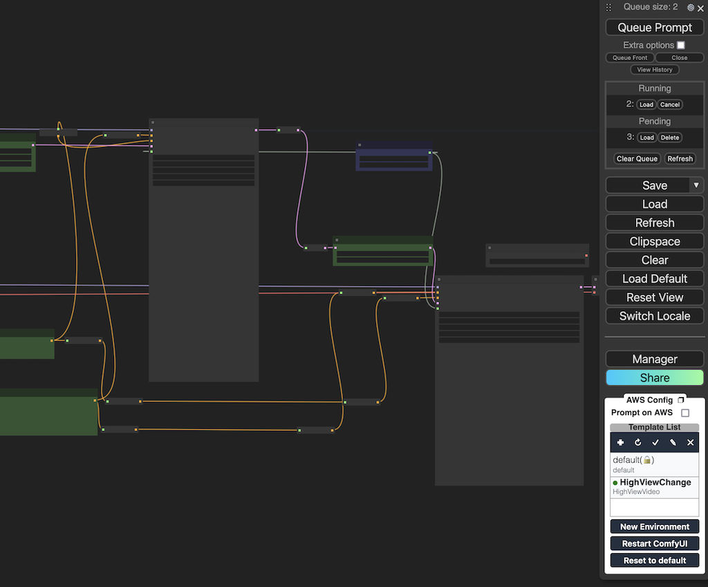

# Image or Video generation through ComfyUI in the cloud

After successfully deploying the solution, you can open the native **ComfyUI** page provided by the deployed stack. The summary steps for workflow debugging, releasing, and inference are as follows:

* Step 1: Connect to the EC2 that deploys ComfyUI frontend.
* Step 2: Open the **Designer** link provided by the stack of solution, debug the new workflow locally (on the EC2 virtual machine), install the missing nodes, upload the required inference models, and ensure they can be successfully loaded and inferred locally (on the EC2 virtual machine).
* Step 3: Release the workflow as a template. 
* Step 4: Create the endpoints needed for the workflow through API.
* Step 5: On the ComfyUI inference page, select the released template, modify the inference parameters (for example: prompts) and models as needed, and perform inference on images/videos. This will utilize Amazon SageMaker resource. 


## Step 1: Connect to the EC2 that deploys ComfyUI frontend

By connecting to the EC2 instance, you can check the corresponding directory structure locally, making it easier to view the log files during local workflow debugging and aid in diagnostics.

If you only need to view the local ComfyUI debugging logs, you can also achieve this through the following steps:

1. Open the EC2 console in the same region where the deployment solution is located, select the **comfy-on-aws-dev** instance, and click **Connect** in the top right corner.
2. In the available connection methods, select the **EC2 Instance Connect** tab and click **Connect**.
3. After a short wait, a new EC2 connection page will pop up. You can enter the required commands as needed to perform various operations. Common commands include:

```
tail -f /var/log/cloud-init-output.log     Used for real-time viewing of the initial logs during the EC2 startup process for Comfy.
sudo journalctl -u comfy -f       Used for real-time viewing of Comfy runtime logs.
tail -f /root/stable-diffusion-aws-extension/container/*.log       Used to view all logs of the Comfy runtime container.
sudo journalctl -u comfy --no-pager -n 200        Used to view the last 200 logs of the Comfy runtime.
docker images -q | xargs docker rmi -f
```

## Step 2: Debug the workflow
In the native **Designer** page provided by this solution, you can debug new workflows using the same methods as the local version of ComfyUI. Model management, and other tasks can be performed by connecting to the virtual machine (EC2) where ComfyUI is deployed.



The steps for using the senior design version of ComfyUI are summarized as follows:

1. (Optional) Drag an existing workflow JSON file into the ComfyUI interface to render the workflow.
2. Adjust (including adding and deleting) work nodes (custom nodes), and adjust inference parameters and the models used.
3. Click **Queue Prompt** to start an inference task based on the current page workflow.
4. (Optional) If step 3 results in an error prompt, follow the instructions to resolve it. For example, if a missing model is indicated, download the model to the corresponding directory on the EC2 instance; if missing custom nodes are indicated, click **Manager** and then **Install Missing Custom Nodes** to install the missing nodes. After resolving the error, repeat step 3 to test again.


5. When the workflow is completed and the generated results are displayed on the interface, it indicates that the workflow debugging has been successful.

## Step 3: Release workflow as new template
Once the workflow can successfully infer images/videos locally (on the EC2 virtual machine), you can follow these steps to quickly release the debugged workflow as a template, making it convenient and stable for future inference calls through Amazon SageMaker.

1. Click **New Workflow** in the right navigation bar or the **plus sign** above the workflow list module on the right side.
2. In the pop-up window, enter the name of the template to be published and click **OK**.


    !!! tip
        The new template name must not exceed 20 characters in length, combining letters and numbers. It is case-sensitive. Additionally, the name must be unique within the same region. If it conflicts with an existing template name, an error message will be displayed.

3. During the workflow publishing process, no updates should be made on the ComfyUI frontend. Once the publishing is complete, a pop-up notification will confirm the successful publication.
4. During publication, the workflow you are currently debugging will be temporarily saved. Each time you switch environments, the temporarily saved workflow corresponding to the current environment will be loaded first.

## Step 4: Deploy new inference endpoint for future inference of released workflow
After completing the workflow releasing, you'll need to create a Amazon SageMaker inference endpoint to perform cloud-based inference based on the workflow:

1. You'll need to call the creation via API, referencing the "Deploying New Amazon SageMaker Inference Nodes" subsection in [this documentation](../../deployment/deployment_comfyui.md).
   
2. Once the inference endpoint is created and in the **InService** state, the published workflow will be ready for inference.


## Step 5: Inference of released template
In the view of **Designer** or **InferencePot**, you can easily perform inference based on a template using the following steps:

1. Open the ComfyUI page and select a released template from the right-hand navigation bar. If in **Designer** view, also need to select the **Prompt on AWS** checkbox in the right-hand navigation bar.
   
2. The selected template will be automatically render in the ComfyUI page. Adjust the parameters as needed, and click **Queue Prompt** to submit the inference task.
   
3. Once the inference task is completed, the generated results will automatically be displayed on the page.


## Manage model(s)
### Upload model
To ensure smooth access during the model debugging phase, new models need to be uploaded to EC2. You can achieve this by entering the corresponding subfolder for the model category under the **models** directory on EC2. Use either direct drag-and-drop or the **wget** command with the model download URL. Considering network speed, it is recommended to prioritize using the **wget** method for model downloads.

