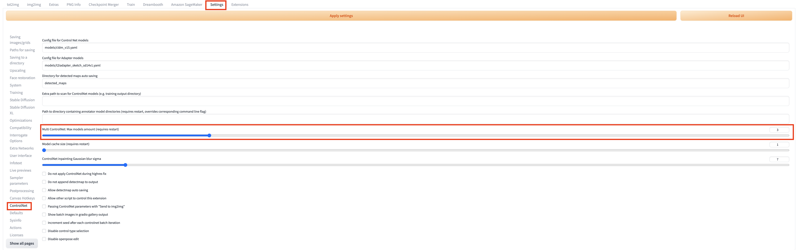
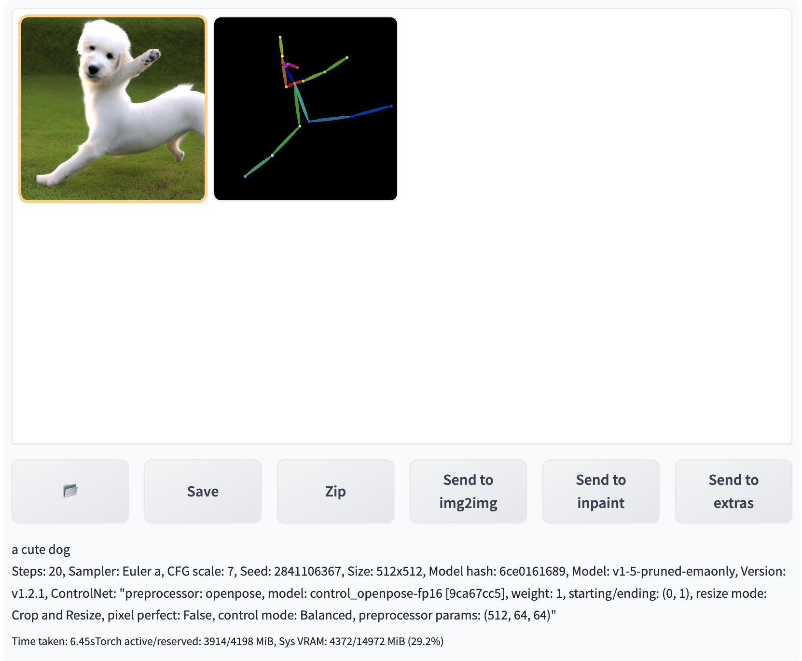

# Use Controlnet for inference

You can open **controlnet** sub-session, by combining the use of native functionalities **txt2img** or **img2img** along with the added panel of **Amazon SageMaker Inference** in the solution, the inference tasks involving cloud resources can be invoked.

## Controlnet User Guide

### Multi-controlnet user guide
1. Navigate to **Settings** tab. In the left sidebar, select **ControlNet**, and adjust the **Multi ControlNet** in the right panel: Max models amount (requires restart) setting to specify the number of ControlNets (1-10). Afterward, restart the webUI for the changes to take effect, and the Multi ControlNet configuration will be active.

2. Navigate to **txt2img** or **img2img** tab，an equal number of ControlNet units will appear. For example, below shows 3 controlNet units started simultaneously.

### openpose User Guide
1. Open ControlNet panel, choose **ControlNet Unit 0**, check **Enable**, select **openpose** from **Preprocessor**, and then upload am image.

2. Similar to local inference, you can customize the inference parameters of the native **ControlNet**. The controlnet model "**control_openpose-fp16.safetensors**" should be uploaded to the cloud before generate. 
3. Click **Generate on Cloud** after finished all parameters setting.
4. Refresh and select the top Inference Job from **Inference Job: Time-Type-Status-Uid**, inference result will be displayed in **Output** section.
5. Subsequent actions. You can click **Save** or others as need to perform further processing.

