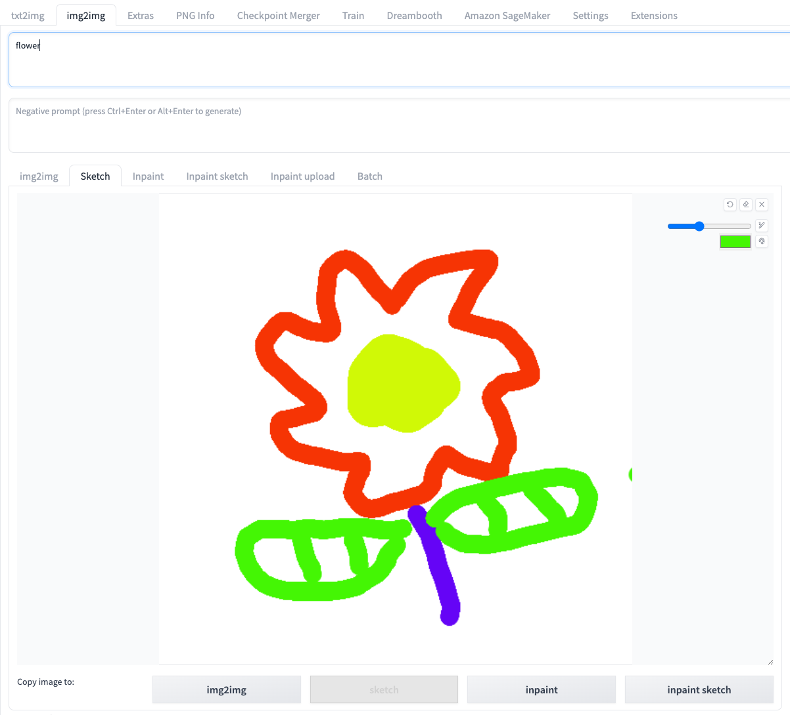
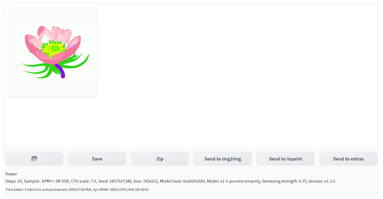
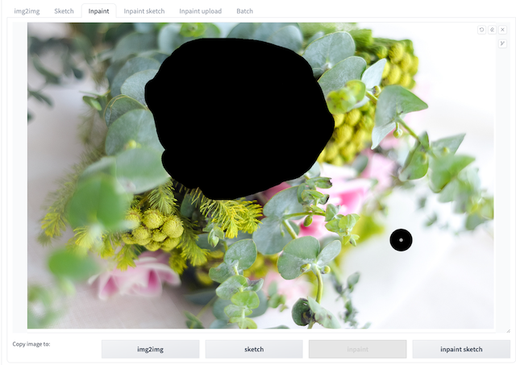
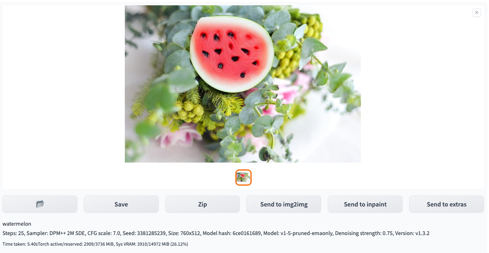
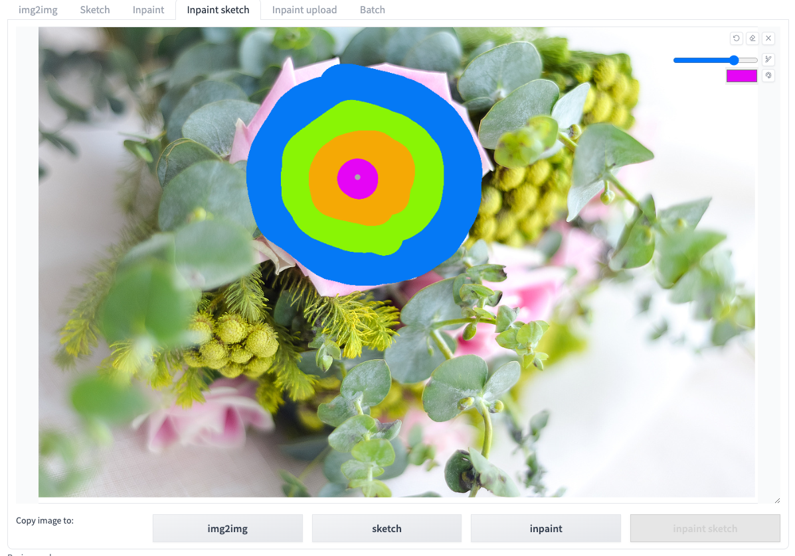
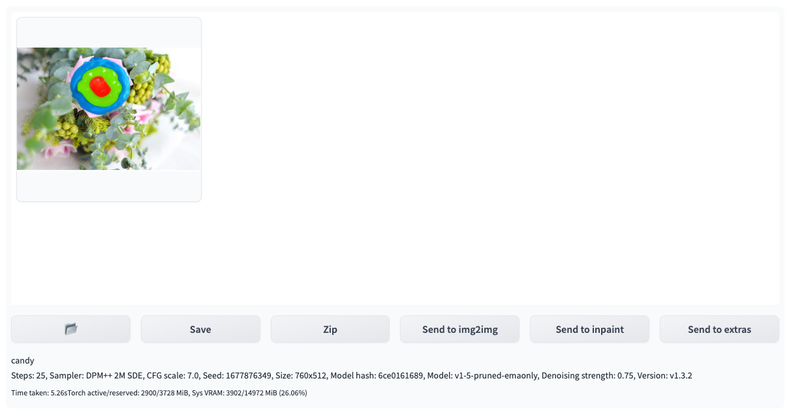
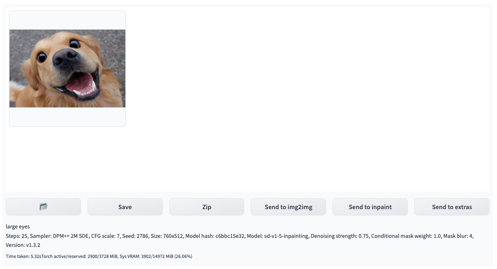
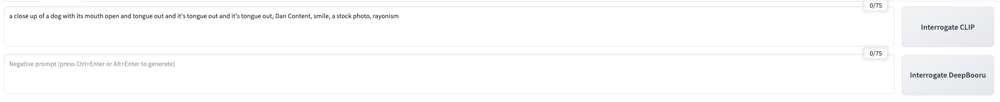

# img2img Guide
You can open the **img2img tab** and use the original region along with the **Amazon SageMaker Inference** to perform inference on the cloud.

## img2img user guide
### Standard process for different functional labels in img2img

1. Navigate to tab **img2img**, find panel **Amazon SageMaker Inference**.
2. Input parameters for inference. The same as local inference, you could edit parameters in native fields for model name (stable diffusion checkpoint, extra networks:Lora, Hypernetworks, Textural Inversion and VAE), prompts, negative prompts, sampling parameters, inference parameters and etc. For functions **img2img**, **sketch**, **inpaint**, **inpaint sketch** and **inpaint upload**, you could upload and modify images in the native way.
    
    !!! Important "Notice" 
        The model files used in the inference should be uploaded to the cloud before generate, which can be referred to the introduction of chapter **Cloud Assets Management**
3. Select Stable Diffusion checkpoint model that will be used for cloud inference through **Stable Diffusion Checkpoint Used on Cloud**, and the button **Generate** will change to button **Generate on Cloud**.

    !!! Important "Notice" 
        This field is mandatory. If you choose an endpoint that is in any other state or leave it empty, an error will occur when you click **Generate on Cloud** to initiate cloud-based inference.

4. Click**Generate on Cloud**。
5. Check inference result. Fresh and select the top option among **Inference Job: Time-Type-Status-Uuid** dropdown list. The **Output** section in the top-right area of the img2img tab will display the results of the inference once completed, including the generated images, prompts, and inference parameters. Based on this, you can perform subsequent workflows such as clicking **Save** or **Send to extras**.
> **Note:** The list is sorted in reverse chronological order based on the inference time, with the most recent inference task appearing at the top. Each record is named in the format of **inference time -> job type(txt2img/img2img/interrogate_clip/interrogate_deepbooru) -> inference status(succeed/in progress/fail) ->inference id**.

### img2img label

1. Upload the original image to **img2img** and enter prompts, and click **Generate on Cloud**.
2. Select corresponding **Inference Job ID**, the generated image will present on the right **Output** session. 

### Sketch label

1. Start **Stable Diffusion WebUI** with ‘--gradio-img2img-tool color-sketch’ on the command line，upload the whiteboard background image to the **Sketch tab**.
2. Use a brush to draw the corresponding sketch and prepare prompts, and click **Generate on Cloud**.

3. Select corresponding **Inference Job ID**, the generated image will present on the right **Output** session.

### Inpaint label

1. Upload original image to **Inpaint** label.
2. Establish masks with brushes and prepare prompts, and click **Generate on Cloud**.

3. Select corresponding **Inference Job ID**, the generated image will present on the right **Output** session.

### Inpaint Sketch label

1. Start **Stable Diffusion WebUI** with ‘--gradio-img2img-tool color-sketch’，and upload original image into **Inpaint Sketch**label with prompts.
2. Establish masks with brushes, and click **Generate on Cloud**.

3. Select corresponding **Inference Job ID**, the generated image will present on the right **Output** session.

### Inpaint Upload label

1. Upload original image and mask image to **Inpaint Upload** label and prepare prompts, for example *large eyes*.

2. Click **Generate on Cloud**, and select corresponding **Inference Job ID**, the generated image will present on the right **Output** session.

### Interrogate clip/deepbooru

1. Navigate to **img2img** tab，open **Amazon SageMaker Inference** panel.
2. Interrogate only need to upload image to **img2img** tab.

3. Select inference endpoint. Click refresh button on the right of **Select Cloud SageMaker Endpoint**, select one inference endpoint in **InService** state.
4. Click **Interrogate CLIP on cloud** or **Interrogate DeepBooru on cloud**.
5. Check inference result. Refresh the dropdown list of **Inference Job JDs**, check the topmost **Inference Job ID** that match the inference submission timestamp to review the inference result.

### Continuous Inference Scenario

1. Following the **General Inference Scenario**, complete the parameter inputs and click **Generate on Cloud** to submit the initial inference task.
2. Wait for the appearance of a new **Inference ID** in the right-side **Output** section.
3. Once the new Inference ID appears, you can proceed to click **Generate on Cloud** again for the next inference task.

