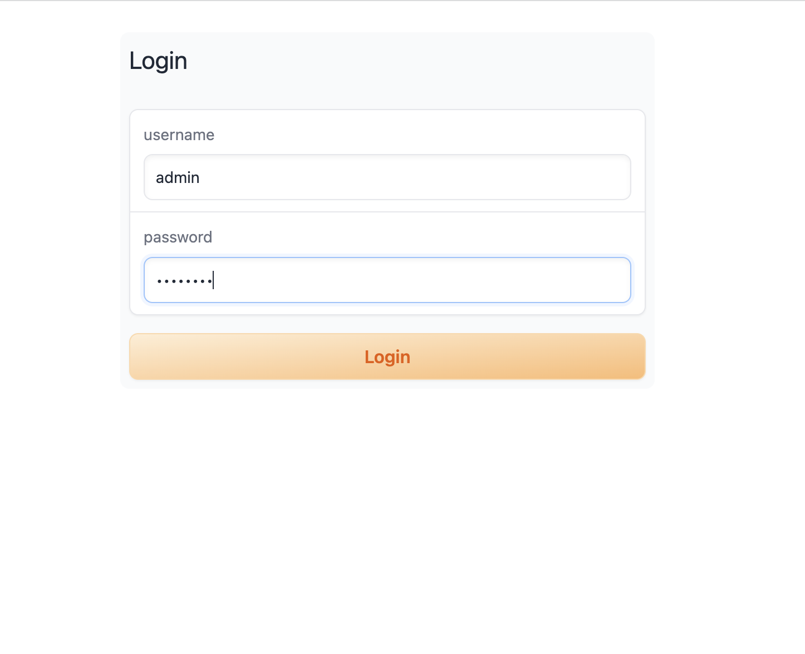

# Configure API and Multiple Users.

## Configure API
1. After the deployment is complete, log in to the web UI. At this point, users do not need to enter a username and password. Click on the "Amazon Sagemaker" page, enter the API URL and API token, and click on `Update Settings`.

2. After completing the page configuration and registering the administrator account, you need to manually restart the web UI to apply the API token and administrator account configuration. Once the restart is complete, go to the login page and use the administrator username and password to log in.

3. After a successful login, navigate back to the Amazon SageMaker page, where you will see the user list.

## Multiple User Management
### Add New User
1. To meet your specific requirements, create new users, passwords, and roles. Once you click on "Next Page," the newly created users will be visible. To ensure the configuration changes related to the new users take effect in the web UI server, it is necessary to restart the web UI again.

2. Open another incognito browser, and log in using the newly created username and password.
3. When accessing the Amazon SageMaker tab, the displayed content may vary for different users.

### Manage Exisitng User
1. Select the corresponding user from **User Table** that is expected to be updated, including **Password** or **User Role** update. The user information will be displayed in field **Update a User Setting**.
2. Update the corresponding fields as need, and click **Upsert a User** to save the change. Otherwise click **Delete a User** to delete the selected user.

