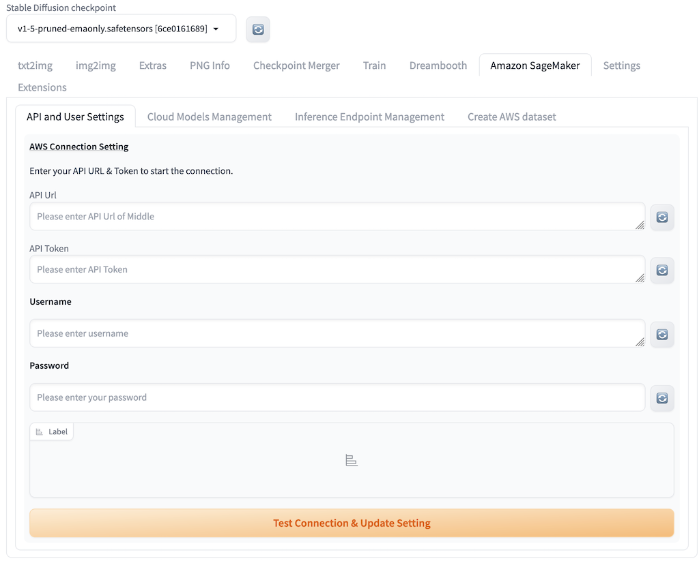

# Configure API and Multiple Users.

## Configure API
1. Open [AWS CloudFormation Console](https://console.aws.amazon.com/cloudformation/), and select the main stack that successfully deployed.
2. Navigate the **Outputs** tab, and copy the information under **APIGatewayUrl** and **ApiGatewayUrlToken**.
3. Open Stable Diffusion webUI, navigate to the 'Amazon SageMaker' tab, paste information from step 2 into fields **API URL** and **API Token**. Create a super admin user name and password by entering information in field **Username** and **Password**. And click **Test Connection & Update Setting**.
4. Message **Successfully Connected & Setting Updated** will be printed once front UI successfully connected with backend cloud resource. The configuration file has been updated to automatically display corresponding information upon future launches of the webUI.

5. Restart the WebUI in the background to ensure that all functionalities take effect.

## Users Management
### Add New User
1. To meet your specific requirements, create new users, passwords, and roles. Once you click on "Next Page," the newly created users will be visible. To ensure the configuration changes related to the new users take effect in the web UI server, it is necessary to restart the web UI again.

2. Open another incognito browser, and log in using the newly created username and password.
3. When accessing the Amazon SageMaker tab, the displayed content may vary for different users.

### Manage Existing User
1. Select the corresponding user from **User Table** that is expected to be updated, including **Password** or **User Role** update. The user information will be displayed in field **Update a User Setting**.
2. Update the corresponding fields as need, and click **Upsert a User** to save the change. Otherwise click **Delete a User** to delete the selected user.

