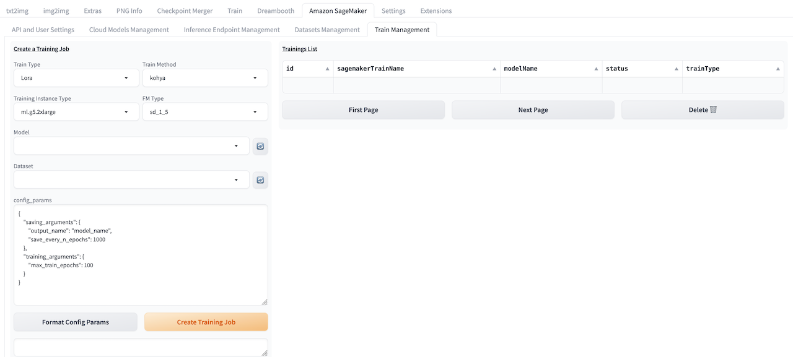

# Training Guide


The training is based on [Kohya-SS](https://github.com/kohya-ss/sd-scripts). Kohya-SS is a Python library for finetuning stable diffusion model which is friendly for consumer-grade GPU and compatible with the Stable Diffusion WebUI. The solution can do LoRA training both on SDXL and SD 1.5.

## Training User Guide


### Prepare Foundation Model
Please refresh and check the dropdown list under **Model** to ensure that the required base models for this training session are available. If not, you can use the **Upload Models** in [Cloud Asset Management](./CloudAssetsManage.md) to upload the base models under the *SD Checkpoints* category.

Alternatively, you can also upload local SD models to an S3 bucket using the following command:

Upload your local SD model to S3 bucket by following commands
```
# Configure credentials
aws configure
# Copy local SD model to S3 bucket
aws s3 cp *safetensors s3://<bucket_path>/<model_path>
```

### Prepare Dataset
The dataset is an indispensable input for model training and fine-tuning.

Taking the example of training a LoRa model containing specific image style, users need to prepare a set of images in advance. These images should have a consistent theme or style, with moderate resolution, and a few dozen images are sufficient. For this image set, users need to preprocess it to adapt to the capabilities of the base model. For example, it is recommended to crop the images to a size of 512 x 512 pixels in preparation for training tasks on the LoRa model based on the base model SD 1.5.

After preprocessing, it is necessary to annotate the images in  dataset, that is, add textual descriptions to each training image and save them as text files with the same name as the corresponding images. Image annotation can be complete through the built-in image annotation function in the SD WebUI or through multi-modal large models. The annotations made by the model may not be perfect, so manual review and adjustments are recommended to ensure the final effect.

Please refer **Dataset Management** in [Cloud Asset Management](./CloudAssetsManage.md) to upload dataset to cloud.

In addition, user could also upload dataset by execute AWS CLI command to copy the dataset to S3 bucket
```
aws s3 sync local_folder_name s3://<bucket_name>/<folder_name>
```

> **Notice:** The folder name should be started with a number and underline, eg. 100_demo. Each image should be paired with a txt file with the same name, eg. demo1.png, demo1.txt, the demo1.txt contains the captions of demo1.png.

### Train the LoRa Model
After the base model and dataset have been uploaded successfully, please follow these steps:
1. Navigate to **Train Management** tab, select desired training instance type in **Training Instance Type**, select the base model type for this training job in the **FM Type** field (i.e., based on Stable Diffusion 1.5 or Stable Diffusion XL). Then, choose the base model for this training session using the **Model** option. Finally, select the dataset that this training session will depend on using the **Dataset** option.
2. Update the training parameters in **config_params**, and click **Format config Params** to check and correct updated params file format.
3. Click **Create Training Job** to submit training job.
4. Refresh **Trainings List** to follow status of training job.
5. The successfully trained LoRa model can be selected directly in **txt2img** or **img2img**, and used in image generation. More details refer to [txt2img guide](./txt2img-guide.md) or [img2img guide](./img2img-guide.md).


### Invoke Training API

Refer to [API document](https://awslabs.github.io/stable-diffusion-aws-extension/en/developer-guide/api/1.5.0/) to invoke training API.
