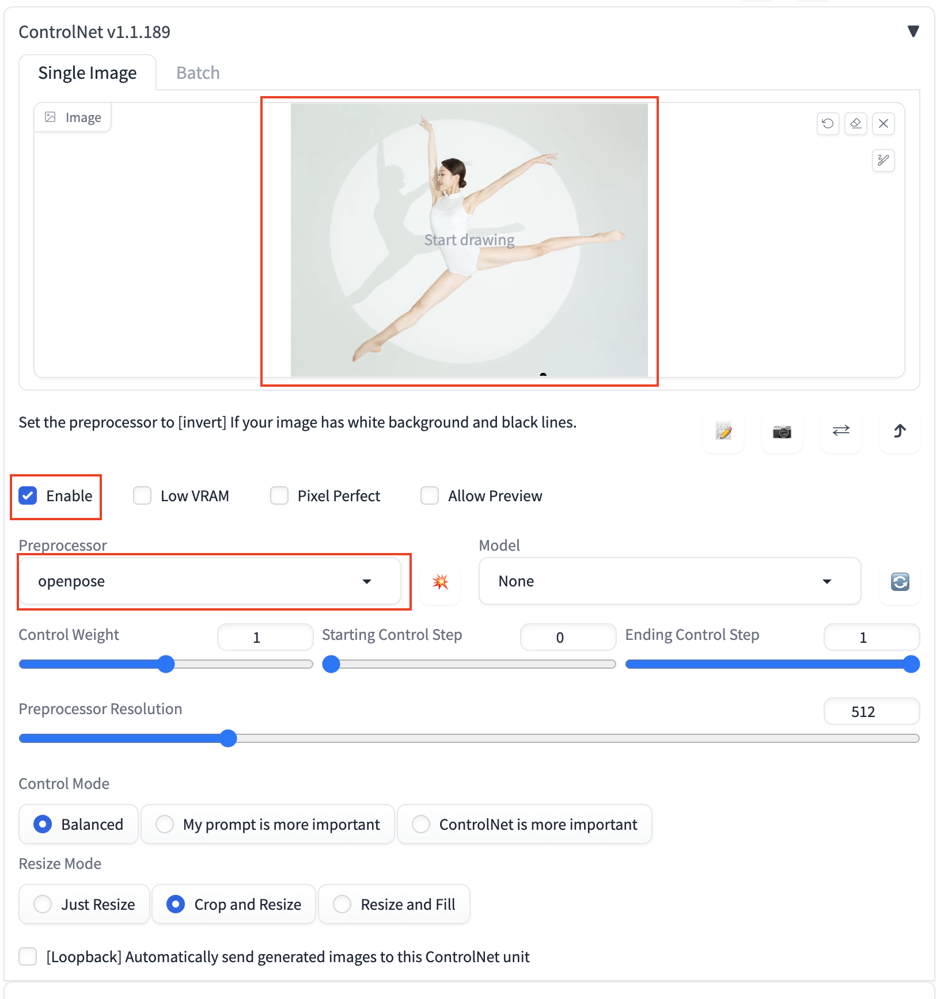
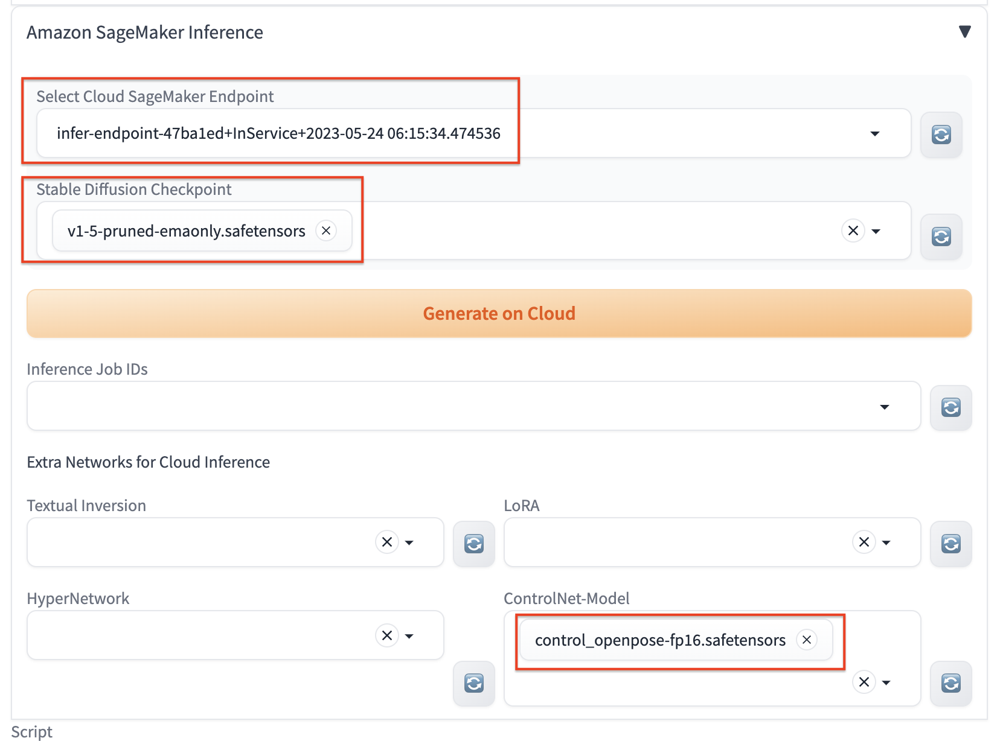

# txt2img Guide

You can open the **txt2img** tab to perform text-to-image inference using the combined functionality of the native region of txt2img and the newly added "Amazon SageMaker Inference" panel in the solution. This allows you to invoke cloud resources for txt2img inference tasks.

## General Inference

1. Navigate to **txt2img** tab, open **Amazon SageMaker Inference** panel. 

2. Enter the required parameters for inference. Similar to local inference, you can customize the inference parameters of the native **txt2img**, including prompts, negative prompts, sampling parameters, and inference parameters.
3. Select an endpoint for inference. Refresh and select an endpoint from **Select Cloud SageMaker Endpoint** dropdown list that is in the *InService* state.

    !!! Important "Notice" 
        This field is mandatory. If you choose an endpoint that is in any other state or leave it empty, an error will occur when you click **Generate on Cloud** to initiate cloud-based inference.
4. Fresh and select **Stable Diffusion Checkpoint** (required single select) and other extra models needed in **Extra Networks for Cloud Inference** (optional, multi-selection allowed).
5. Click **Generate on Cloud**.
6. Check inference result. Fresh and select the top option among **Inference Job ID** dropdown list. The **Output** section in the top-right area of the **txt2img** tab will display the results of the inference once completed, including the generated images, prompts, and inference parameters. Based on this, you can perform subsequent workflows such as clicking **Save** or **Send to img2img**.
> **Note：** The list is sorted in reverse chronological order based on the inference time, with the most recent inference task appearing at the top. Each record is named in the format of *inference time -> inference id*.

## Controlnet Guide

* ### openpose use guide
1. Open ControlNet panel, check **Enable**, select **openpose** from **Preprocessor**, and then upload am image.

2. Open **Amazon SageMaker Inference**panel, select one checkpoint from **Stable Diffusion Checkpoint** and one model from **ControlNet-Model**. For example: below is the ineference based on **v1-5-pruned-emaonly.safetensors** and **control_openpose-fp16.safetensors**, prompts **a cute dog**, click **Generate on Cloud**.

3. Refresh and select the top Inference Job from **Inference Job IDs**, inference result will be dispaly in **Output** section.