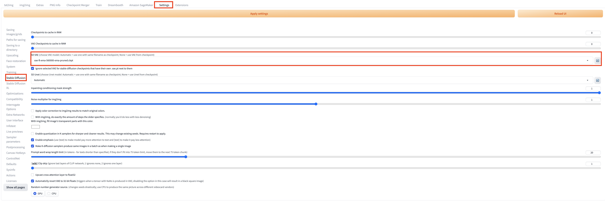

# txt2img Guide

You can open the **txt2img** tab to perform text-to-image inference using the combined functionality of the native region of txt2img and the newly added "Amazon SageMaker Inference" panel in the solution. This allows you to invoke cloud resources for txt2img inference tasks.

## txt2img user guide

### General Inference Scenario

1. Navigate to **txt2img** tab, find **Amazon SageMaker Inference** panel. 

2. Enter the required parameters for inference. Similar to local inference, you can customize the inference parameters of the native **txt2img**, including model name (stable diffusion checkpoint, extra networks:Lora, Hypernetworks, Textural Inversion and VAE), prompts, negative prompts, sampling parameters, and inference parameters. For VAE model switch, navigate to **Settings** tab, select **Stable Diffusion** in the left panel, and then select VAE model in **SD VAE** (choose VAE model: Automatic = use one with same filename as checkpoint; None = use VAE from checkpoint).

    !!! Important "Notice" 
        The model files used in the inference should be uploaded to the cloud before generate, which can be referred to the introduction of chapter **Cloud Assets Management**. The current model list displays options for both local and cloud-based models. For cloud-based inference, it is recommended to select models with the **sagemaker** keyword as a suffix, indicating that they have been uploaded to the cloud for subsequent inference.

3. Select an endpoint for inference. Refresh and select an endpoint from **Select Cloud SageMaker Endpoint** dropdown list that is in the *InService* state. After select one *InService* endpoint, the button **Generate** will change to button **Generate on Cloud**。

    !!! Important "Notice" 
        This field is mandatory. If you choose an endpoint that is in any other state or leave it empty, an error will occur when you click **Generate on Cloud** to initiate cloud-based inference.

4. Finish setting all the parameters, and then click **Generate on Cloud**.

5. Check inference result. Fresh and select the top option among **Inference Job** dropdown list, the **Output** section in the top-right area of the **txt2img** tab will display the results of the inference once completed, including the generated images, prompts, and inference parameters. Based on this, you can perform subsequent workflows such as clicking **Save** or **Send to img2img**.
> **Note：** The list is sorted in reverse chronological order based on the inference time, with the most recent inference task appearing at the top. Each record is named in the format of *inference time -> inference id*.

### Continuous Inference Scenario
1. Following the **General Inference Scenario**, complete the parameter inputs and click **Generate on Cloud** to submit the initial inference task.
2. Wait for the appearance of a new **Inference ID**in the right-side "Output" section.
3. Once the new **Inference ID** appears, you can proceed to click **Generate on Cloud** again for the next inference task.

## Inference Job
Inference Job displays latest 10 inference job by default, following naming format Time-Type-Status-Uuid. Checking **Show All** will display all inference jobs the account has. Checking **Advanced Inference Job filter** and apply filters as need will provide users customized inference job list.
