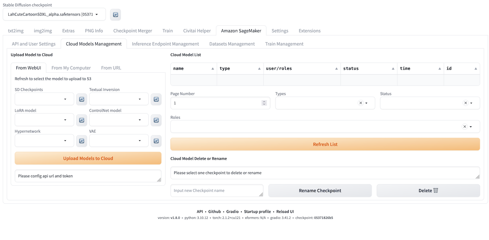
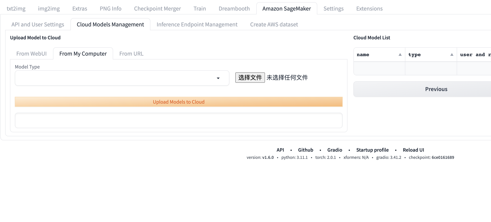
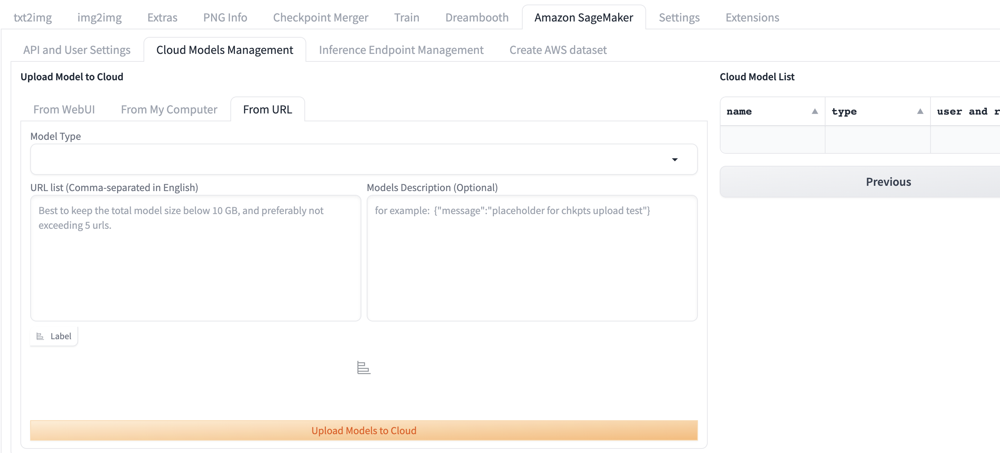

# メインタブ
このチャプターでは、このソリューションが提供する便利なクラウドベースのリソース管理アプローチの詳細な概要を説明します。

## モデルのアップロード
推論に追加のモデルを使用するには、2つの方法でモデルをアップロードし、[txt2img](txt2img-guide.md)または[img2img](img2img-guide.md)のステップに従って必要に応じて追加のモデルで推論を行うことができます。

方法1:

1. Stable Diffusion WebUI で、ソリューションのメインタブ**Amazon SageMaker**に移動し、セッション**Cloud Models Management**を見つけます。

2. **from WebUI**タブを選択すると、WebUI サービスがデプロイされているモデルファイルパスからモデルをアップロードできます。
3. 対応するモデルのテキストボックスに WebUI サービスがデプロイされているモデルパスを入力します。
> **注意**: 複数のモデルパスをテキストボックスに入力することで、複数の種類のモデルをアップロードできます。
4. **Upload Models to Cloud**をクリックしてアップロードプロセスを開始します。
5. アップロードが完了するとメッセージが表示されます。

方法2:

1. Stable Diffusion WebUI で、ソリューションのメインタブ**Amazon SageMaker**に移動し、セッション**Cloud Models Management**を見つけます。

2. **from Laptop**タブを選択すると、WebUI にアクセスするローカルパスからモデルをアップロードできます。
3. アップロードするモデルの種類を選択します。現在サポートされているのは6種類:SD チェックポイント、Textual Inversion、LORS モデル、ControlNet モデル、Hypernetwork、VAE です。
4. アップロードするローカルのモデルファイルを選択します。
> **注意**: 複数のモデルを選択できますが、ブラウザの制限により、10 個以下を選択し、合計サイズが 8GB を超えないのが最適です。
5. **Upload Models to Cloud**をクリックしてアップロードプロセスを開始します。
6. アップロードは非同期にファイルサイズと数量に応じて分割されて行われます。各部分のアップロードが完了するごとに、**Choose File**ボタンの下にプロンプトが表示されます。

方法3:

1. Stable Diffusion WebUI で、**Amazon SageMaker**メインタブに移動し、セッション**Cloud Models Management**を見つけます。
2. **from URL**タブを選択します。このオプションを使うと、モデルがダウンロードされている URL から S3 にモデルをアップロードできます。

3. アップロードするモデルの種類を選択します。現在、6種類がサポートされています:SD チェックポイント、Textual Inversion、LORS モデル、ControlNet モデル、Hypernetwork、VAE。
4. **URL list (Comma-separated in English)**入力ボックスに、コンマ区切りでモデルダウンロードの URL リストを入力します。
5. **Models Description (Optional)**入力ボックスに、JSON 形式の説明(オプション)を入力します。
> **注意**: 複数のモデルファイルを選択できますが、5ファイル以内、合計サイズが 12GB を超えないことを推奨します。これは、Lambda のメモリと並行スレッドの制限によるものです。
6. **Upload Models to Cloud**をクリックしてモデルのアップロードプロセスを開始します。
7. **Label**セクションの下にプロンプトが表示され、アップロードリクエストの進捗状況がわかります。

## Amazon SageMaker エンドポイント管理
### 新しいエンドポイントをデプロイ

1. ソリューションの**Amazon SageMaker**メインタブに移動します。**Cloud Assets Management**モジュールで、**Deploy New SageMaker Endpoint**セクションを見つけます。
2. ソリューションのデフォルトのデプロイメントタイプは ml.g5.2xlarge、インスタンス数は1つです。エンドポイントの自動スケーリング機能はデフォルトで有効になっています。**Deploy**ボタンをクリックするだけで SageMaker エンドポイントのデプロイを開始できます。
3. ユーザーがエンドポイント名、インスタンスタイプ、エンドポイントインスタンスの最大インスタンス数を指定したい場合は、**Advanced Endpoint Configuration**チェックボックスをオンにします。これにより、ユーザー入力用の追加パラメーターが表示されます。これらのパラメーターの名称と説明は次の表の通りです。

    | パラメーター名 | 説明 |
    |-------------------|--------------------------------------------------------------------------------------------------------------------------------------------------------------------------------------------------------------------------------------------------------------------------------------------|
    | Endpoint Name (Optional) | SageMaker エンドポイントの名称を指定する必要がある場合は、このテキストボックスに入力してください。変更しない場合、デフォルトのエンドポイント名が esd-type-XXXXX となります。 |
    | Endpoint Type | デプロイするエンドポイントの推論タイプ(Async/Real-time)を選択します。 |
    | Instance Type | ドロップダウンリストから、デプロイするエンドポイントのインスタンスタイプを選択します。 |
    | Max Instance Number | ドロップダウンリストから、デプロイするエンドポイントの最大インスタンス数を選択します。自動スケーリングが有効な場合、SageMaker は平均 CPU の使用率に応じて0から最大インスタンス数までスケーリングします。 |
    | Enable Autoscaling | このチェックボックスを選択すると、非同期推論では各インスタンスの平均バックログに応じて0から最大インスタンス数までスケーリし、リアルタイム推論では1から最大インスタンス数までスケーリします。 |
    | Min Instance Number | 自動スケーリングが有効な場合、この値がエンドポイントインスタンスの最小数となります。 |

4. デフォルトのエンドポイント設定を選択するか、高度なエンドポイント設定を設定した後、**Deploy**をクリックします。**Label**の下に**Endpoint deployment started**というメッセージが表示されます。

5. **txt2img**タブ、**Amazon SageMaker Inference**セッションに移動し、ドロップダウンリスト**Select Cloud SageMaker Endpoint**を更新すると、すべてのエンドポイントのデプロイ状況を確認できます。
> **注意:** ドロップダウンリストの形式は：エンドポイント名+ デプロイメントステータス(Creating/Failed/InService など)+デプロイ完了時間です。
6. エンドポイントのデプロイ状況が*InService*に変わるまでには約3分かかります。これはエンドポイントが正常にデプロイされたことを示します。

### デプロイされたエンドポイントを削除

1. **Select Cloud SageMaker Endpoint**ドロップダウンリストを更新し、削除するエンドポイントを選択します。
2. **Delete**をクリックすると、**Endpoint delete completed**というメッセージが左側に表示され、選択したエンドポイントが正常に削除されたことを示します。

# AWS データセット管理
## データセットの作成
モデルのファインチューニングなどの機能では、ファインチューニング作業に使用する画像ファイルを提供する必要があります。この機能モジュールは、ユーザーがクラウドに迅速に画像をアップロードするのを支援します。

1. **Amazon SageMaker**メインタブ、**AWS Dataset Management**セクション、**Create**タブに移動します。

2. **Click to Upload a File**をクリックし、ポップアップする
ローカルのファイルブラウザから、1つのモデルのファインチューニングに必要なすべての画像を選択して確認します。
3. **Dataset Name**にファイル名を入力し、**Dataset Description**に説明を入力して、**Create Dataset**をクリックします。
4. プロセスが完了すると、右側に**Complete Dataset XXXX creation**のメッセージが表示されます。

## データセットの参照
データセットのアップロードが完了すると、この機能モジュールにより、ユーザーはデータセットの対応するクラウドアドレスを迅速に取得できます。ユーザーはこのアドレスをコピーし、画像の収集場所に貼り付けることができます。

1. **Amazon SageMaker**、**AWS Dataset Management**セッション、**Browse**タブに移動し、**Dataset From Cloud**リストを更新し、目的のデータセットを選択します。
2. **dataset s3 location**フィールドにクラウド上の S3 パスが表示されます。必要に応じてこのパスをコピーして使用できます。
