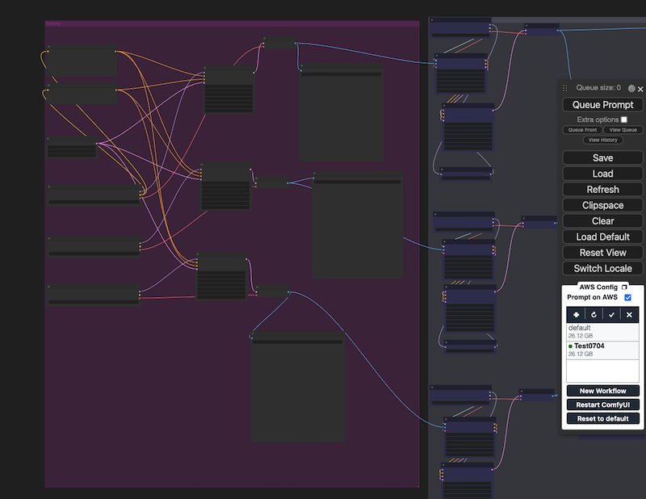

# ComfyUIを使ったクラウド上での画像または動画生成

ソリューションを正常にデプロイした後、デプロイされたスタックによって提供されるネイティブの **ComfyUI** ページを開くことができます。ワークフローのデバッグ、リリース、推論の概要手順は次のとおりです:

* ステップ1: ComfyUIフロントエンドをデプロイするEC2に接続します。
* ステップ2: ソリューションのスタックによって提供される **Designer** リンクを開き、新しいワークフローをローカル(EC2仮想マシン上)でデバッグし、不足しているノードをインストールし、必要な推論モデルをアップロードし、それらがローカル(EC2仮想マシン上)で正常にロードおよび推論できることを確認します。
* ステップ3: ワークフローをテンプレートとしてリリースします。
* ステップ4: ワークフローに必要なエンドポイントをAPIを通じて作成します。
* ステップ5: ComfyUIの推論ページで、リリースされたテンプレートを選択し、必要に応じて推論パラメータ(例: プロンプト)とモデルを変更し、画像/動画に対して推論を実行します。これにより、Amazon SageMakerリソースが利用されます。


## ステップ1: ComfyUIフロントエンドをデプロイするEC2に接続する

EC2インスタンスに接続すると、対応するディレクトリ構造をローカルで確認できるため、ローカルワークフローのデバッグ中にログファイルを表示しやすくなり、診断を支援します。

ComfyUIのデバッグログのみを表示する必要がある場合は、次の手順で実現できます。

1. デプロイソリューションが存在する同じリージョンのEC2コンソールを開き、**comfy-on-aws-dev**インスタンスを選択し、右上の**接続**をクリックします。
2. 利用可能な接続方法で、**EC2 Instance Connect**タブを選択し、**接続**をクリックします。
3. 少し待つと、新しいEC2接続ページがポップアップします。必要に応じて、必要なコマンドを入力して、さまざまな操作を実行できます。一般的なコマンドには以下があります。

```
tail -f /var/log/cloud-init-output.log     ComfyのEC2起動プロセス中の初期ログをリアルタイムで表示するために使用します。
sudo journalctl -u comfy -f       Comfyの実行時ログをリアルタイムで表示するために使用します。
tail -f /root/stable-diffusion-aws-extension/container/*.log       Comfyの実行時コンテナのすべてのログを表示するために使用します。
sudo journalctl -u comfy --no-pager -n 200        Comfyの実行時の最後の200ログを表示するために使用します。
docker images -q | xargs docker rmi -f
```

## ステップ2: ワークフローのデバッグ
この解決策で提供されるネイティブの **Designer** ページでは、ComfyUIのローカルバージョンと同じ方法で新しいワークフローをデバッグできます。モデル管理やその他のタスクは、ComfyUIが展開されている仮想マシン(EC2)に接続して実行できます。



ComfyUIの上級設計バージョンを使用する手順は以下の通りです。

1. (オプション) 既存のワークフローJSONファイルをComfyUIインターフェイスにドラッグしてワークフローをレンダリングします。
2. ワークノード(カスタムノード)を調整(追加と削除を含む)し、推論パラメータと使用するモデルを調整します。
3. **Queue Prompt** をクリックして、現在のページのワークフローに基づいて推論タスクを開始します。
4. (オプション) ステップ3でエラープロンプトが表示された場合は、指示に従ってエラーを解決します。例えば、モデルが見つからない場合は、EC2インスタンスの対応するディレクトリにモデルをダウンロードします。カスタムノードが見つからない場合は、**Manager** をクリックしてから **Install Missing Custom Nodes** をクリックして、不足しているノードをインストールします。エラーを解決した後、ステップ3を繰り返してテストし直します。


5. ワークフローが完了し、生成された結果がインターフェイスに表示されると、ワークフローのデバッグが成功したことを示します。

## ステップ3: ワークフローを新しいテンプレートとしてリリースする
ワークフローがローカル(EC2仮想マシン上)で画像/動画を正常に推論できるようになったら、以下の手順に従ってデバッグされたワークフローを簡単にテンプレートとしてリリースし、Amazon SageMakerを通じて将来の推論呼び出しを便利で安定したものにすることができます。

1. 右側のナビゲーションバーの「New Workflow」または右側のワークフローリストモジュールの上部にある「プラスサイン」をクリックします。
2. ポップアップウィンドウで公開するテンプレートの名前を入力し、「OK」をクリックします。

    !!! tip
        新しいテンプレート名は、文字と数字の組み合わせで20文字以内にする必要があります。大文字と小文字が区別されます。さらに、同じリージョン内で名前が重複することはできません。既存のテンプレート名と競合する場合はエラーメッセージが表示されます。

3. ワークフローの公開中は、ComfyUIフロントエンドで更新を行わないでください。公開が完了すると、ポップアップ通知で正常に公開されたことが確認できます。
4. 公開中は、現在デバッグ中のワークフローが一時的に保存されます。環境を切り替えるたびに、現在の環境に対応する一時保存されたワークフローが最初にロードされます。

## ステップ4: リリースされたワークフローの将来の推論のための新しい推論エンドポイントをデプロイする
ワークフローのリリースを完了した後、ワークフローに基づいてクラウドベースの推論を実行するためのAmazon SageMaker推論エンドポイントを作成する必要があります。

1. [このドキュメント](../../deployment/deployment_comfyui.md)の「新しいAmazon SageMaker推論ノードのデプロイ」サブセクションを参照して、APIを呼び出して作成する必要があります。

2. 推論エンドポイントが作成され、**InService**状態になると、公開されたワークフローが推論の準備ができます。

## ステップ5: リリースされたテンプレートの推論
**Designer**ビューまたは**InferencePot**ビューでは、次の手順でテンプレートに基づいて簡単に推論を実行できます。

1. ComfyUIページを開き、右側のナビゲーションバーからリリースされたテンプレートを選択します。**Designer**ビューの場合は、右側のナビゲーションバーにある**Prompt on AWS**チェックボックスも選択する必要があります。

2. 選択したテンプレートがComfyUIページに自動的にレンダリングされます。必要に応じてパラメータを調整し、**Queue Prompt**をクリックして推論タスクを送信します。

3. 推論タスクが完了すると、生成された結果がページに自動的に表示されます。

## モデルを管理する
### モデルをアップロードする
モデルのデバッグ段階でスムーズにアクセスできるようにするため、新しいモデルをEC2にアップロードする必要があります。これは、EC2上の**models**ディレクトリ内のモデルカテゴリの対応するサブフォルダに移動し、モデルのダウンロードURLを使ってドラッグアンドドロップまたは**wget**コマンドで実行できます。ネットワーク速度を考慮すると、モデルのダウンロードには**wget**方式を優先することをお勧めします。