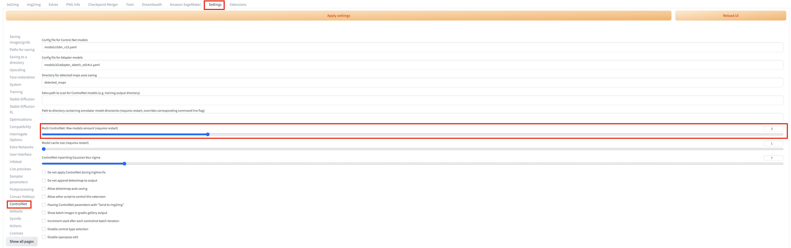
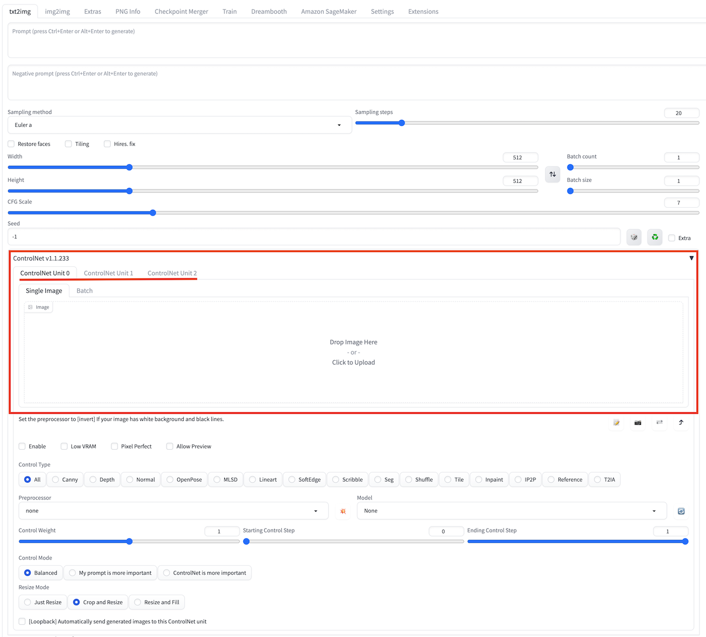
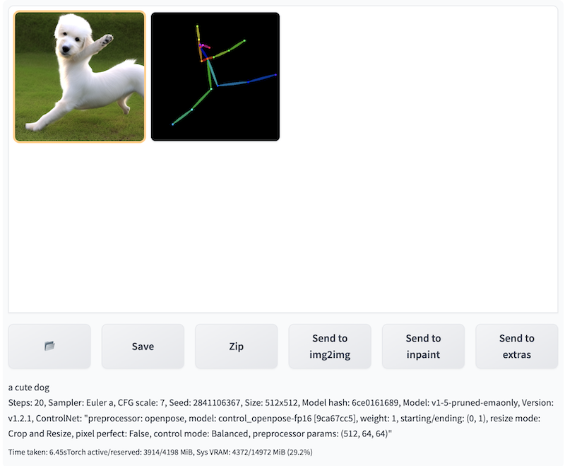

# Controlnet を使用した推論

**controlnet** サブセッションを開くことで、ネイティブの機能の **txt2img** や **img2img** と、ソリューションに追加された **Amazon SageMaker Inference** パネルを組み合わせて使用できます。クラウドリソースを使った推論タスクを呼び出すことができます。

## Controlnet ユーザーガイド

### Multi ControlNet ユーザーガイド
1. **Settings** タブに移動します。左のサイドバーで **ControlNet** を選択し、右のパネルの **Multi ControlNet** を調整します。最大モデル数(再起動が必要)設定で ControlNet の数 (1-10) を指定します。その後、webUI を再起動すると変更が反映され、Multi ControlNet 設定が有効になります。
 

2. **txt2img** または **img2img** タブに移動すると、同数の ControlNet ユニットが表示されます。以下の例では3つの ControlNet ユニットが同時に起動しています。
 

### openpose ユーザーガイド
1. ControlNet パネルを開き、**ControlNet Unit 0** を選択し、**Enable** にチェックを入れ、**Preprocessor** から **openpose** を選択し、画像をアップロードします。
 
2. ローカルの推論と同様に、ネイティブの **ControlNet** の推論パラメータをカスタマイズできます。controlnet モデルの "**control_openpose-fp16.safetensors**" はクラウド上にアップロードされている必要があります。
3. すべてのパラメータ設定が完了したら、**Generate on Cloud** をクリックします。
4. **Inference Job: Time-Type-Status-Uid** から最新の Inference Job を選択し、**Output** セクションに推論結果が表示されます。
5. その後の操作。**Save** などをクリックして、さらに処理を行うことができます。
 

