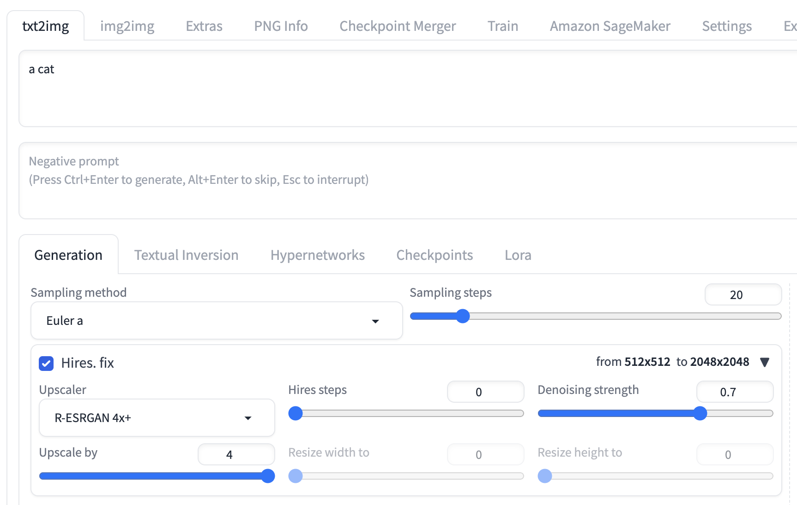

# その他のプラグインの使用ガイド

## ReActor プラグインを使ってクラウド上の顔交換機能を活用する

**ReActor**タブを開き、**txt2img**または**img2img**のネイティブエリアと**Amazon SageMaker Inference**という新しいパネルを組み合わせて使うことで、クラウド上のリソースを活用して推論作業を行うことができます。

### 使い方
ここでは、文生成(txt2img)でこのプラグインを使う方法を説明します。
1. 文生成と同様に、まず クラウド上の生成モデルを選択し、 "generate on cloud" ボタンをオンにします。
2. 例えば、モナ・リザ風の女の子を生成したい場合、prompt に "a girl" と入力します。
 3. ReActor パネルを開き、モナ・リザの画像を "Single Source Image" の枠にドラッグ&ドロップします。

 4. "generate on cloud" ボタンをクリックすると、以下のような結果が得られます。

 ReActor は複数人の顔交換にも対応しており、顔の番号を指定するだけで行えます。
また、顔モデルをロードして顔交換することも可能です。
詳しい使い方は[プラグインのドキュメント](https://github.com/Gourieff/sd-webui-reactor)を参照してください。

## Tiled Diffusion & Tiled VAE プラグインを使って画像の超解像度化

**Tiled VAE**タブを開き、**txt2img**または**img2img**のネイティブエリアと**Amazon SageMaker Inference**という新しいパネルを組み合わせて使うことで、クラウド上のリソースを活用して推論作業を行うことができます。

### 使い方
これらのプラグインを使うことで、限られた GPU メモリで超解像度の画像を生成できます。
ここでは文生成(txt2img)でのプラグインの使い方を説明します。
1. 文生成と同様に、まずクラウド上の生成モデルを選択し、 "generate on cloud" ボタンをオンにします。
2. 例えば、子猫の画像を生成したい場合、prompt に "a cat" と入力します。
 3. "Hires.fix"の超解像度パネルを開き、4倍の超解像度を設定します。

 4. Tiled VAE パネルを開き、Enable Tiled VAE をオンにして、デフォルトのパラメータで生成を行います。

 5. "Generate on cloud" ボタンをクリックすると、以下のような結果が得られます。

 Tiled Diffusion は、リージョンごとに異なるプロンプトを設定して超解像度の画像を生成できます。
詳しい使い方は[プラグインのドキュメント](https://github.com/pkuliyi2015/multidiffusion-upscaler-for-automatic1111/tree/main)を参照してください。
