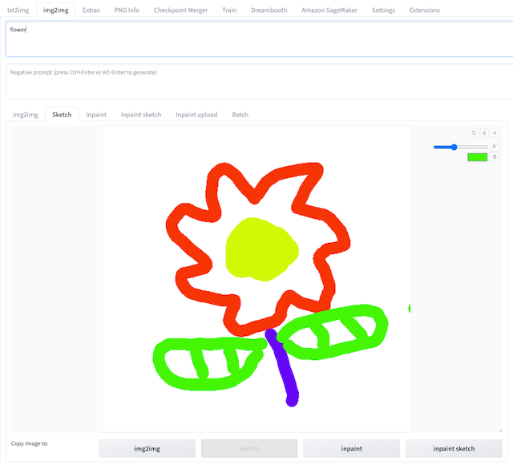
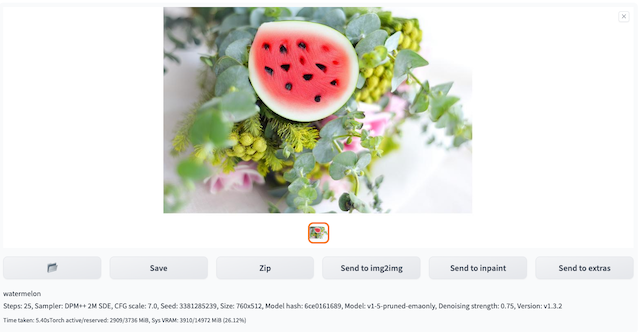
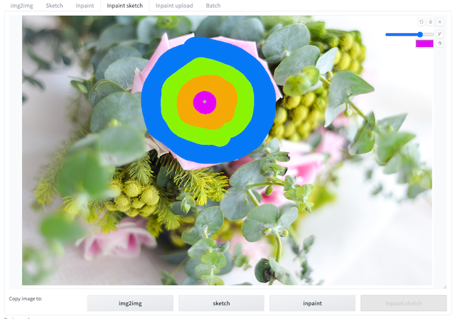
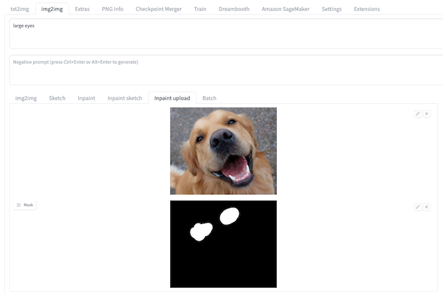

# img2img ガイド
オリジナルの領域と **Amazon SageMaker Inference** を使用してクラウド上で推論を行うことができます。

## img2img ユーザーガイド
### img2img の異なる機能ラベルの標準プロセス

1. **img2img** タブに移動し、**Amazon SageMaker Inference** パネルを見つけます。
2. 推論のパラメーターを入力します。ローカルの推論と同様に、ネイティブのフィールドでモデル名 (Stable Diffusion checkpoint、extra networks:Lora、Hypernetworks、Textural Inversion および VAE)、プロンプト、ネガティブプロンプト、サンプリングパラメーター、推論パラメーターなどを編集できます。 **img2img**、**sketch**、**inpaint**、**inpaint sketch**、**inpaint upload** の各機能では、ネイティブの方法で画像をアップロードして修正できます。

    !!!Important 注意
        推論に使用するモデルファイルは、生成前にクラウドにアップロードする必要があります。これについては、**クラウドアセット管理** の章の説明を参照してください。

3. **Stable Diffusion Checkpoint Used on Cloud** を通じて、クラウド上での推論に使用する Stable Diffusion checkpoint モデルを選択します。**Generate** ボタンが **Generate on Cloud** ボタンに変わります。
 

    !!!Important 注意 
        このフィールドは必須です。エンドポイントを何らかの状態に選択するか空のままにすると、**Generate on Cloud** をクリックしてクラウドベースの推論を開始するときにエラーが発生します。

4. **Generate on Cloud** をクリックします。
5. 推論結果を確認します。**Inference Job Histories: Time-Type-Status-UUID** ドロップダウンリストの上位オプションを新鮮に選択します。img2img タブの右上の **Output** セクションに、推論が完了すると、生成された画像、プロンプト、推論パラメーターが表示されます。これに基づいて、**Save** または **Send to extras** などの後続のワークフローを実行できます。
> **注意:** リストは推論時間の逆順に並べ替えられており、最新の推論タスクが一番上に表示されます。各レコードは **推論時間 -> ジョブタイプ (txt2img/img2img/interrogate_clip/interrogate_deepbooru) -> 推論ステータス(成功/進行中/失敗 ) -> 推論 ID** という形式で名付けられています。

### img2img ラベル

1. オリジナルの画像を **img2img** にアップロードし、プロンプトを入力して、**Generate on Cloud** をクリックします。
2. 対応する **Inference Job ID** を選択すると、生成された画像が右側の **Output** セッションに表示されます。

### Sketch ラベル

1. コマンドラインで `--gradio-img2img-tool color-sketch` で Stable Diffusion WebUI を起動し、ホワイトボードの背景画像を **Sketch** タブにアップロードします。
2. ブラシを使って対応するスケッチを描き、プロンプトを準備し、**Generate on Cloud** をクリックします。
 

3. 対応する **Inference Job ID** を選択すると、生成された画像が右側の **Output** セッションに表示されます。
 

### Inpaint ラベル

1. オリジナルの画像を **Inpaint** ラベルにアップロードします。
2. ブラシでマスクを設定し、プロンプトを準備して、**Generate on Cloud** をクリックします。
 

3. 対応する **Inference Job ID** を選択すると、生成された画像が右側の **Output** セッションに表示されます。
 

### Inpaint Sketch ラベル

1. コマンドラインで `--gradio-img2img-tool color-sketch` で Stable Diffusion WebUI を起動し、オリジナルの画像を **Inpaint Sketch** ラベルにアップロードしてプロンプトを準備します。
2. ブラシでマスクを設定し、**Generate on Cloud** をクリックします。
 

3. 対応する **Inference Job ID** を選択すると、生成された画像が右側の **Output** セッションに表示されます。
 

### Inpaint Upload ラベル

1. オリジナルの画像とマスク画像を **Inpaint Upload** ラベルにアップロードし、プロンプト(例 : *large eyes*) を準備します。
 

2. **Generate on Cloud** をクリックし、対応する **Inference Job ID** を選択すると、生成された画像が右側の **Output** セッションに表示されます。
 

### Interrogate clip/deepbooru 

1. **img2img** タブに移動し、**Amazon SageMaker Inference** パネルを開きます。
2. Interrogate を行うには、画像を **img2img** タブにアップロードするだけです。
 

3. 推論エンドポイントを選択します。**Select Cloud SageMaker Endpoint** の右側の更新ボタンをクリックし、**InService** 状態の推論エンドポイントを選択します。
4. **Interrogate CLIP on cloud** または **Interrogate DeepBooru on cloud** をクリックします。
5. 推論結果を確認します。**Inference Job JDs** のドロップダウンリストを更新し、推論の提出タイムスタンプに一致する最上位の **Inference Job ID** を確認して、推論結果を確認します。
 

### 連続推論シナリオ

1. **一般推論シナリオ** に従って、パラメーターを入力し、**Generate on Cloud** をクリックして、最初の推論タスクを送信します。
2. 右側の **Output** セクションに新しい **Inference ID** が表示されるまで待ちます。
3. 新しい Inference ID が表示されたら、再度 **Generate on Cloud** をクリックして次