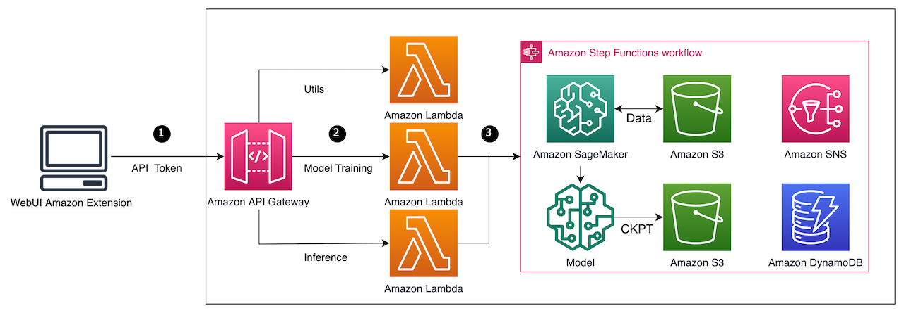

以下的图表简要展示了我们的插件和中间件之间的内部工作流程。用户仍旧可以在单独的EC2/本地服务器上安装并启动社区WebUI并在此基础上安装我们的插件，其中训练和推理部分则通过用户AWS账户中安装的中间件所提供的RESTful API迁移到AWS（Amazon SageMaker，S3等）。请注意，中间件是基于AWS账户粒度的，这意味着它可以作为工作节点单独安装，同作为控制节点的WebUI进行通信。用户只需要输入每个账户的API URL和API密钥，中间件将会决定使用哪个特定的AWS账户来执行后续的工作。

整体工作流程

中间件的主要功能是为WebUI插件提供RESTful API，以符合OpenAPI规范与AWS云资源（SageMaker、S3等）进行交互，它将处理请求身份验证，将请求分派到特定的Amazon SageMaker/S3 API（比如SageMaker.jumpstart/model/predictor/estimator/tuner/utils等）和模型生命周期管理等工作。下图是中间件的整体架构，包括实现RESTful API功能的API Gateway和Lambda，以及编排模型生命周期的Step Function。

中间件架构

为了使插件中的容器镜像与社区保持同步，我们构建了CI/CD自动化流程（如下图所示）来自动跟踪社区提交并打包和构建新的容器镜像，用户可以轻松启动最新的扩展而无需任何手动操作。

Image CI/CD Workflow
