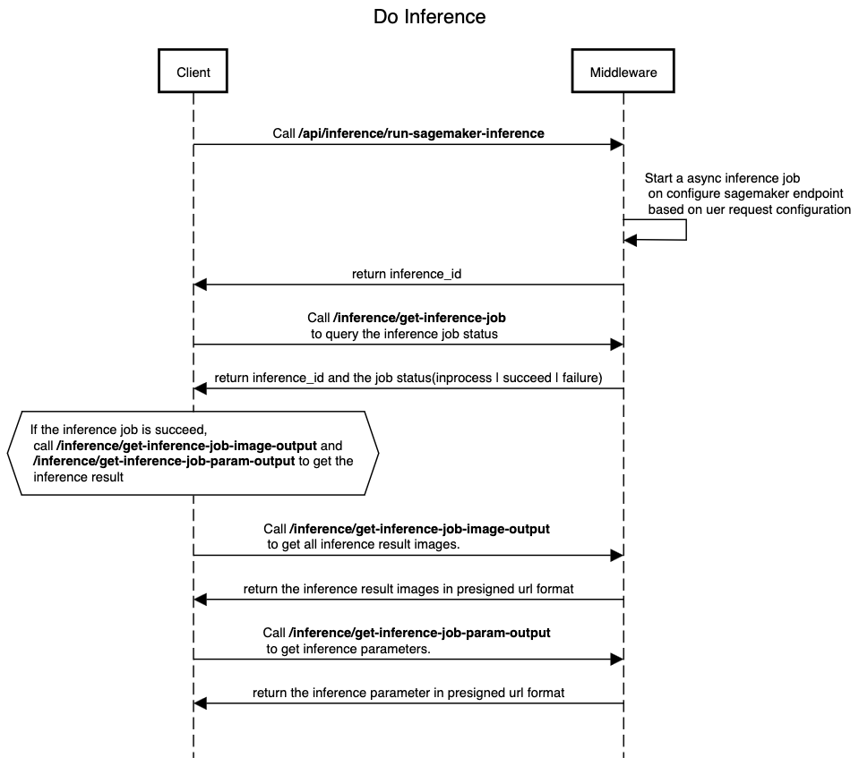

<!-- Generator: Widdershins v4.0.1 -->

<h1 id="stable-diffusion-train-and-deploy-api">Stable Diffusion 亚马逊云科技插件 API</h1>

# 概述
本文档描述了Stable Diffusion 亚马逊云科技插件解决方案的所有 API。此解决方案包括两个部分，一部分是Stable Diffusion WebUI 扩展，它是基于 Gradio 的客户端，提供用户友好的界面，另一部分是称为中间件的资源部署在 AWS 云上，中间件提供了多个 API 接口，允许Stable Diffusion 亚马逊云科技插件客户端与 AWS 云上的服务进行交互，如 Sagemaker 和 S3，以执行模型更新/训练和推理操作。

为了支持不使用Stable Diffusion WebUI的用户，我们提供了本文档，列出了所有的 API 接口，以帮助用户了解如何调用 API 方法进行训练或推理。

在用户[部署](../deployment/deployment.md)解决方案中间件 CloudFormation 后，用户可以在主堆栈的输出部分获取 API URL 和令牌。请参考[此文档](../deployment/deployment.md)。


**URL示例:**

* https://API_Gateway_ID.execute-api.AWS_Account_Region.amazonaws.com/prod


**认证**

* API Key (api_key)
    - API 调用时您需要在标头的**x-api-key**参数中配置此值。

# 用户场景
## 1. 部署新的终端节点


调用 [/inference/deploy-sagemaker-endpoint](#inferencedeploy-sagemaker-endpoint) 来创建一个新的 Sagemaker 终端节点，您需要指定两个用于创建的参数，一个是 `instance_type`，可选值为 "ml.g4dn.2xlarge"、"ml.g4dn.4xlarge"、"ml.g4dn.8xlarge"、"ml.g4dn.12xlarge"，另一个是 `initial_instance_count`，可选值为 1|2|3|4。

在调用 [/inference/deploy-sagemaker-endpoint](#inferencedeploy-sagemaker-endpoint) 后，您需要调用 [/inference/list-endpoint-deployment-jobs](#inferencelist-endpoint-deployment-jobs) 来列出所有终端节点的状态。通常需要超过10分钟时间才能使新的 Sagemaker 终端节点更改为 "inService" 状态。Sagemaker 终端节点只能在 "inService" 状态下用于推理。

如果终端节点处于失败状态，您可以调用 [/inference/get-endpoint-deployment-job](#inferenceget-endpoint-deployment-job) 并传递参数 `jobID`，响应将显示终端节点部署失败的原因，通常是由于 AWS 帐户配额限制引起的。

<details>
  <summary>sequence digram raw</summary>
  
  title Create a Sagemaker Endpoint

Client->Middleware:Call /inference/deploy-sagemaker-endpoint
Middleware->Middleware: Start a workflow to configure sagemaker endpoint \n based on uer request configuration
Client->Middleware:Call /inference/list-endpoint-deployment-jobs \n to list all the endpoint creation job list
Client->Middleware:Call /inference/get-endpoint-deployment-job \n to check whether Sagemaker endpoint is in \n 'inService' state.
  
</details>

## 2. 上传模型

## 3. 训练模型

## 4. 进行推理

在 Sagemaker 终端节点处于 "inService" 状态之后，您可以调用 [/inference-api/inference](#inference-l2-api) 来进行文本到图像或图像到图像的推理。您需要在请求的 POST 主体中的 "sagemaker_endpoint" 参数中指定终端节点的名称。其他所需参数位于 [/inference-api/inference](#inference-l2-api) 中。

[/inference-api/inference](#inference-l2-api) 将向客户端返回以下 JSON 结构：

```json
{
  "inference_id": "XXXXXXX",
  "status": "inprogress | failed",
  "endpoint_name": "NAME_OF_ENDPOINT",
  "output_path": "path_of_prediction_output"
}
```
然后，客户端可以调用 [/inference/get-inference-job](#inferenceget-inference-job)，并将 `inference_id` 作为参数来查询推理作业的状态。如果推理作业成功完成（状态为 "succeed"），客户端可以使用 [/inference/get-inference-job-image-output](#inferenceget-inference-job-image-output) 来获取所有推理结果图像，这些图像将以 S3 预签名 URL 列表的形式返回，以便客户端下载。以下是一个示例，展示了 `get-inference-job-image-output` 的结果：

```json
[
  "https://stable-diffusion-aws-extension-aigcbucketa457cb49-1tlr2pqwkosg3.s3.amazonaws.com/out/1f9679f3-25b8-4c44-8345-0a845da30094/result/image_0.jpg"
]
```

此外，客户端还可以调用 [/inference/get-inference-job-param-output](#inferenceget-inference-job-param-output) 来获取所有推理参数，[/inference/get-inference-job-param-output](#inferenceget-inference-job-param-output) 的响应是一个包含参数的 JSON 格式的 S3 预签名 URL，以下是一个响应示例：


```json
[
  "https://stable-diffusion-aws-extension-aigcbucketa457cb49-1tlr2pqwkosg3.s3.amazonaws.com/out/1f9679f3-25b8-4c44-8345-0a845da30094/result/1f9679f3-25b8-4c44-8345-0a845da30094_param.json"
]
```

<details>
  <summary>sequence digram raw</summary>
  
title Do Inference

Client->Middleware:Call **/inference-api/inference**
Middleware->Middleware: Start a async inference job \n on configure sagemaker endpoint \n based on uer request configuration
Middleware->Client: return inference_id 
Client->Middleware:Call **/inference/get-inference-job** \n to query the inference job status
Middleware->Client: return inference_id and the job status(inprocess | succeed | failure)

abox over Client: If the inference job is succeed, \n call **/inference/get-inference-job-image-output** and \n **/inference/get-inference-job-param-output** to get the \n inference result 
Client->Middleware:Call **/inference/get-inference-job-image-output** \n to get all inference result images.

Middleware->Client: return the inference result images in presigned url format

Client->Middleware:Call **/inference/get-inference-job-param-output** \n to get inference parameters.

Middleware->Client: return the inference parameter in presigned url format
  
</details>
# API 列表

| 序号  | HTTP 方法 | API 名称                                                                                                  | 描述                                  |
|-----|---------|---------------------------------------------------------------------------------------------------------|-------------------------------------|
| 1   | GET     | [/inference/test-connection](#inferencetest-connection)                                                 | 测试客户端是否可以连接到 API 并检查 API_TOKEN 是否正确 |
| 2   | GET     | [/inference/list-inference-jobs](#inferencelist-inference-jobs)                                         | 列出所有推理作业。                           |
| 3   | GET     | [/inference/get-inference-job](#inferenceget-inference-job)                                             | 获取特定推理作业的详细信息。                      |
| 4   | GET     | [/inference/get-inference-job-image-output](#inferenceget-inference-job-image-output)                   | 获取特定推理作业的图像输出。                      |
| 5   | GET     | [/inference/get-inference-job-param-output](#inferenceget-inference-job-param-output)                   | 获取特定推理作业的参数输出。                      |
| 6   | POST    | [/inference-api/inference](#inference-l2-api)                                                           | 使用默认参数运行 SageMaker 推理               |
| 7   | POST    | [/inference/deploy-sagemaker-endpoint](#inferencedeploy-sagemaker-endpoint)                             | 部署 SageMaker 终端节点。                  |
| 8   | POST    | [/inference/delete-sagemaker-endpoint](#inferencedelete-sagemaker-endpoint)                             | 删除 SageMaker 终端节点。                  |
| 9   | GET     | [/inference/list-endpoint-deployment-jobs](#inferencelist-endpoint-deployment-jobs)                     | 列出所有终端节点部署作业。                       |
| 10  | GET     | [/inference/get-endpoint-deployment-job](#inferenceget-endpoint-deployment-job)                         | 获取特定终端节点部署作业。                       |
| 11  | GET     | [/inference/generate-s3-presigned-url-for-uploading](#inferencegenerate-s3-presigned-url-for-uploading) | 生成用于上传的 S3 预签名 URL。                 |
| 12  | GET     | [/inference/get-texual-inversion-list](#inferenceget-texual-inversion-list)                             | 获取文本反演列表。                           |
| 13  | GET     | [/inference/get-lora-list](#inferenceget-lora-list)                                                     | 获取 LoRa 列表。                         |
| 14  | GET     | [/inference/get-hypernetwork-list](#inferenceget-hypernetwork-list)                                     | 获取超网络列表。                            |
| 15  | GET     | [/inference/get-controlnet-model-list](#inferenceget-controlnet-model-list)                             | 获取 ControlNet 模型列表。                 |
| 16  | POST    | [/inference/run-model-merge](#inferencerun-model-merge)                                                 | 运行模型合并。                             |
| 17  | POST    | [/model](#modelpost)                                                                                    | 创建新模型。                              |
| 18  | PUT     | [/model](#modelput)                                                                                     | 上传模型文件。                             |
| 19  | GET     | [/models](#modelsget)                                                                                   | 列出所有模型。                             |
| 20  | GET     | [/checkpoint](#checkpoint)                                                                              | 获取检查点。                              |
| 21  | PUT     | [/checkpoint](#checkpointput)                                                                           | 更新检查点。                              |
| 22  | GET     | [/checkpoints](#checkpoints)                                                                            | 列出所有检查点。                            |
| 23  | POST    | [/train-api/train](#train-api-post)                                                                     | 启动训练作业。                             |
| 24  | PUT     | [/train](#trainput)                                                                                     | 更新训练作业。                             |
| 25  | GET     | [/trains](#trainsget)                                                                                   | 列出所有训练作业。                           |
| 26  | POST    | [/dataset](#datasetpost)                                                                                | 创建新数据集。                             |
| 27  | PUT     | [/dataset](#datasetput)                                                                                 | 更新数据集。                              |
| 28  | GET     | [/datasets](#datasetsget)                                                                               | 列出所有数据集。                            |
| 29  | GET     | [/{dataset_name}/data](#dataset_namedata)                                                               | 获取特定数据集的数据。                         |
| 30  | POST    | [/upload_checkpoint](#upload_checkpointpost)                                                            | 根据模型url直接上传到s3。                   |


<br/>

# /inference/test-connection
## 测试中间件连接状态

<a id="opIdtest_connection_get"></a>

### **示例：**

Python示例代码：

```Python
import requests
headers = {
  'Accept': 'application/json',
  'x-api-key': 'API_TOKEN_VALUE'
}

r = requests.get('https://<Your API Gateway ID>.execute-api.<Your AWS Account Region>.amazonaws.com/{basePath}/inference/test-connection', headers = headers)

print(r.json())

```

Javascript示例代码：

```javascript

const headers = {
  'Accept':'application/json',
  'x-api-key': 'API_TOKEN_VALUE'
};

fetch('https://<Your API Gateway ID>.execute-api.<Your AWS Account Region>.amazonaws.com/{basePath}/inference/test-connection',
{
  method: 'GET',

  headers: headers
})
.then(function(res) {
    return res.json();
}).then(function(body) {
    console.log(body);
});

```

`GET /inference/test-connection`

> 响应示例

> 200 响应

```json
{
    "message": "Success"
}
```

<h3 id="used-to-let-client-test-connection-responses">响应</h3>

|状态码|含义|描述|结构|
|---|---|---|---|
|200|[OK](https://tools.ietf.org/html/rfc7231#section-6.3.1)|Successful Response|Inline|


<br/>

# /inference-api/inference

文生图，通过文字生成图片

<a id="inference-l2-api"></a>

### **示例：**

Python示例代码：

```Python
import requests
headers = {
  "Content-Type": "application/json",
  "Accept": "application/json",
  'x-api-key': 'API_TOKEN_VALUE'
}
body = {
  "task_type": "txt2img",
  "models": {
    "Stable-diffusion": [
      "v1-5-pruned-emaonly.safetensors"
    ]
  },
  "sagemaker_endpoint_name": "infer-endpoint-cb821ea",
  "prompt": "a cute panda",
  "denoising_strength": 0.75
}

r = requests.post("https://<Your API Gateway ID>.execute-api.<Your AWS Account Region>.amazonaws.com/{basePath}/inference-api/inference", headers = headers, json = body)

print(r.json())

```

Javascript示例代码：

```javascript
const inputBody = '{
  "task_type": "txt2img",
  "models": {
    "Stable-diffusion": [
      "v1-5-pruned-emaonly.safetensors"
    ]
  },
  "sagemaker_endpoint_name": "infer-endpoint-cb821ea",
  "prompt": "a cute panda",
  "denoising_strength": 0.75
}';
const headers = {
  "Content-Type":"application/json",
  "Accept":"application/json",
  'x-api-key': 'API_TOKEN_VALUE'
};

fetch("https://<Your API Gateway ID>.execute-api.<Your AWS Account Region>.amazonaws.com/{basePath}/inference-api/inference",
{
  method: "POST",
  body: inputBody,
  headers: headers
})
.then(function(res) {
    return res.json();
}).then(function(body) {
    console.log(body);
});

```

`POST /inference-api/inference`

> Body

```json
{
  "task_type": "txt2img",
  "models": {
    "Stable-diffusion": [
      "v1-5-pruned-emaonly.safetensors"
    ]
  },
  "sagemaker_endpoint_name": "infer-endpoint-cb821ea",
  "prompt": "a cute panda",
  "denoising_strength": 0.75
}
```

<h3 id="inference-api">参数</h3>

> Parameter example

Below JSON shows the parameters with default value. 
sagemaker_endpoint_name, task_type, prompt and Stable-diffusion are mandatory, other parameters are optional.

```json
{
  "sagemaker_endpoint_name": "infer-endpoint-ef3abcd", 
  "task_type": "txt2img",
  "prompt": "",
  "models": {
    "Stable-diffusion": [
      "v1-5-pruned-emaonly.safetensors"
    ],
    "Lora": [
      "raidenshogun1-000009.safetensors"
    ]
  },
  "enable_hr": false,
  "denoising_strength": null,
  "firstphase_width": 0,
  "firstphase_height": 0,
  "hr_scale": 2.0,
  "hr_upscaler": "Latent",
  "hr_second_pass_steps": 0,
  "hr_resize_x": 0,
  "hr_resize_y": 0,
  "hr_sampler_name": null,
  "hr_prompt": "",
  "hr_negative_prompt": "",
  "prompt": "",
  "styles": [],
  "seed": -1,
  "subseed": -1,
  "subseed_strength": 0.0,
  "seed_resize_from_h": 0,
  "seed_resize_from_w": 0,
  "sampler_name": "Euler a",
  "batch_size": 1,
  "n_iter": 1,
  "steps": 28,
  "cfg_scale": 7.0,
  "width": 512,
  "height": 512,
  "restore_faces": false,
  "tiling": false,
  "do_not_save_samples": false,
  "do_not_save_grid": false,
  "negative_prompt": "",
  "eta": null,
  "s_min_uncond": 0.0,
  "s_churn": 0.0,
  "s_tmax": 1.0,
  "s_tmin": 0.0,
  "s_noise": 1.0,
  "override_settings": {},
  "override_settings_restore_afterwards": true,
  "script_args": [],
  "sampler_index": "Euler a",
  "script_name": null,
  "send_images": true,
  "save_images": false,
  "alwayson_scripts": {
    "controlnet": {
      "args": [
        {
          "enabled": false,
          "module": "none",
          "model": "None",
          "weight": 1,
          "image": null,
          "resize_mode": "Crop and Resize",
          "low_vram": false,
          "processor_res": -1,
          "threshold_a": -1,
          "threshold_b": -1,
          "guidance_start": 0,
          "guidance_end": 1,
          "pixel_perfect": false,
          "control_mode": "Balanced",
          "is_ui": true,
          "input_mode": "simple",
          "batch_images": "",
          "output_dir": "",
          "loopback": false
        }
      ]
    },
    "extra options": {
      "args": []
    }
  }
}
```
> 响应示例

> 200 响应

```json
{
  "inference_id": "XXXXXXX",
  "status": "inprogress | failed",
  "endpoint_name": "NAME_OF_ENDPOINT",
  "output_path": "path_of_prediction_output"
}
```

<h3 id="inference-api">响应</h3>

|状态码|含义|描述|结构|
|---|---|---|---|
|200|[OK](https://tools.ietf.org/html/rfc7231#section-6.3.1)|Successful Response|Inline|

<br/>

# /inference/deploy-sagemaker-endpoint

<a id="opIddeploy_sagemaker_endpoint_inference_deploy_sagemaker_endpoint_post"></a>

### **示例：**

Python示例代码：

```Python
import requests
headers = {
  'Content-Type': 'application/json',
  'Accept': 'application/json',
  'x-api-key': 'API_TOKEN_VALUE'
}
inputBody = {
	"instance_type": "ml.g4dn.xlarge | ml.g4dn.2xlarge | ml.g4dn.4xlarge",
	"initial_instance_count": "1|2|3|4"
}

r = requests.post('https://<Your API Gateway ID>.execute-api.<Your AWS Account Region>.amazonaws.com/{basePath}/inference/deploy-sagemaker-endpoint', headers = headers, json = inputBody)

print(r.json())

```

Javascript示例代码：

```javascript
const inputBody = '{
  "instance_type": "ml.g4dn.xlarge | ml.g4dn.2xlarge | ml.g4dn.4xlarge",
  "initial_instance_count": "1|2|3|4"
}';
const headers = {
  'Content-Type':'application/json',
  'Accept':'application/json',
  'x-api-key': 'API_TOKEN_VALUE'
};

fetch('https://<Your API Gateway ID>.execute-api.<Your AWS Account Region>.amazonaws.com/{basePath}/inference/deploy-sagemaker-endpoint',
{
  method: 'POST',
  body: inputBody,
  headers: headers
})
.then(function(res) {
    return res.json();
}).then(function(body) {
    console.log(body);
});

```

`POST /inference/deploy-sagemaker-endpoint`

> Body参数

```json
{
  "instance_type": "ml.g4dn.xlarge | ml.g4dn.2xlarge | ml.g4dn.4xlarge",
  "initial_instance_count": "1|2|3|4"
}
```

<h3 id="deploy-sagemaker-endpoint-parameters">参数</h3>

|名称|位置|数据类型|是否需要填写|描述|
|---|---|---|---|---|
|body|body|object|false|none|

> 响应示例

> 200 响应

```json
null
```

<h3 id="deploy-sagemaker-endpoint-responses">响应</h3>

|状态码|含义|描述|结构|
|---|---|---|---|
|200|[OK](https://tools.ietf.org/html/rfc7231#section-6.3.1)|Successful Response|Inline|


<br/>

# /inference/delete-sagemaker-endpoint

<a id="opIddelete_sagemaker_endpoint_inference_delete_sagemaker_endpoint_post"></a>

### **示例：**

Python示例代码：

```Python
import requests
headers = {
  'Content-Type': 'application/json',
  'Accept': 'application/json',
  'x-api-key': 'API_TOKEN_VALUE'
}

inputBody = {
"delete_endpoint_list": [
  "infer-endpoint-XXXXXX",
  "infer-endpoint-YYYYYY"
]
}

r = requests.post('https://<Your API Gateway ID>.execute-api.<Your AWS Account Region>.amazonaws.com/{basePath}/inference/delete-sagemaker-endpoint', headers = headers, json = inputBody)

print(r.json())

```

Javascript示例代码：

```javascript
const inputBody = '{
  "delete_endpoint_list": [
    "infer-endpoint-XXXXXX",
    "infer-endpoint-YYYYYY"
  ]
}';
const headers = {
  'Content-Type':'application/json',
  'Accept':'application/json',
  'x-api-key': 'API_TOKEN_VALUE'
};

fetch('https://<Your API Gateway ID>.execute-api.<Your AWS Account Region>.amazonaws.com/{basePath}/inference/delete-sagemaker-endpoint',
{
  method: 'POST',
  body: inputBody,
  headers: headers
})
.then(function(res) {
    return res.json();
}).then(function(body) {
    console.log(body);
});

```

`POST /inference/delete-sagemaker-endpoint`

> Body 参数

```json
{
  "delete_endpoint_list": [
    "infer-endpoint-XXXXXX",
    "infer-endpoint-YYYYYY"
  ]
}
```

<h3 id="delete-sagemaker-endpoint-parameters">参数</h3>

|名称|位置|数据类型|是否需要填写|描述|
|---|---|---|---|---|
|body|body|object|false|none|

> 响应示例

> 200 响应

```json
null
```

<h3 id="delete-sagemaker-endpoint-responses">响应</h3>

|状态码|含义|描述|结构|
|---|---|---|---|
|200|[OK](https://tools.ietf.org/html/rfc7231#section-6.3.1)|Successful Response|Inline|


<br/>

# /inference/list-endpoint-deployment-jobs

<a id="opIdlist_endpoint_deployment_jobs_inference_list_endpoint_deployment_jobs_get"></a>

### **示例：**

Python示例代码：

```Python
import requests
headers = {
  'Accept': 'application/json',
  'x-api-key': 'API_TOKEN_VALUE'
}

r = requests.get('https://<Your API Gateway ID>.execute-api.<Your AWS Account Region>.amazonaws.com/{basePath}/inference/list-endpoint-deployment-jobs', headers = headers)

print(r.json())

```

Javascript示例代码：

```javascript

const headers = {
  'Accept':'application/json',
  'x-api-key': 'API_TOKEN_VALUE'
};

fetch('https://<Your API Gateway ID>.execute-api.<Your AWS Account Region>.amazonaws.com/{basePath}/inference/list-endpoint-deployment-jobs',
{
  method: 'GET',

  headers: headers
})
.then(function(res) {
    return res.json();
}).then(function(body) {
    console.log(body);
});

```

`GET /inference/list-endpoint-deployment-jobs`

> 响应示例

> 200 响应

```json
[
  {
    "EndpointDeploymentJobId": "e0f9ccfd-8d14-4e77-9e75-b340e1ef23c8",
    "startTime": "2023-07-04 08:00:35.171309",
    "endTime": "2023-07-04 08:00:37.158519",
    "error": "",
    "status": "failed"
  },
  {
    "EndpointDeploymentJobId": "1bd447d2-e561-4cb3-965d-2707b30aea81",
    "startTime": "2023-07-04 08:00:22.435828",
    "endTime": "2023-07-04 08:00:25.421777",
    "error": "",
    "status": "failed"
  },
  {
    "EndpointDeploymentJobId": "cb821ea9-e9d1-4bae-98f8-c20ecadf11e0",
    "startTime": "2023-07-04 08:00:47.736033",
    "endTime": "2023-07-04 08:12:55.148070",
    "endpoint_name": "infer-endpoint-cb821ea",
    "endpoint_status": "InService",
    "status": "success"
  }
]
```

<h3 id="list-endpoint-deployment-jobs-responses">响应</h3>

|状态码|含义|描述|结构|
|---|---|---|---|
|200|[OK](https://tools.ietf.org/html/rfc7231#section-6.3.1)|Successful Response|Inline|


<br/>

# /inference/list-inference-jobs

<a id="opIdlist_inference_jobs_inference_list_inference_jobs_get"></a>

### **示例：**

Python示例代码：

```Python
import requests
headers = {
  'Accept': 'application/json',
  'x-api-key': 'API_TOKEN_VALUE'
}

r = requests.get('https://<Your API Gateway ID>.execute-api.<Your AWS Account Region>.amazonaws.com/{basePath}/inference/list-inference-jobs', headers = headers)

print(r.json())

```

Javascript示例代码：

```javascript

const headers = {
  'Accept':'application/json',
  'x-api-key': 'API_TOKEN_VALUE'
};

fetch('https://<Your API Gateway ID>.execute-api.<Your AWS Account Region>.amazonaws.com/{basePath}/inference/list-inference-jobs',
{
  method: 'GET',

  headers: headers
})
.then(function(res) {
    return res.json();
}).then(function(body) {
    console.log(body);
});

```

`GET /inference/list-inference-jobs`

> 响应示例

> 200 响应

```json
[
  {
    "inference_info_name": "/tmp/417d8bc5-f6d0-49c6-9669-c981beeb602a_param.json",
    "startTime": "2023-07-04 09:14:21.170303",
    "taskType": "txt2img",
    "completeTime": "2023-07-04-09-14-26",
    "InferenceJobId": "417d8bc5-f6d0-49c6-9669-c981beeb602a",
    "status": "succeed",
    "sagemakerRaw": "",
    "image_names": [
      "image_0.jpg"
    ]
  },
  {
    "inference_info_name": "/tmp/1f9679f3-25b8-4c44-8345-0a845da30094_param.json",
    "startTime": "2023-07-05 06:38:45.752740",
    "taskType": "txt2img",
    "completeTime": "2023-07-05-06-38-49",
    "InferenceJobId": "1f9679f3-25b8-4c44-8345-0a845da30094",
    "status": "succeed",
    "sagemakerRaw": "{'awsRegion': 'us-west-2', 'eventTime': '2023-07-05T06:38:47.73Z', 'receivedTime': '2023-07-05T06:38:45.725Z', 'invocationStatus': 'Completed', 'requestParameters': {'accept': '*/*', 'endpointName': 'infer-endpoint-cb821ea', 'inputLocation': 's3://sagemaker-us-west-2-489670441870/async-endpoint-inputs/infer-endpoint-cb821ea-230705-0638/2023-07-05-06-38-45-445-81a1ec03-f000-4a20-9a60-032ab1558a9d'}, 'responseParameters': {'contentType': 'application/json', 'outputLocation': 's3://stable-diffusion-aws-extension-aigcbucketa457cb49-1tlr2pqwkosg3/sagemaker_output/211d2095-68bc-4404-a9e1-8a18a41f4dc7.out'}, 'inferenceId': '1f9679f3-25b8-4c44-8345-0a845da30094', 'eventVersion': '1.0', 'eventSource': 'aws:sagemaker', 'eventName': 'InferenceResult'}",
    "image_names": [
      "image_0.jpg"
    ]
  }
]
```

<h3 id="list-inference-jobs-responses">响应</h3>

|状态码|含义|描述|结构|
|---|---|---|---|
|200|[OK](https://tools.ietf.org/html/rfc7231#section-6.3.1)|Successful Response|Inline|


<br/>

# /inference/get-endpoint-deployment-job

<a id="opIdget_endpoint_deployment_job_inference_get_endpoint_deployment_job_get"></a>

### **示例：**

Python示例代码：

```Python
import requests
headers = {
  'Accept': 'application/json',
  'x-api-key': 'API_TOKEN_VALUE'
}

r = requests.get('https://<Your API Gateway ID>.execute-api.<Your AWS Account Region>.amazonaws.com/{basePath}/inference/get-endpoint-deployment-job', params={
  'jobID': 'string'
}, headers = headers)

print(r.json())

```

Javascript示例代码：

```javascript

const headers = {
  'Accept':'application/json',
  'x-api-key': 'API_TOKEN_VALUE'
};

fetch('https://<Your API Gateway ID>.execute-api.<Your AWS Account Region>.amazonaws.com/{basePath}/inference/get-endpoint-deployment-job?jobID=string',
{
  method: 'GET',

  headers: headers
})
.then(function(res) {
    return res.json();
}).then(function(body) {
    console.log(body);
});

```

`GET /inference/get-endpoint-deployment-job`

<h3 id="get-endpoint-deployment-job-parameters">参数</h3>

|名称|位置|数据类型|是否需要填写|描述|
|---|---|---|---|---|
|jobID|query|string|true|none|

> 响应示例

> 200 响应

```json
{
  "EndpointDeploymentJobId": "cb821ea9-e9d1-4bae-98f8-c20ecadf11e0",
  "startTime": "2023-07-04 08:00:47.736033",
  "endTime": "2023-07-04 08:12:55.148070",
  "endpoint_name": "infer-endpoint-cb821ea",
  "endpoint_status": "InService",
  "status": "success"
}
```

<h3 id="get-endpoint-deployment-job-responses">响应</h3>

|状态码|含义|描述|结构|
|---|---|---|---|
|200|[OK](https://tools.ietf.org/html/rfc7231#section-6.3.1)|Successful Response|Inline|
|422|[Unprocessable Entity](https://tools.ietf.org/html/rfc2518#section-10.3)|Validation Error|[HTTPValidationError](#schemahttpvalidationerror)|


<br/>

# /inference/get-inference-job

<a id="opIdget_inference_job_inference_get_inference_job_get"></a>

### **示例：**

Python示例代码：

```Python
import requests
headers = {
  'Accept': 'application/json',
  'x-api-key': 'API_TOKEN_VALUE'
}

r = requests.get('https://<Your API Gateway ID>.execute-api.<Your AWS Account Region>.amazonaws.com/{basePath}/inference/get-inference-job', headers = headers)

print(r.json())

```

Javascript示例代码：

```javascript

const headers = {
  'Accept':'application/json',
  'x-api-key': 'API_TOKEN_VALUE'
};

fetch('https://<Your API Gateway ID>.execute-api.<Your AWS Account Region>.amazonaws.com/{basePath}/inference/get-inference-job',
{
  method: 'GET',

  headers: headers
})
.then(function(res) {
    return res.json();
}).then(function(body) {
    console.log(body);
});

```

`GET /inference/get-inference-job`

<h3 id="get-inference-job-parameters">参数</h3>

|名称|位置|数据类型|是否需要填写|描述|
|---|---|---|---|---|
|jobID|query|string|false|none|

> 响应示例

> 200 响应

```json
{
  "inference_info_name": "/tmp/1f9679f3-25b8-4c44-8345-0a845da30094_param.json",
  "startTime": "2023-07-05 06:38:45.752740",
  "taskType": "txt2img",
  "completeTime": "2023-07-05-06-38-49",
  "InferenceJobId": "1f9679f3-25b8-4c44-8345-0a845da30094",
  "status": "succeed",
  "sagemakerRaw": "{'awsRegion': 'us-west-2', 'eventTime': '2023-07-05T06:38:47.73Z', 'receivedTime': '2023-07-05T06:38:45.725Z', 'invocationStatus': 'Completed', 'requestParameters': {'accept': '*/*', 'endpointName': 'infer-endpoint-cb821ea', 'inputLocation': 's3://sagemaker-us-west-2-489670441870/async-endpoint-inputs/infer-endpoint-cb821ea-230705-0638/2023-07-05-06-38-45-445-81a1ec03-f000-4a20-9a60-032ab1558a9d'}, 'responseParameters': {'contentType': 'application/json', 'outputLocation': 's3://stable-diffusion-aws-extension-aigcbucketa457cb49-1tlr2pqwkosg3/sagemaker_output/211d2095-68bc-4404-a9e1-8a18a41f4dc7.out'}, 'inferenceId': '1f9679f3-25b8-4c44-8345-0a845da30094', 'eventVersion': '1.0', 'eventSource': 'aws:sagemaker', 'eventName': 'InferenceResult'}",
  "image_names": [
    "image_0.jpg"
  ]
}
```

<h3 id="get-inference-job-responses">响应</h3>

|状态码|含义|描述|结构|
|---|---|---|---|
|200|[OK](https://tools.ietf.org/html/rfc7231#section-6.3.1)|Successful Response|Inline|
|422|[Unprocessable Entity](https://tools.ietf.org/html/rfc2518#section-10.3)|Validation Error|[HTTPValidationError](#schemahttpvalidationerror)|


<br/>

# /inference/get-inference-job-image-output

<a id="opIdget_inference_job_image_output_inference_get_inference_job_image_output_get"></a>

### **示例：**

Python示例代码：

```Python
import requests
headers = {
  'Accept': 'application/json',
  'x-api-key': 'API_TOKEN_VALUE'
}

r = requests.get('https://<Your API Gateway ID>.execute-api.<Your AWS Account Region>.amazonaws.com/{basePath}/inference/get-inference-job-image-output', headers = headers)

print(r.json())

```

Javascript示例代码：

```javascript

const headers = {
  'Accept':'application/json',
  'x-api-key': 'API_TOKEN_VALUE'
};

fetch('https://<Your API Gateway ID>.execute-api.<Your AWS Account Region>.amazonaws.com/{basePath}/inference/get-inference-job-image-output',
{
  method: 'GET',

  headers: headers
})
.then(function(res) {
    return res.json();
}).then(function(body) {
    console.log(body);
});

```

`GET /inference/get-inference-job-image-output`

<h3 id="get-inference-job-image-output-parameters">参数</h3>

|名称|位置|数据类型|是否需要填写|描述|
|---|---|---|---|---|
|jobID|query|string|false|none|

> 响应示例

> 200 响应

```json
[
  "https://stable-diffusion-aws-extension-aigcbucketa457cb49-1tlr2pqwkosg3.s3.amazonaws.com/out/1f9679f3-25b8-4c44-8345-0a845da30094/result/image_0.jpg"
]
```

<h3 id="get-inference-job-image-output-responses">响应</h3>

|状态码|含义|描述|结构|
|---|---|---|---|
|200|[OK](https://tools.ietf.org/html/rfc7231#section-6.3.1)|Successful Response|Inline|
|422|[Unprocessable Entity](https://tools.ietf.org/html/rfc2518#section-10.3)|Validation Error|[HTTPValidationError](#schemahttpvalidationerror)|

<h3 id="get-inference-job-image-output-responseschema">响应结构</h3>

状态码 **200**

*Response Get Inference Job Image Output Inference Get Inference Job Image Output Get*

|名称|类型|是否需要填写|限制|描述|
|---|---|---|---|---|
|Response Get Inference Job Image Output Inference Get Inference Job Image Output Get|[string]|false|none|none|


<br/>

# /inference/get-inference-job-param-output

<a id="opIdget_inference_job_param_output_inference_get_inference_job_param_output_get"></a>

### **示例：**

Python示例代码：

```Python
import requests
headers = {
  'Accept': 'application/json',
  'x-api-key': 'API_TOKEN_VALUE'
}

r = requests.get('https://<Your API Gateway ID>.execute-api.<Your AWS Account Region>.amazonaws.com/{basePath}/inference/get-inference-job-param-output', headers = headers)

print(r.json())

```

Javascript示例代码：

```javascript

const headers = {
  'Accept':'application/json',
  'x-api-key': 'API_TOKEN_VALUE'
};

fetch('https://<Your API Gateway ID>.execute-api.<Your AWS Account Region>.amazonaws.com/{basePath}/inference/get-inference-job-param-output',
{
  method: 'GET',

  headers: headers
})
.then(function(res) {
    return res.json();
}).then(function(body) {
    console.log(body);
});

```

`GET /inference/get-inference-job-param-output`

<h3 id="get-inference-job-param-output-parameters">参数</h3>

|名称|位置|数据类型|是否需要填写|描述|
|---|---|---|---|---|
|jobID|query|string|false|none|

> 响应示例

> 200 响应

```json
[
  "https://stable-diffusion-aws-extension-aigcbucketa457cb49-1tlr2pqwkosg3.s3.amazonaws.com/out/1f9679f3-25b8-4c44-8345-0a845da30094/result/1f9679f3-25b8-4c44-8345-0a845da30094_param.json"
]
```

<h3 id="get-inference-job-param-output-responses">响应</h3>

|状态码|含义|描述|结构|
|---|---|---|---|
|200|[OK](https://tools.ietf.org/html/rfc7231#section-6.3.1)|Successful Response|Inline|
|422|[Unprocessable Entity](https://tools.ietf.org/html/rfc2518#section-10.3)|Validation Error|[HTTPValidationError](#schemahttpvalidationerror)|


<br/>

# /inference/generate-s3-presigned-url-for-uploading

<a id="opIdgenerate_s3_presigned_url_for_uploading_inference_generate_s3_presigned_url_for_uploading_get"></a>

### **示例：**

Python示例代码：

```Python
import requests
headers = {
  'Accept': 'application/json',
  'x-api-key': 'API_TOKEN_VALUE'
}

r = requests.get('https://<Your API Gateway ID>.execute-api.<Your AWS Account Region>.amazonaws.com/{basePath}/inference/generate-s3-presigned-url-for-uploading', headers = headers)

print(r.json())

```

Javascript示例代码：

```javascript

const headers = {
  'Accept':'application/json',
  'x-api-key': 'API_TOKEN_VALUE'
};

fetch('https://<Your API Gateway ID>.execute-api.<Your AWS Account Region>.amazonaws.com/{basePath}/inference/generate-s3-presigned-url-for-uploading',
{
  method: 'GET',

  headers: headers
})
.then(function(res) {
    return res.json();
}).then(function(body) {
    console.log(body);
});

```

`GET /inference/generate-s3-presigned-url-for-uploading`

<h3 id="generate-s3-presigned-url-for-uploading-parameters">参数</h3>

|名称|位置|数据类型|是否需要填写|描述|
|---|---|---|---|---|
|s3_bucket_name|query|string|false|none|
|key|query|string|false|none|

> 响应示例

> 200 响应

```json
"https://stable-diffusion-aws-extension-aigcbucketa457cb49-1tlr2pqwkosg3.s3.amazonaws.com/config/aigc.json?XXX"
```

<h3 id="generate-s3-presigned-url-for-uploading-responses">响应</h3>

|状态码|含义|描述|结构|
|---|---|---|---|
|200|[OK](https://tools.ietf.org/html/rfc7231#section-6.3.1)|Successful Response|string|
|422|[Unprocessable Entity](https://tools.ietf.org/html/rfc2518#section-10.3)|Validation Error|[HTTPValidationError](#schemahttpvalidationerror)|

 

<br/>

# /inference/get-texual-inversion-list

<a id="opIdget_texual_inversion_list_inference_get_texual_inversion_list_get"></a>

### **示例：**

Python示例代码：

```Python
import requests
headers = {
  'Accept': 'application/json',
  'x-api-key': 'API_TOKEN_VALUE'
}

r = requests.get('https://<Your API Gateway ID>.execute-api.<Your AWS Account Region>.amazonaws.com/{basePath}/inference/get-texual-inversion-list', headers = headers)

print(r.json())

```

Javascript示例代码：

```javascript

const headers = {
  'Accept':'application/json',
  'x-api-key': 'API_TOKEN_VALUE'
};

fetch('https://<Your API Gateway ID>.execute-api.<Your AWS Account Region>.amazonaws.com/{basePath}/inference/get-texual-inversion-list',
{
  method: 'GET',

  headers: headers
})
.then(function(res) {
    return res.json();
}).then(function(body) {
    console.log(body);
});

```

`GET /inference/get-texual-inversion-list`

> 响应示例

> 200 响应

```json
null
```

<h3 id="get-textual-inversion-list-responses">响应</h3>

|状态码|含义|描述|结构|
|---|---|---|---|
|200|[OK](https://tools.ietf.org/html/rfc7231#section-6.3.1)|Successful Response|Inline|


<br/>

# /inference/get-lora-list

<a id="opIdget_lora_list_inference_get_lora_list_get"></a>

### **示例：**

Python示例代码：

```Python
import requests
headers = {
  'Accept': 'application/json',
  'x-api-key': 'API_TOKEN_VALUE'
}

r = requests.get('https://<Your API Gateway ID>.execute-api.<Your AWS Account Region>.amazonaws.com/{basePath}/inference/get-lora-list', headers = headers)

print(r.json())

```

Javascript示例代码：

```javascript

const headers = {
  'Accept':'application/json',
  'x-api-key': 'API_TOKEN_VALUE'
};

fetch('https://<Your API Gateway ID>.execute-api.<Your AWS Account Region>.amazonaws.com/{basePath}/inference/get-lora-list',
{
  method: 'GET',

  headers: headers
})
.then(function(res) {
    return res.json();
}).then(function(body) {
    console.log(body);
});

```

`GET /inference/get-lora-list`

> 响应示例

> 200 响应

```json
null
```

<h3 id="get-lora-list-responses">响应</h3>

|状态码|含义|描述|结构|
|---|---|---|---|
|200|[OK](https://tools.ietf.org/html/rfc7231#section-6.3.1)|Successful Response|Inline|


<br/>

# /inference/get-hypernetwork-list

<a id="opIdget_hypernetwork_list_inference_get_hypernetwork_list_get"></a>

### **示例：**

Python示例代码：

```Python
import requests
headers = {
  'Accept': 'application/json',
  'x-api-key': 'API_TOKEN_VALUE'
}

r = requests.get('https://<Your API Gateway ID>.execute-api.<Your AWS Account Region>.amazonaws.com/{basePath}/inference/get-hypernetwork-list', headers = headers)

print(r.json())

```

Javascript示例代码：

```javascript

const headers = {
  'Accept':'application/json',
  'x-api-key': 'API_TOKEN_VALUE'
};

fetch('https://<Your API Gateway ID>.execute-api.<Your AWS Account Region>.amazonaws.com/{basePath}/inference/get-hypernetwork-list',
{
  method: 'GET',

  headers: headers
})
.then(function(res) {
    return res.json();
}).then(function(body) {
    console.log(body);
});

```

`GET /inference/get-hypernetwork-list`

> 响应示例

> 200 响应

```json
null
```

<h3 id="get-hypernetwork-list-responses">响应</h3>

|状态码|含义|描述|结构|
|---|---|---|---|
|200|[OK](https://tools.ietf.org/html/rfc7231#section-6.3.1)|Successful Response|Inline|


<br/>

# /inference/get-controlnet-model-list

<a id="opIdget_controlnet_model_list_inference_get_controlnet_model_list_get"></a>

### **示例：**

Python示例代码：

```Python
import requests
headers = {
  'Accept': 'application/json',
  'x-api-key': 'API_TOKEN_VALUE'
}

r = requests.get('https://<Your API Gateway ID>.execute-api.<Your AWS Account Region>.amazonaws.com/{basePath}/inference/get-controlnet-model-list', headers = headers)

print(r.json())

```

Javascript示例代码：

```javascript

const headers = {
  'Accept':'application/json',
  'x-api-key': 'API_TOKEN_VALUE'
};

fetch('https://<Your API Gateway ID>.execute-api.<Your AWS Account Region>.amazonaws.com/{basePath}/inference/get-controlnet-model-list',
{
  method: 'GET',

  headers: headers
})
.then(function(res) {
    return res.json();
}).then(function(body) {
    console.log(body);
});

```

`GET /inference/get-controlnet-model-list`

> 响应示例

> 200 响应

```json
null
```

<h3 id="get-controlnet-model-list-responses">响应</h3>

|状态码|含义|描述|结构|
|---|---|---|---|
|200|[OK](https://tools.ietf.org/html/rfc7231#section-6.3.1)|Successful Response|Inline|


<br/>

# /inference/run-model-merge

<a id="opIdrun_model_merge_inference_run_model_merge_post"></a>

### **示例：**

Python示例代码：

```Python
import requests
headers = {
  'Accept': 'application/json',
  'x-api-key': 'API_TOKEN_VALUE'
}

r = requests.post('https://<Your API Gateway ID>.execute-api.<Your AWS Account Region>.amazonaws.com/{basePath}/inference/run-model-merge', headers = headers)

print(r.json())

```

Javascript示例代码：

```javascript

const headers = {
  'Accept':'application/json',
  'x-api-key': 'API_TOKEN_VALUE'
};

fetch('https://<Your API Gateway ID>.execute-api.<Your AWS Account Region>.amazonaws.com/{basePath}/inference/run-model-merge',
{
  method: 'POST',

  headers: headers
})
.then(function(res) {
    return res.json();
}).then(function(body) {
    console.log(body);
});

```

`POST /inference/run-model-merge`

> 响应示例

> 200 响应

```json
{
  "primary_model_name": "primary_model_name,",
  "secondary_model_name": "secondary_model_name,",
  "tertiary_model_name": "teritary_model_name"
}
```

<h3 id="run-model-merge-responses">响应</h3>

|状态码|含义|描述|结构|
|---|---|---|---|
|200|[OK](https://tools.ietf.org/html/rfc7231#section-6.3.1)|Successful Response|Inline|


<h1 id="stable-diffusion-train-and-deploy-api-default">default</h1>

<br/>

# /model(POST)

### **示例：**

Python示例代码：

```Python
import requests
headers = {
  'Content-Type': 'application/json',
  'Accept': 'application/json',
  'x-api-key': 'API_TOKEN_VALUE'
}

r = requests.post('https://<Your API Gateway ID>.execute-api.<Your AWS Account Region>.amazonaws.com/{basePath}/model', headers = headers)

print(r.json())

```

Javascript示例代码：

```javascript
const inputBody = '{
  "model_type": "Stable-diffusion",
  "name": "testmodelcreation01",
  "filenames": [
    {
      "filename": "v1-5-pruned-emaonly.safetensors.tar",
      "parts_number": 5
    }
  ],
  "params": {
    "create_model_params": {
      "new_model_name": "testmodelcreation01",
      "ckpt_path": "v1-5-pruned-emaonly.safetensors",
      "from_hub": false,
      "new_model_url": "",
      "new_model_token": "",
      "extract_ema": false,
      "train_unfrozen": false,
      "is_512": true
    }
  }
}';
const headers = {
  'Content-Type':'application/json',
  'Accept':'application/json',
  'x-api-key':'API_TOKEN_VALUE'
};

fetch('https://<Your API Gateway ID>.execute-api.<Your AWS Account Region>.amazonaws.com/{basePath}/model',
{
  method: 'POST',
  body: inputBody,
  headers: headers
})
.then(function(res) {
    return res.json();
}).then(function(body) {
    console.log(body);
});

```

`POST /model`

> Body 参数

```json
{
  "model_type": "Stable-diffusion",
  "name": "testmodelcreation01",
  "filenames": [
    {
      "filename": "v1-5-pruned-emaonly.safetensors.tar",
      "parts_number": 5
    }
  ],
  "params": {
    "create_model_params": {
      "new_model_name": "testmodelcreation01",
      "ckpt_path": "v1-5-pruned-emaonly.safetensors",
      "from_hub": false,
      "new_model_url": "",
      "new_model_token": "",
      "extract_ema": false,
      "train_unfrozen": false,
      "is_512": true
    }
  }
}
```

<h3 id="create-model-parameters">参数</h3>

|名称|位置|数据类型|是否需要填写|描述|
|---|---|---|---|---|
|body|body|object|false|none|

> 响应示例

> 200 响应

```json
{
  "statusCode": 200,
  "job": {
    "id": "id",
    "status": "Initialed",
    "s3_base": "s3://S3_Location",
    "model_type": "Stable-diffusion",
    "params": {},
    "s3PresignUrl": [
      {
        "upload_id": "id",
        "bucket": "bucket name",
        "key": "object key"
      }
    ]
  }
}
```

> 500 响应

```json
{
  "statusCode": 500,
  "error": "error_message"
}
```

<h3 id="create-model-responses">响应</h3>

|状态码|含义|描述|结构|
|---|---|---|---|
|200|[OK](https://tools.ietf.org/html/rfc7231#section-6.3.1)|Successful response|Inline|
|500|[Internal Server Error](https://tools.ietf.org/html/rfc7231#section-6.6.1)|Error response|Inline|

<h3 id="create-model-responseschema">响应结构</h3>

<aside class="warning">
要执行此操作，需要在请求时添加api_key进行身份验证
</aside>

<br/>

# /model(PUT)

### **示例：**

Python示例代码：

```Python
import requests
headers = {
  'Content-Type': 'application/json',
  'Accept': 'application/json',
  'x-api-key': 'API_TOKEN_VALUE'
}

inputBody = {
"model_id": "c9f59ee7-0672-4fd1-8a45-8a494de8a48d",
"status": "Creating",
"multi_parts_tags": {
  "v1-5-pruned-emaonly.safetensors.tar": [
    {
      "ETag": "cc95c41fa28463c8e9b88d67805f24e0",
      "PartNumber": 1
    },
    {
      "ETag": "e4378bd84b0497559c55be8373cb79d0",
      "PartNumber": 2
    },
    {
      "ETag": "815b68042f6ac5e60b9cff5c697ffea6",
      "PartNumber": 3
    },
    {
      "ETag": "2c6cfbd9bfbafd5664cdc8b3ba07df6d",
      "PartNumber": 4
    },
    {
      "ETag": "e613d37e5065b0cd63f1cad216423141",
      "PartNumber": 5
    }
  ]
}
}

r = requests.put('https://<Your API Gateway ID>.execute-api.<Your AWS Account Region>.amazonaws.com/{basePath}/model', headers = headers, json = inputBody)

print(r.json())

```

Javascript示例代码：

```javascript
const inputBody = '{
  "model_id": "c9f59ee7-0672-4fd1-8a45-8a494de8a48d",
  "status": "Creating",
  "multi_parts_tags": {
    "v1-5-pruned-emaonly.safetensors.tar": [
      {
        "ETag": "cc95c41fa28463c8e9b88d67805f24e0",
        "PartNumber": 1
      },
      {
        "ETag": "e4378bd84b0497559c55be8373cb79d0",
        "PartNumber": 2
      },
      {
        "ETag": "815b68042f6ac5e60b9cff5c697ffea6",
        "PartNumber": 3
      },
      {
        "ETag": "2c6cfbd9bfbafd5664cdc8b3ba07df6d",
        "PartNumber": 4
      },
      {
        "ETag": "e613d37e5065b0cd63f1cad216423141",
        "PartNumber": 5
      }
    ]
  }
}';
const headers = {
  'Content-Type':'application/json',
  'Accept':'application/json',
  'x-api-key':'API_TOKEN_VALUE'
};

fetch('https://<Your API Gateway ID>.execute-api.<Your AWS Account Region>.amazonaws.com/{basePath}/model',
{
  method: 'PUT',
  body: inputBody,
  headers: headers
})
.then(function(res) {
    return res.json();
}).then(function(body) {
    console.log(body);
});

```

`PUT /model`

> Body 参数

```json
{
  "model_id": "c9f59ee7-0672-4fd1-8a45-8a494de8a48d",
  "status": "Creating",
  "multi_parts_tags": {
    "v1-5-pruned-emaonly.safetensors.tar": [
      {
        "ETag": "cc95c41fa28463c8e9b88d67805f24e0",
        "PartNumber": 1
      },
      {
        "ETag": "e4378bd84b0497559c55be8373cb79d0",
        "PartNumber": 2
      },
      {
        "ETag": "815b68042f6ac5e60b9cff5c697ffea6",
        "PartNumber": 3
      },
      {
        "ETag": "2c6cfbd9bfbafd5664cdc8b3ba07df6d",
        "PartNumber": 4
      },
      {
        "ETag": "e613d37e5065b0cd63f1cad216423141",
        "PartNumber": 5
      }
    ]
  }
}
```

<h3 id="update-model-parameters">参数</h3>

|名称|位置|数据类型|是否需要填写|描述|
|---|---|---|---|---|
|body|body|object|false|none|

> 响应示例

> 200 响应

```json
{
  "statusCode": 200,
  "job": {
    "output_path": "s3://S3_Location",
    "id": "job.id",
    "endpointName": "endpoint_name",
    "jobStatus": "Created",
    "jobType": "Stable-diffusion"
  }
}
```

> 500 响应

```json
{
  "statusCode": 500,
  "error": "error_message"
}
```

<h3 id="update-model-responses">响应</h3>

|状态码|含义|描述|结构|
|---|---|---|---|
|200|[OK](https://tools.ietf.org/html/rfc7231#section-6.3.1)|Successful response|Inline|
|500|[Internal Server Error](https://tools.ietf.org/html/rfc7231#section-6.6.1)|Error response|Inline|

<h3 id="update-model-responseschema">响应结构</h3>

<aside class="warning">
要执行此操作，需要在请求时添加api_key进行身份验证
</aside>

<br/>

# /models(GET)

### **示例：**

Python示例代码：

```Python
import requests
headers = {
  'Accept': 'application/json',
  'x-api-key': 'API_TOKEN_VALUE'
}

r = requests.get('https://<Your API Gateway ID>.execute-api.<Your AWS Account Region>.amazonaws.com/{basePath}/models', headers = headers)

print(r.json())

```

Javascript示例代码：

```javascript

const headers = {
  'Accept':'application/json',
  'x-api-key':'API_TOKEN_VALUE'
};

fetch('https://<Your API Gateway ID>.execute-api.<Your AWS Account Region>.amazonaws.com/{basePath}/models',
{
  method: 'GET',

  headers: headers
})
.then(function(res) {
    return res.json();
}).then(function(body) {
    console.log(body);
});

```

`GET /models`

<h3 id="list-models-parameters">参数</h3>

|名称|位置|数据类型|是否需要填写|描述|
|---|---|---|---|---|
|types|query|array[string]|false|none|

> 响应示例

> 200 响应

```json
{
  "statusCode": 200,
  "models": {
    "id": "id",
    "model_name": "name",
    "created": 12341234,
    "params": {},
    "status": "Initialed",
    "output_s3_location": "s3://S3_LOCATION/"
  }
}
```

> 500 响应

```json
{
  "statusCode": 500,
  "error": "error_message"
}
```

<h3 id="list-models-responses">响应</h3>

|状态码|含义|描述|结构|
|---|---|---|---|
|200|[OK](https://tools.ietf.org/html/rfc7231#section-6.3.1)|Successful response|Inline|
|500|[Internal Server Error](https://tools.ietf.org/html/rfc7231#section-6.6.1)|Error response|Inline|

<h3 id="list-models-responseschema">响应结构</h3>

<aside class="warning">
要执行此操作，需要在请求时添加api_key进行身份验证
</aside>

<br/>

# /checkpoint

### **示例：**

Python示例代码：

```Python
import requests
headers = {
  'Content-Type': 'application/json',
  'Accept': 'application/json',
  'x-api-key': 'API_TOKEN_VALUE'
}

inputBody = {
"checkpoint_type": "Stable-diffusion",
"filenames": [
  {
    "filename": "v1-5-pruned-emaonly.safetensors",
    "parts_number": 5
  }
],
"params": {
  "new_model_name": "test_api",
  "number": 1,
  "string": "abc"
}
}

r = requests.post('https://<Your API Gateway ID>.execute-api.<Your AWS Account Region>.amazonaws.com/{basePath}/checkpoint', headers = headers, json = inputBody)

print(r.json())

```

Javascript示例代码：

```javascript
const inputBody = '{
  "checkpoint_type": "Stable-diffusion",
  "filenames": [
    {
      "filename": "v1-5-pruned-emaonly.safetensors",
      "parts_number": 5
    }
  ],
  "params": {
    "new_model_name": "test_api",
    "number": 1,
    "string": "abc"
  }
}';
const headers = {
  'Content-Type':'application/json',
  'Accept':'application/json',
  'x-api-key':'API_TOKEN_VALUE'
};

fetch('https://<Your API Gateway ID>.execute-api.<Your AWS Account Region>.amazonaws.com/{basePath}/checkpoint',
{
  method: 'POST',
  body: inputBody,
  headers: headers
})
.then(function(res) {
    return res.json();
}).then(function(body) {
    console.log(body);
});

```

`POST /checkpoint`

> Body 参数

```json
{
  "checkpoint_type": "Stable-diffusion",
  "filenames": [
    {
      "filename": "v1-5-pruned-emaonly.safetensors",
      "parts_number": 5
    }
  ],
  "params": {
    "new_model_name": "test_api",
    "number": 1,
    "string": "abc"
  }
}
```

<h3 id="create-checkpoint-parameters">参数</h3>

|名称|位置|数据类型|是否需要填写|描述|
|---|---|---|---|---|
|body|body|object|false|none|

> 响应示例

> 200 响应

```json
{
  "statusCode": 200,
  "checkpoint": {
    "id": "id",
    "type": "Stable-diffusion",
    "s3_location": "s3://S3_Location",
    "status": "Initialed",
    "params": {}
  },
  "s3PresignUrl": [
    {
      "upload_id": "id,",
      "bucket": "bucket name,",
      "key": "key,"
    }
  ]
}
```

> 500 响应

```json
{
  "statusCode": 500,
  "error": "error_message"
}
```

<h3 id="create-checkpoint-responses">响应</h3>

|状态码|含义|描述|结构|
|---|---|---|---|
|200|[OK](https://tools.ietf.org/html/rfc7231#section-6.3.1)|Successful response|Inline|
|500|[Internal Server Error](https://tools.ietf.org/html/rfc7231#section-6.6.1)|Error response|Inline|

<h3 id="create-checkpoint-responseschema">响应结构</h3>

<aside class="warning">
要执行此操作，需要在请求时添加api_key进行身份验证
</aside>

<br/>

# /checkpoint(put)

### **示例：**

Python示例代码：

```Python
import requests
headers = {
  'Content-Type': 'application/json',
  'Accept': 'application/json',
  'x-api-key': 'API_TOKEN_VALUE'
}

inputBody = {
"checkpoint_id": "906a5a1f-6833-45aa-8a10-fb0e983e0eae",
"status": "Active",
"multi_parts_tags": {
  "v1-5-pruned-emaonly.safetensors.tar": [
    {
      "ETag": "cc95c41fa28463c8e9b88d67805f24e0",
      "PartNumber": 1
    },
    {
      "ETag": "e4378bd84b0497559c55be8373cb79d0",
      "PartNumber": 2
    },
    {
      "ETag": "815b68042f6ac5e60b9cff5c697ffea6",
      "PartNumber": 3
    },
    {
      "ETag": "2c6cfbd9bfbafd5664cdc8b3ba07df6d",
      "PartNumber": 4
    },
    {
      "ETag": "e613d37e5065b0cd63f1cad216423141",
      "PartNumber": 5
    }
  ]
}
}

r = requests.put('https://<Your API Gateway ID>.execute-api.<Your AWS Account Region>.amazonaws.com/{basePath}/checkpoint', headers = headers, json = inputBody)

print(r.json())

```

Javascript示例代码：

```javascript
const inputBody = '{
  "checkpoint_id": "906a5a1f-6833-45aa-8a10-fb0e983e0eae",
  "status": "Active",
  "multi_parts_tags": {
    "v1-5-pruned-emaonly.safetensors.tar": [
      {
        "ETag": "cc95c41fa28463c8e9b88d67805f24e0",
        "PartNumber": 1
      },
      {
        "ETag": "e4378bd84b0497559c55be8373cb79d0",
        "PartNumber": 2
      },
      {
        "ETag": "815b68042f6ac5e60b9cff5c697ffea6",
        "PartNumber": 3
      },
      {
        "ETag": "2c6cfbd9bfbafd5664cdc8b3ba07df6d",
        "PartNumber": 4
      },
      {
        "ETag": "e613d37e5065b0cd63f1cad216423141",
        "PartNumber": 5
      }
    ]
  }
}';
const headers = {
  'Content-Type':'application/json',
  'Accept':'application/json',
  'x-api-key':'API_TOKEN_VALUE'
};

fetch('https://<Your API Gateway ID>.execute-api.<Your AWS Account Region>.amazonaws.com/{basePath}/checkpoint',
{
  method: 'PUT',
  body: inputBody,
  headers: headers
})
.then(function(res) {
    return res.json();
}).then(function(body) {
    console.log(body);
});

```

`PUT /checkpoint`

> Body 参数

```json
{
  "checkpoint_id": "906a5a1f-6833-45aa-8a10-fb0e983e0eae",
  "status": "Active",
  "multi_parts_tags": {
    "v1-5-pruned-emaonly.safetensors.tar": [
      {
        "ETag": "cc95c41fa28463c8e9b88d67805f24e0",
        "PartNumber": 1
      },
      {
        "ETag": "e4378bd84b0497559c55be8373cb79d0",
        "PartNumber": 2
      },
      {
        "ETag": "815b68042f6ac5e60b9cff5c697ffea6",
        "PartNumber": 3
      },
      {
        "ETag": "2c6cfbd9bfbafd5664cdc8b3ba07df6d",
        "PartNumber": 4
      },
      {
        "ETag": "e613d37e5065b0cd63f1cad216423141",
        "PartNumber": 5
      }
    ]
  }
}
```

<h3 id="update-checkpoints-parameters">参数</h3>

|名称|位置|数据类型|是否需要填写|描述|
|---|---|---|---|---|
|body|body|object|false|none|

> 响应示例

> 200 响应

```json
{
  "statusCode": 200,
  "checkpoint": {
    "id": "id",
    "type": "Stable-diffusion",
    "s3_location": "s3://S3_Location",
    "status": "Active",
    "params": {}
  }
}
```

> 500 响应

```json
{
  "statusCode": 500,
  "error": "error_message"
}
```

<h3 id="update-checkpoints-responses">响应</h3>

|状态码|含义|描述|结构|
|---|---|---|---|
|200|[OK](https://tools.ietf.org/html/rfc7231#section-6.3.1)|Successful response|Inline|
|500|[Internal Server Error](https://tools.ietf.org/html/rfc7231#section-6.6.1)|Error response|Inline|

<h3 id="update-checkpoints-responseschema">响应结构</h3>

<aside class="warning">
要执行此操作，需要在请求时添加api_key进行身份验证
</aside>

<br/>

# /checkpoints

### **示例：**

Python示例代码：

```Python
import requests
headers = {
  'Accept': 'application/json',
  'x-api-key': 'API_TOKEN_VALUE'
}

r = requests.get('https://<Your API Gateway ID>.execute-api.<Your AWS Account Region>.amazonaws.com/{basePath}/checkpoints', headers = headers)

print(r.json())

```

Javascript示例代码：

```javascript

const headers = {
  'Accept':'application/json',
  'x-api-key':'API_TOKEN_VALUE'
};

fetch('https://<Your API Gateway ID>.execute-api.<Your AWS Account Region>.amazonaws.com/{basePath}/checkpoints',
{
  method: 'GET',

  headers: headers
})
.then(function(res) {
    return res.json();
}).then(function(body) {
    console.log(body);
});

```

`GET /checkpoints`

<h3 id="list-checkpoints-parameters">参数</h3>

|名称|位置|数据类型|是否需要填写|描述|
|---|---|---|---|---|
|status|query|array[string]|false|none|
|types|query|array[string]|false|none|

> 响应示例

> 200 响应

```json
{
  "statusCode": 200,
  "checkpoints": [
    {
      "id": "id",
      "s3Location": "s3://S3_Location",
      "type": "Stable-diffusion",
      "status": "Active",
      "name": [
        "object_1",
        "object_2"
      ],
      "created": 12341234
    }
  ]
}
```

> 500 响应

```json
{
  "statusCode": 500,
  "error": "error_message"
}
```

<h3 id="list-checkpoints-responses">响应</h3>

|状态码|含义|描述|结构|
|---|---|---|---|
|200|[OK](https://tools.ietf.org/html/rfc7231#section-6.3.1)|Successful response|Inline|
|500|[Internal Server Error](https://tools.ietf.org/html/rfc7231#section-6.6.1)|Error response|Inline|

<h3 id="list-checkpoints-responseschema">响应结构</h3>

<aside class="warning">
要执行此操作，需要在请求时添加api_key进行身份验证
</aside>

<br/>

# /train-api/train(POST)

<a id="train-api-post"></a>
### **示例：**

Python示例代码：

```Python
import requests
headers = {
  'Content-Type': 'application/json',
  'Accept': 'application/json',
  'x-api-key': 'API_TOKEN_VALUE'
}

const inputBody = {
	"train_type": "Stable-diffusion",
	"model_id": "7ec754d6-1f68-46ea-9cfe-efeeed0c986c",
	"params": {
		"training_params": {
			"data_tar_list": [
				"s3://<your_s3_bucket>/dataset/<your_dataset_name>"
			],
			"class_data_tar_list": [
				""
			],
			"training_instance_type": "ml.g5.2xlarge"
		},
		"config_params": {
			"concepts_list": [{
				"class_data_dir": "",
				"class_guidance_scale": 7.5,
				"class_infer_steps": 40,
				"class_negative_prompt": "",
				"class_prompt": "",
				"class_token": "",
				"instance_prompt": "hanportraittest123",
				"num_class_images_per": 0,
				"instance_data_dir": "s3://<your_s3_bucket>/dataset/<your_dataset_name>",
				"instance_token": "",
				"is_valid": true,
				"n_save_sample": 1,
				"sample_seed": -1,
				"save_guidance_scale": 7.5,
				"save_infer_steps": 20,
				"save_sample_negative_prompt": "",
				"save_sample_prompt": "",
				"save_sample_template": ""
			}],
			"model_dir": "models/dreambooth/<your_model_name>",
			"model_name": "your_model_name",
			"pretrained_model_name_or_path": "models/dreambooth/<your_model_name>/working",
			"num_train_epochs": 100,
			"use_lora": true,
			"revision": ""
		}
	}
}


r = requests.post('https://<Your API Gateway ID>.execute-api.<Your AWS Account Region>.amazonaws.com/{basePath}/train-api/train', headers = headers, json = inputBody)

print(r.json())

```

Javascript示例代码：

```javascript
const inputBody = '{
	"train_type": "Stable-diffusion",
	"model_id": "7ec754d6-1f68-46ea-9cfe-efeeed0c986c",
	"params": {
		"training_params": {
			"data_tar_list": [
				"s3://<your_s3_bucket>/dataset/<your_dataset_name>"
			],
			"class_data_tar_list": [
				""
			],
			"training_instance_type": "ml.g5.2xlarge"
		},
		"config_params": {
			"concepts_list": [{
				"class_data_dir": "",
				"class_guidance_scale": 7.5,
				"class_infer_steps": 40,
				"class_negative_prompt": "",
				"class_prompt": "",
				"class_token": "",
				"instance_prompt": "hanportraittest123",
				"num_class_images_per": 0,
				"instance_data_dir": "s3://<your_s3_bucket>/dataset/<your_dataset_name>",
				"instance_token": "",
				"is_valid": true,
				"n_save_sample": 1,
				"sample_seed": -1,
				"save_guidance_scale": 7.5,
				"save_infer_steps": 20,
				"save_sample_negative_prompt": "",
				"save_sample_prompt": "",
				"save_sample_template": ""
			}],
			"model_dir": "models/dreambooth/<your_model_name>",
			"model_name": "your_model_name",
			"pretrained_model_name_or_path": "models/dreambooth/<your_model_name>/working",
			"num_train_epochs": 100,
			"use_lora": true,
			"revision": ""
		}
	}
}';
const headers = {
  'Content-Type':'application/json',
  'Accept':'application/json',
  'x-api-key':'API_TOKEN_VALUE'
};

fetch('https://<Your API Gateway ID>.execute-api.<Your AWS Account Region>.amazonaws.com/{basePath}/train-api/train',
{
  method: 'POST',
  body: inputBody,
  headers: headers
})
.then(function(res) {
    return res.json();
}).then(function(body) {
    console.log(body);
});

```

`POST /train-api/train`

> Body 参数

```json
{
	"train_type": "Stable-diffusion",
	"model_id": "7ec754d6-1f68-46ea-9cfe-efeeed0c986c",
	"params": {
		"training_params": {
			"data_tar_list": [
				"s3://<your_s3_bucket>/dataset/<your_dataset_name>"
			],
			"class_data_tar_list": [
				""
			],
			"training_instance_type": "ml.g5.2xlarge"
		},
		"config_params": {
			"concepts_list": [{
				"class_data_dir": "",
				"class_guidance_scale": 7.5,
				"class_infer_steps": 40,
				"class_negative_prompt": "",
				"class_prompt": "",
				"class_token": "",
				"instance_prompt": "hanportraittest123",
				"num_class_images_per": 0,
				"instance_data_dir": "s3://<your_s3_bucket>/dataset/<your_dataset_name>",
				"instance_token": "",
				"is_valid": true,
				"n_save_sample": 1,
				"sample_seed": -1,
				"save_guidance_scale": 7.5,
				"save_infer_steps": 20,
				"save_sample_negative_prompt": "",
				"save_sample_prompt": "",
				"save_sample_template": ""
			}],
			"model_dir": "models/dreambooth/<your_model_name>",
			"model_name": "your_model_name",
			"pretrained_model_name_or_path": "models/dreambooth/<your_model_name>/working",
			"num_train_epochs": 100,
			"use_lora": true,
			"revision": ""
		}
	}
}
```

<h3 id="create-train-job-parameters">参数</h3>

|名称|位置|数据类型|是否需要填写|描述|
|---|---|---|---|---|
|body|body|object|false|none|

> 响应示例

> 200 响应

```json
{
	"statusCode": 200,
	"job": {
		"id": "81f00711-7cc3-4cac-90f3-13934f29524a",
		"status": "Initial",
		"trainType": "Stable-diffusion",
		"params": {
			"training_params": {
				...
			},
			"config_params": {
				...
			}
		},
		"input_location": "s3://<your_s3_bucket>/train/<your_model_name>/81f00711-7cc3-4cac-90f3-13934f29524a/input"
	},
	"s3PresignUrl": null
}
```

> 500 响应

```json
{
  "statusCode": 500,
  "error": "error_message"
}
```

<h3 id="create-train-job-responses">响应</h3>

|状态码|含义|描述|结构|
|---|---|---|---|
|200|[OK](https://tools.ietf.org/html/rfc7231#section-6.3.1)|Successful response|Inline|
|500|[Internal Server Error](https://tools.ietf.org/html/rfc7231#section-6.6.1)|Error response|Inline|

<h3 id="create-train-job-responseschema">响应结构</h3>

<aside class="warning">
要执行此操作，需要在请求时添加api_key进行身份验证
</aside>

<br/>

# /train(PUT)

### **示例：**

Python示例代码：

```Python
import requests
headers = {
  'Content-Type': 'application/json',
  'Accept': 'application/json',
  'x-api-key': 'API_TOKEN_VALUE'
}

inputBody = {
"train_job_id": "b5183dd3-0279-46ff-b64e-6cd687c0fe71",
"status": "Training"
}

r = requests.put('https://<Your API Gateway ID>.execute-api.<Your AWS Account Region>.amazonaws.com/{basePath}/train', headers = headers, json = inputBody)

print(r.json())

```

Javascript示例代码：

```javascript
const inputBody = '{
  "train_job_id": "b5183dd3-0279-46ff-b64e-6cd687c0fe71",
  "status": "Training"
}';
const headers = {
  'Content-Type':'application/json',
  'Accept':'application/json',
  'x-api-key':'API_TOKEN_VALUE'
};

fetch('https://<Your API Gateway ID>.execute-api.<Your AWS Account Region>.amazonaws.com/{basePath}/train',
{
  method: 'PUT',
  body: inputBody,
  headers: headers
})
.then(function(res) {
    return res.json();
}).then(function(body) {
    console.log(body);
});

```

`PUT /train`

> Body 参数

```json
{
  "train_job_id": "b5183dd3-0279-46ff-b64e-6cd687c0fe71",
  "status": "Training"
}
```

<h3 id="update-train-job-parameters">参数</h3>

|名称|位置|数据类型|是否需要填写|描述|
|---|---|---|---|---|
|body|body|object|false|none|

> 响应示例

> 200 响应

```json
{
  "statusCode": 200,
  "job": {
    "id": "id",
    "status": "Training",
    "created": 12341234,
    "trainType": "Stable-diffusion",
    "params": {},
    "input_location": "s3://S3_Location"
  }
}
```

> 500 响应

```json
{
  "statusCode": 500,
  "error": "error_message"
}
```

<h3 id="update-train-job-responses">响应</h3>

|状态码|含义|描述|结构|
|---|---|---|---|
|200|[OK](https://tools.ietf.org/html/rfc7231#section-6.3.1)|Successful response|Inline|
|500|[Internal Server Error](https://tools.ietf.org/html/rfc7231#section-6.6.1)|Error response|Inline|

<h3 id="update-train-job-responseschema">响应结构</h3>

<aside class="warning">
要执行此操作，需要在请求时添加api_key进行身份验证
</aside>

<br/>

# /trains(GET)

### **示例：**

Python示例代码：

```Python
import requests
headers = {
  'Accept': 'application/json',
  'x-api-key': 'API_TOKEN_VALUE'
}

r = requests.get('https://<Your API Gateway ID>.execute-api.<Your AWS Account Region>.amazonaws.com/{basePath}/trains', headers = headers)

print(r.json())

```

Javascript示例代码：

```javascript

const headers = {
  'Accept':'application/json',
  'x-api-key':'API_TOKEN_VALUE'
};

fetch('https://<Your API Gateway ID>.execute-api.<Your AWS Account Region>.amazonaws.com/{basePath}/trains',
{
  method: 'GET',

  headers: headers
})
.then(function(res) {
    return res.json();
}).then(function(body) {
    console.log(body);
});

```

`GET /trains`

<h3 id="list-train-jobs-parameters">参数</h3>

|名称|位置|数据类型|是否需要填写|描述|
|---|---|---|---|---|
|types|query|array[string]|false|none|

> 响应示例

> 200 响应

```json
{
  "statusCode": "200,",
  "trainJobs": [
    {
      "id": "id",
      "modelName": "model_name",
      "status": "Complete",
      "trainType": "Stable-diffusion",
      "created": 1234124,
      "sagemakerTrainName": "sagemaker_train_name"
    }
  ]
}
```

> 500 响应

```json
{
  "statusCode": 500,
  "error": "error_message"
}
```

<h3 id="list-train-jobs-responses">响应</h3>

|状态码|含义|描述|结构|
|---|---|---|---|
|200|[OK](https://tools.ietf.org/html/rfc7231#section-6.3.1)|Successful response|Inline|
|500|[Internal Server Error](https://tools.ietf.org/html/rfc7231#section-6.6.1)|Error response|Inline|

<h3 id="list-train-jobs-responseschema">响应结构</h3>

<aside class="warning">
要执行此操作，需要在请求时添加api_key进行身份验证
</aside>

<br/>

# /dataset(POST)

### **示例：**

Python示例代码：

```Python
import requests
headers = {
  'Content-Type': 'application/json',
  'Accept': 'application/json',
  'x-api-key': 'API_TOKEN_VALUE'
}

const inputBody = {
"dataset_name": "test_dataset",
"content": [
  {
    "filename": "/path/to/a/file.png",
    "name": "another_name",
    "type": "png"
  }
],
"params": {}
}

r = requests.post('https://<Your API Gateway ID>.execute-api.<Your AWS Account Region>.amazonaws.com/{basePath}/dataset', headers = headers, json = inputBody)

print(r.json())

```

Javascript示例代码：

```javascript
const inputBody = '{
  "dataset_name": "test_dataset",
  "content": [
    {
      "filename": "/path/to/a/file.png",
      "name": "another_name",
      "type": "png"
    }
  ],
  "params": {}
}';
const headers = {
  'Content-Type':'application/json',
  'Accept':'application/json',
  'x-api-key':'API_TOKEN_VALUE'
};

fetch('https://<Your API Gateway ID>.execute-api.<Your AWS Account Region>.amazonaws.com/{basePath}/dataset',
{
  method: 'POST',
  body: inputBody,
  headers: headers
})
.then(function(res) {
    return res.json();
}).then(function(body) {
    console.log(body);
});

```

`POST /dataset`

> Body 参数

```json
{
  "dataset_name": "test_dataset",
  "content": [
    {
      "filename": "/path/to/a/file.png",
      "name": "another_name",
      "type": "png"
    }
  ],
  "params": {}
}
```

<h3 id="create-dataset-parameters">参数</h3>

|名称|位置|数据类型|是否需要填写|描述|
|---|---|---|---|---|
|body|body|object|false|none|

> 响应示例

> 200 响应

```json
{
  "statusCode": 200,
  "datasetName": "dataset_name",
  "s3PresignUrl": [
    {
      "filename": "s3://S3_Location"
    }
  ]
}
```

> 500 响应

```json
{
  "statusCode": 500,
  "error": "error_message"
}
```

<h3 id="create-dataset-responses">响应</h3>

|状态码|含义|描述|结构|
|---|---|---|---|
|200|[OK](https://tools.ietf.org/html/rfc7231#section-6.3.1)|Successful response|Inline|
|500|[Internal Server Error](https://tools.ietf.org/html/rfc7231#section-6.6.1)|Error response|Inline|

<h3 id="create-dataset-responseschema">响应结构</h3>

<aside class="warning">
要执行此操作，需要在请求时添加api_key进行身份验证
</aside>

<br/>

# /dataset(PUT)

### **示例：**

Python示例代码：

```Python
import requests
headers = {
  'Content-Type': 'application/json',
  'Accept': 'application/json',
  'x-api-key': 'API_TOKEN_VALUE'
}

inputBody = {
"dataset_name": "test_dataset",
"status": "Enabled"
}

r = requests.put('https://<Your API Gateway ID>.execute-api.<Your AWS Account Region>.amazonaws.com/{basePath}/dataset', headers = headers, json = inputBody)

print(r.json())

```

Javascript示例代码：

```javascript
const inputBody = '{
  "dataset_name": "test_dataset",
  "status": "Enabled"
}';
const headers = {
  'Content-Type':'application/json',
  'Accept':'application/json',
  'x-api-key':'API_TOKEN_VALUE'
};

fetch('https://<Your API Gateway ID>.execute-api.<Your AWS Account Region>.amazonaws.com/{basePath}/dataset',
{
  method: 'PUT',
  body: inputBody,
  headers: headers
})
.then(function(res) {
    return res.json();
}).then(function(body) {
    console.log(body);
});

```

`PUT /dataset`

> Body 参数

```json
{
  "dataset_name": "test_dataset",
  "status": "Enabled"
}
```

<h3 id="update-dataset-parameters">参数</h3>

|名称|位置|数据类型|是否需要填写|描述|
|---|---|---|---|---|
|body|body|object|false|none|

> 响应示例

> 200 响应

```json
{
  "statusCode": 200,
  "datasetName": "dataset_name",
  "status": "Enabled"
}
```

> 500 响应

```json
{
  "statusCode": 500,
  "error": "error_message"
}
```

<h3 id="update-dataset-responses">响应</h3>

|状态码|含义|描述|结构|
|---|---|---|---|
|200|[OK](https://tools.ietf.org/html/rfc7231#section-6.3.1)|Successful response|Inline|
|500|[Internal Server Error](https://tools.ietf.org/html/rfc7231#section-6.6.1)|Error response|Inline|

<h3 id="update-dataset-responseschema">响应结构</h3>

<aside class="warning">
要执行此操作，需要在请求时添加api_key进行身份验证
</aside>

<br/>

# /datasets(GET)

### **示例：**

Python示例代码：

```Python
import requests
headers = {
  'Accept': 'application/json',
  'x-api-key': 'API_TOKEN_VALUE'
}

r = requests.get('https://<Your API Gateway ID>.execute-api.<Your AWS Account Region>.amazonaws.com/{basePath}/datasets', headers = headers)

print(r.json())

```

Javascript示例代码：

```javascript

const headers = {
  'Accept':'application/json',
  'x-api-key':'API_TOKEN_VALUE'
};

fetch('https://<Your API Gateway ID>.execute-api.<Your AWS Account Region>.amazonaws.com/{basePath}/prod/datasets',
{
  method: 'GET',

  headers: headers
})
.then(function(res) {
    return res.json();
}).then(function(body) {
    console.log(body);
});

```

`GET /prod/datasets`

<h3 id="list-datasets-by-dataset-status-parameters">参数</h3>

|名称|位置|数据类型|是否需要填写|描述|
|---|---|---|---|---|
|dataset_status|query|array[string]|false|none|

> 响应示例

> 200 响应

```json
{
  "statusCode": 200,
  "datasets": [
    {
      "datasetName": "dataset_name",
      "s3": "s3://S3_Location",
      "status": "Enabled",
      "timestamp": 1234124
    }
  ]
}
```

> 500 响应

```json
{
  "statusCode": 500,
  "error": "error_message"
}
```

<h3 id="list-datasets-by-dataset-status-responses">响应</h3>

|状态码|含义|描述|结构|
|---|---|---|---|
|200|[OK](https://tools.ietf.org/html/rfc7231#section-6.3.1)|Successful response|Inline|
|500|[Internal Server Error](https://tools.ietf.org/html/rfc7231#section-6.6.1)|Error response|Inline|

<h3 id="list-datasets-by-dataset-status-responseschema">响应结构</h3>

<aside class="warning">
要执行此操作，需要在请求时添加api_key进行身份验证
</aside>

<br/>

# /{dataset_name}/data

### **示例：**

Python示例代码：

```Python
import requests
headers = {
  'Accept': 'application/json',
  'x-api-key': 'API_TOKEN_VALUE'
}

r = requests.get('https://<Your API Gateway ID>.execute-api.<Your AWS Account Region>.amazonaws.com/{basePath}/{dataset_name}/data', headers = headers)

print(r.json())

```

Javascript示例代码：

```javascript

const headers = {
  'Accept':'application/json',
  'x-api-key':'API_TOKEN_VALUE'
};

fetch('https://<Your API Gateway ID>.execute-api.<Your AWS Account Region>.amazonaws.com/{basePath}/{dataset_name}/data',
{
  method: 'GET',

  headers: headers
})
.then(function(res) {
    return res.json();
}).then(function(body) {
    console.log(body);
});

```

`GET /{dataset_name}/data`

<h3 id="list-dataset-items-by-dataset-name-parameters">参数</h3>

|名称|位置|数据类型|是否需要填写|描述|
|---|---|---|---|---|
|dataset_name|path|string|true|none|

> 响应示例

> 200 响应

```json
{
  "statusCode": 200,
  "dataset_name": "dataset_name",
  "data": [
    {
      "key": "key",
      "name": "file name",
      "type": "image",
      "preview_url": "https://presigned_s3_url",
      "dataStatus": "Enabled"
    }
  ]
}
```

> 500 响应

```json
{
  "statusCode": 500,
  "error": "error_message"
}
```

<h3 id="list-dataset-items-by-dataset-name-responses">响应</h3>

|状态码|含义|描述|结构|
|---|---|---|---|
|200|[OK](https://tools.ietf.org/html/rfc7231#section-6.3.1)|Successful response|Inline|
|500|[Internal Server Error](https://tools.ietf.org/html/rfc7231#section-6.6.1)|Error response|Inline|

<h3 id="list-dataset-items-by-dataset-name-responseschema">响应结构</h3>

<aside class="warning">
要执行此操作，需要在请求时添加api_key进行身份验证
</aside>

<br/>

# /upload_checkpoint

### **示例：**

Python示例代码：

```Python
import requests
headers = {
  'Content-Type': 'application/json',
  'Accept': 'application/json',
  'x-api-key': 'API_TOKEN_VALUE'
}

const inputBody = {
  "checkpointType":"Stable-diffusion",
  "modelUrl":["https://huggingface.co/xxx.safetensors","https://civitai.com/api/download/models/xxx"],
  "params":{"message":"description"}
}

r = requests.post('https://<Your API Gateway ID>.execute-api.<Your AWS Account Region>.amazonaws.com/upload_checkpoint', headers = headers, json = inputBody)

print(r.json())

```

Javascript示例代码：

```javascript
const inputBody = '{
  "checkpointType":"Stable-diffusion",
  "modelUrl":["https://huggingface.co/xxx/sd_xl_base_1.0.safetensors","https://civitai.com/api/download/models/xxx"],
  "params":{"message":"description"}
}';
const headers = {
  'Content-Type':'application/json',
  'Accept':'application/json',
  'x-api-key':'API_TOKEN_VALUE'
};

fetch('https://<Your API Gateway ID>.execute-api.<Your AWS Account Region>.amazonaws.com/{basePath}/dataset',
{
  method: 'POST',
  body: inputBody,
  headers: headers
})
.then(function(res) {
    return res.json();
}).then(function(body) {
    console.log(body);
});

```

`POST /upload_checkpoint`

> Body 参数

```json

{
  // checkpointType 可选项包括："Stable-diffusion", "embeddings", "Lora", "hypernetworks", "ControlNet", "VAE"
  "checkpointType":"Stable-diffusion",
  "modelUrl":["https://huggingface.co/xxx.safetensors","https://civitai.com/api/download/models/xxx"],
  "params":{"message":"description"}
}

```

<a id="upload-checkpoint-params">参数</a>

|名称|位置|数据类型|是否需要填写|描述|
|---|---|---|---|---|
|body|body|object|false|none|

> 响应示例

> 200 响应

```json
{
    "statusCode": 200,
    "checkpoint": {
        "id": "07dbd061-1df8-463f-bc78-44a41956435c",
        "type": "Stable-diffusion",
        "s3_location": "s3://path",
        "status": "Active",
        "params": {
            "message": "description",
            "created": "2023-09-26 09:02:52.146566",
            "multipart_upload": {
                "bubble-gum-kaugummi-v20": null
            }
        }
    }
}
```

> 500 响应

```json
{
  "statusCode": 500,
  "error": "error_message"
}
```

<h3 id="upload-checkpoint">响应</h3>

|状态码|含义|描述|结构|
|---|---|---|---|
|200|[OK](https://tools.ietf.org/html/rfc7231#section-6.3.1)|Successful response|Inline|
|500|[Internal Server Error](https://tools.ietf.org/html/rfc7231#section-6.6.1)|Error response|Inline|

<h3 id="upload-checkpoint-responseschema">响应结构</h3>

<aside class="warning">
要执行此操作，需要在请求时添加api_key进行身份验证
</aside>


