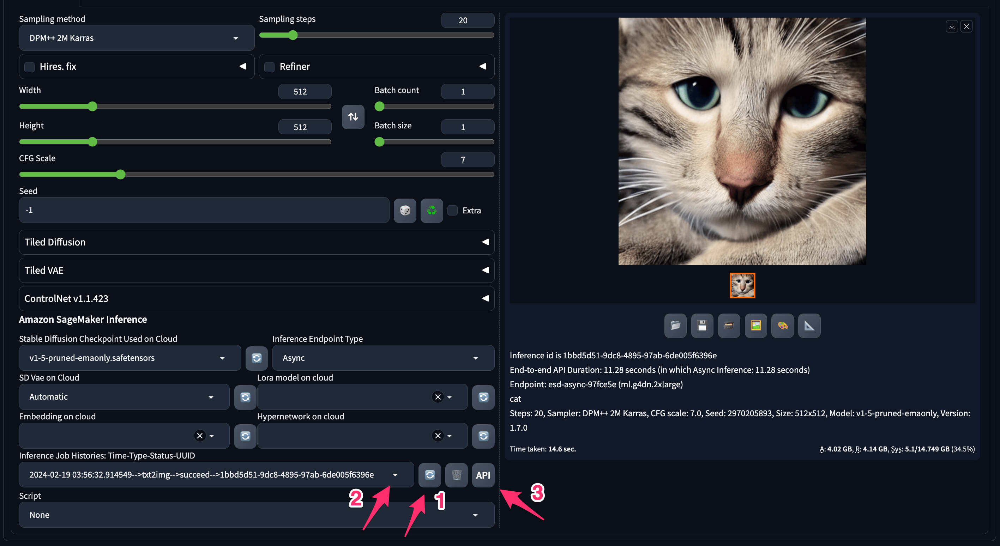

由于推理参数众多，建议使用 `API 推理调试器` 辅助推理作业的开发。`API 推理调试器` 会完整记录真实的推理流程和参数，您只需要复制相关数据结构，做少许更改即可。

## 开启 API 推理调试器

> 注意：该功能将在 `1.4.1` 之后默认开启

登陆安装有 WebUI 的 EC2，执行以下命令：

```bash
cd /home/ubuntu/stable-diffusion-webui/extensions/stable-diffusion-aws-extension
git pull
git checkout api_debugger
sudo systemctl restart sd-webui
```

等待重启 WebUI 完成，大约3分钟内。

## 使用 API 推理调试器

完成一个推理作业后，请按照以下顺序打开该作业的API请求记录：

1. 点击按钮刷新推理历史作业列表
2. 下拉推理作业列表，找到并选中该作业
3. 点击右侧的 `API` 按钮




## API 推理调试器 日志


