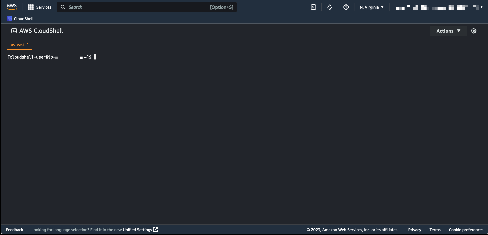
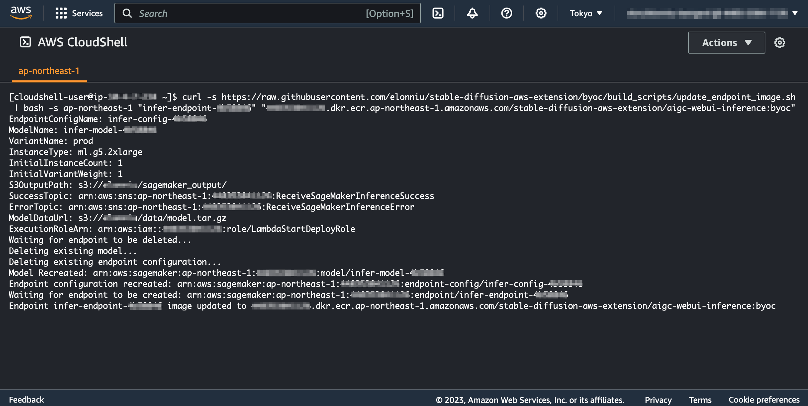

<!-- Generator: Widdershins v4.0.1 -->

<h1 id="stable-diffusion-train-and-deploy-api">自定义容器镜像</h1>

# 概述

Stable Diffusion 亚马逊云科技插件解决方案具有极高的灵活性，您可以随时替换 SageMaker Endpoint 模型的容器镜像，也可以随时恢复到默认镜像。

为了实现这个能力，请按照以下步骤操作：

- 第一步：构建容器镜像
- 第二步：准备命令执行环境和权限
- 第三步：将指定的 SageMaker Endpoint 模型镜像**替换**为您自己的容器镜像或**恢复**为默认镜像
- 第四步：验证或诊断容器镜像是否正常工作

<br>

# 准备容器镜像

您可自行构建容器镜像（**强烈建议您在更换镜像前验证该镜像是否正常**），验证后将镜像上传到和部署方案相同区域的 [Amazon ECR](https://console.aws.amazon.com/ecr){:target="_blank"}
中，详细请阅读 [将 Amazon ECR 与 AWS CLI 结合使用](https://docs.aws.amazon.com/zh_cn/AmazonECR/latest/userguide/getting-started-cli.html){:target="_blank"}
，操作完成后，您将获得一个镜像 URI，如：

```shell
123456789012.dkr.ecr.cn-northwest-1.amazonaws.com.cn/your-image:latest
```

Dockerfile 模板如下：

```dockerfile
# Use base iamge
FROM public.ecr.aws/aws-gcr-solutions/stable-diffusion-aws-extension/aigc-webui-inference

# Set environment variables to non-interactive (this prevents some prompts)
ENV DEBIAN_FRONTEND=non-interactive

# Install packages in a single RUN step
RUN apt-get install -y xxxxx && \
    apt-get clean && \
    apt-get autoclean && \
    rm -rf /var/lib/apt/lists/* /tmp/* /var/tmp/*
```

<br>

# 准备命令执行环境和权限

关于执行后续命令的环境，有两种方式：

- **方式一（推荐）**：打开并登陆 [CloudShell](https://docs.aws.amazon.com/zh_cn/cloudshell/latest/userguide/welcome.html){:target="_blank"} ，在终端初始化完成后执行命令，请将 {region} 更换为您方案部署的区域，如：`us-east-1`
    - 登录地址：https://{region}.console.aws.amazon.com/cloudshell/home
    - 请确保您登陆的账户具备足够的权限（比如部署解决方案的权限），否则执行命令会因为权限不足而失败。
    - 
- **方式二**：在您自己的环境中执行，您需要：
    - 安装 [CURL](https://curl.se/){:target="_blank"}
    - 安装 [jq](https://jqlang.github.io/jq/){:target="_blank"}
    - 安装并配置 [AWS CLI](https://docs.aws.amazon.com/zh_cn/cli/latest/userguide/cli-chap-getting-started.html){:target="_blank"}
    - 请确保您配置的账户具备足够的权限（比如部署解决方案的权限），否则执行命令会因为权限不足而失败。

<br>

# 使用自定义容器镜像

准备好镜像后，您只需替换以下命令中的变量，并执行命令，即可完成更换镜像：

- **{region}**：方案部署的区域，如：`us-east-1`
- **{endpoint-name}**：Endpoint 名称，如：`infer-endpoint-111111`
- **{image-uri}**：容器镜像 URI

```shell
curl -s https://raw.githubusercontent.com/awslabs/stable-diffusion-aws-extension/main/build_scripts/update_endpoint_image.sh | bash -s {region} {endpoint-name} {image-uri}
```

<br>

效果如下：



<br>

# 恢复默认镜像

如欲恢复默认镜像，请替换以下命令中的变量，并执行命令，即可恢复到默认镜像：

- **{region}**：方案部署的区域，如：`us-east-1`
- **{endpoint-name}**：Endpoint 名称，如：`infer-endpoint-111111`

```shell
curl -s https://raw.githubusercontent.com/awslabs/stable-diffusion-aws-extension/main/build_scripts/update_endpoint_image.sh | bash -s {region} {endpoint-name} default
```

<br>

# 验证或诊断容器镜像

强烈建议您在更换镜像后验证或诊断容器镜像是否正常工作，如需查看日志，您可进入 Endpoint 的日志组查看日志：

- **{region}**：方案部署的区域，如：`us-east-1`
- **{endpoint-name}**：Endpoint 名称，如：`infer-endpoint-111111`

```shell
https://{region}.console.aws.amazon.com/cloudwatch/home?region={region}#logsV2:log-groups$3FlogGroupNameFilter$3D{endpoint-name}
```
