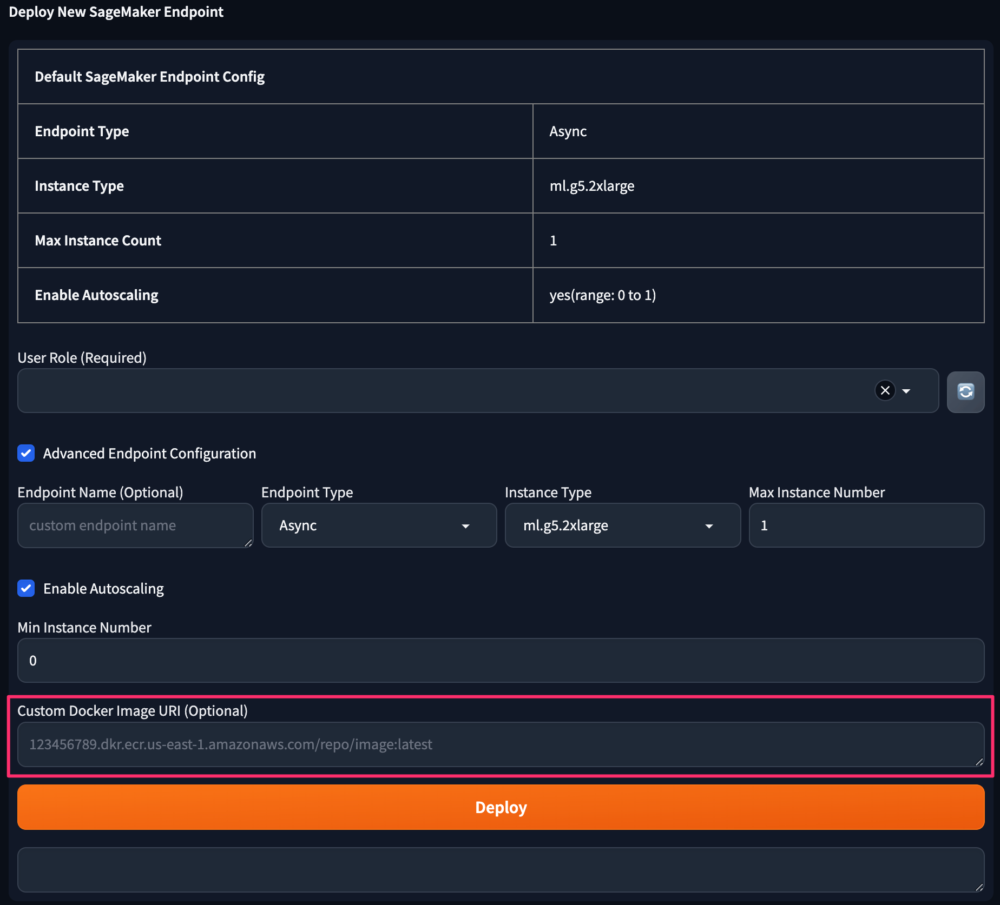

<!-- Generator: Widdershins v4.0.1 -->

<h1 id="stable-diffusion-train-and-deploy-api">自定义容器镜像</h1>

# 概述

Stable Diffusion 亚马逊云科技插件解决方案具有极高的灵活性，您可以随时替换 SageMaker Endpoint 模型的容器镜像。

为了实现这个能力，请按照以下步骤操作：

- 第一步：构建容器镜像
- 第二步：使用自定义容器镜像创建 Endpoint
- 第三步：验证或诊断容器镜像是否正常工作

<br>

# 准备容器镜像

您可自行构建容器镜像（**强烈建议您在更换镜像前验证该镜像是否正常**），验证后将镜像上传到和部署方案相同区域的 [Amazon ECR](https://console.aws.amazon.com/ecr){:target="_blank"}
中，详细请阅读 [将 Amazon ECR 与 AWS CLI 结合使用](https://docs.aws.amazon.com/zh_cn/AmazonECR/latest/userguide/getting-started-cli.html){:target="_blank"}
，操作完成后，您将获得一个镜像 URI，如：

```shell
{your_account_id}.dkr.ecr.{region}.amazonaws.com/your-image:latest
```

Dockerfile 模板如下：

```dockerfile
# 建议在部署方案后，使用方案创建的 Image 作为基础镜像。
FROM {your_account_id}.dkr.ecr.{region}.amazonaws.com/stable-diffusion-aws-extension/aigc-webui-inference:latest

# 安装插件
RUN mkdir -p /opt/ml/code/extensions/ && \
    cd /opt/ml/code/extensions/ && \
    git clone https://github.com/**.git

```

<br>


# 使用自定义容器镜像创建 Endpoint

创建名为 `byoc` 的角色，并将登陆用户添加至该角色，即可开启如下图功能：



<br>

# 验证或诊断容器镜像

强烈建议您在更换镜像后验证或诊断容器镜像是否正常工作，如需查看日志，您可进入 Endpoint 的日志组查看日志：

- **{region}**：方案部署的区域，如：`us-east-1`
- **{endpoint-name}**：Endpoint 名称，如：`infer-endpoint-111111`

```shell
https://{region}.console.aws.amazon.com/cloudwatch/home?region={region}#logsV2:log-groups$3FlogGroupNameFilter$3D{endpoint-name}
```
