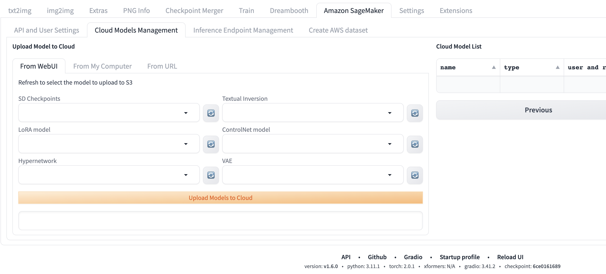
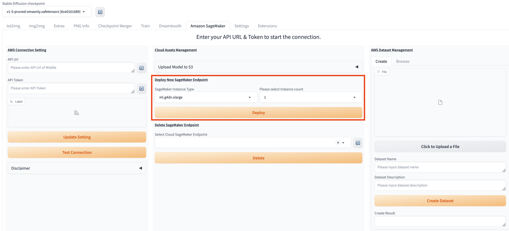

本章节将详细介绍本解决方案提供的便捷云上资源管理方式。

## 上传训练模型
如需在txt2img或img2img使用非云端推理模型，您可以选择按下列两种方式的步骤完成推理模型上传，即可按[txt2img](./txt2img-guide.md)或[img2img](./img2img-guide.md)相应步骤完成模型调用及推理。

### 从原生webUI上传模型至云上
考虑到用户多样的使用场景，本方式适用于将webUI前端部署在非本地电脑的其他机器上的场景。同于webUI社区原生使用方式，用户需要首先将相关模型上传至部署了webUI前端的机器上，对应webUI项目文件夹下、models子文件夹的对应处，之后即可跟从下面步骤完成模型上传到云上。

1. 进入解决方案主标签页**Amazon SageMaker**，找到**Cloud Models Management**模块。
2. 选择from WebUI标签页, 该方式表示从部署WebUI服务的models文件路径上传模型。

3. 在对应的模型输入部署WebUI服务的models文件路径地址。
> **提示**: 您可以通过在文本框中输入多个本地模型路径来上传多种模型。
4. 点击**Upload Models to Cloud**，启动模型上传。
5. 上传完成后，会在左侧**Label**看到提示。

### 从本地机器上传模型至云上
考虑到用户多样的使用场景，本方式适用于将webUI前端部署在本地电脑上的场景。

1. 进入解决方案主标签页**Amazon SageMaker**，找到**Cloud Models Management**模块。
2. 选择from My Computer标签页, 该方式表示从访问WebUI的本地路径上传模型。

3. 选择要上传的模型类型，目前支持六种：SD Checkpoints, Textual Inversion, LoRA model, ControlNet model, Hypernetwork, VAE
4. 本地选择要上传的模型文件。
> **提示**: 您可以多选模型文件，但受制于浏览器限制，最好选择的文件数不要超过10个，总大小不要超过8g。
5. 点击**Upload Models to Cloud**，启动模型上传。
6. 上传会依据文件大小与数量异步分片上传，各分片上传完成后，会在**选择文件**按钮下看到提示。

### 从模型下载地址直接上传至云上
考虑到用户多样的使用场景，本方式适用于直接通过模型下载的URL地址上传到S3的场景。

1. 进入解决方案主标签页**Amazon SageMaker**，找到**Cloud Models Management**模块。
2. 选择from URL标签页, 该方式表示从模型下载的URL地址上传到S3。

3. 选择要上传的模型类型，目前支持六种：SD Checkpoints, Textual Inversion, LoRA model, ControlNet model, Hypernetwork, VAE
4. 在URL list (Comma-separated in English)输入框中填入模型下载的url列表，用英文逗号分隔。
5. 在Models Description (Optional)输入框中输入json格式的描述（选填）。
> **提示**: 您可以多选模型文件，但受制于Lambda内存以及并发线程数的限制，最好选择的文件数不要超过5个，总大小不要超过12g。
6. 点击**Upload Models to Cloud**，启动模型上传。
7. 上传请求会在下方**Label**看到提示。

## Amazon SageMaker推理节点管理

### 部署推理节点

1. 进入解决方案主标签页**Amazon SageMaker**，找到**Cloud Assents Management**模块的**Deploy New SageMaker Endpoint**区域。
2. 方案默认部署的Endpoint类型为ml.g5.2xlarge, instance数量是1，默认会开启endpoint的autoscaling功能，直接点击**Deploy**按钮启动Sagemaker endpoint的部署。
3. 如果用户需要自己指定Endpoint的名字，Instance类型以及Endpoint中instance的最大数量，可以点击**Advanced Ednpoint Configuration**的checkbox，这时界面会显示更多的参数让用户输入，下列标哥列出了这几个参数的名字和含义:

    | 参数名                | 描述                                                                                                            |
    |--------------------|---------------------------------------------------------------------------------------------------------------|
    | Endpoint Name (可选) | 如果需要指定Sagemaker endpoint的名字，在这个输入框中输入，如果不修改这个值，默认的Endpoint的名字为infer-endpoint-XXXXX                            |
    | Instance Type      | 下拉框选择部署的Endpoint的实例类型                                                                                         |
    | Max Instance count | 下拉框选择部署的Endpoint的实例最大值，如果选择了Autoscaling，Sagemaker会根据CPU的平均占用率在0-Max Instance count之间弹性伸缩                      |
    | Enable Autoscaling | 如果选择了该checkbox，Sagemaker会根据CPU的平均占用率在0-Max Instance count之间弹性伸缩, 否则Endpoint对应的instance数会固定在Max Instance count |

4. 选择完默认的Endpoint配置或者设置完高级的Endpoint配置后，点击**Deploy**, 可以在左侧**Label**处看到**Endpoint deployment started**的提示信息。

5. 您可进入**txt2img**或**img2img**的**Amazon SageMaker Inference**模块的下拉菜单**Select Cloud SageMaker Endpoint**，刷新并看到当前所有推理节点的部署状态。
> **补充：** 推理节点列表的名字的格式是：推理节点名字+部署状态：Creating/Failed/InService+部署结束时间。
6. 等待大约10分钟，即可看到最新推理节点的状态变成**InService**，表明推理节点部署成功。

### 删除已部署推理节点
1. 进入解决方案主标签页**Amazon SageMaker**，点击**Select Cloud SageMaker Endpoint**列表右侧刷新按钮，刷新下拉列表，选择需要删除的推理节点。
2. 点击**Delete**，左侧**Label**处会显示提示信息，完成推理节点删除。

## AWS数据集管理

### 数据集上传
在模型微调等功能中，需要输入一个图片集，用以微调工作。该功能模块助力用户快速上传图片集到云端。

1. 进入解决方案主标签页**Amazon SageMaker**，**AWS Dataset Management**区块，**Create**标签页。

2. 点击**Click to Upload a File**，在弹出的本地文件列表中，确认选中一次模型微调所需的所有图片。
3. 在**Dataset Name**输入该图片文件夹的名字，在**Dataset Description**输入该数据集的描述，点击**Create Dataset**。
4. 等待几秒，下方的**Create Result**区域显示**Complete Dataset XXXX creation**，即表示该数据集已经成功上传到云上。

### 数据集浏览
数据集上传完成后，通过此功能模块，能够帮助用户快速得到数据集对应的云上地址。用户可以复制此地址，粘贴到对应需要上传图片集的地址位置。

1. 进入解决方案主标签页**Amazon SageMaker**，**AWS Dataset Management**区块，**Browse**标签页。
2. 刷新**Dataset From Cloud**列表，选择需要浏览的图片集名称。
3. 等待几秒，**dataset s3 location**区域即会显示该数据集的云上S3地址，复制粘贴即可取用，做后续步骤。

