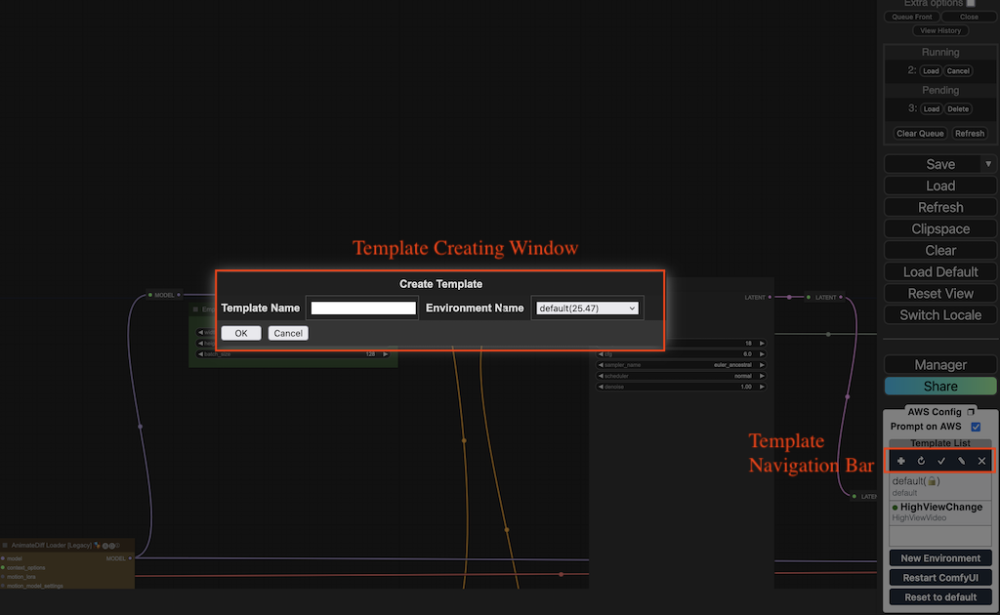

# 在comfyUI上推理

在成功部署解决方案后，您可以打开部署成功的堆栈所提供的**ComfyUI**的**Designer**端口页面，在工作流的调试、发布和推理，总结步骤如下：

* 步骤1: 连接部署了ComfyUI前端的EC2。
* 步骤2: 在本方案提供的**Designer**链接页面，可进行新工作流的调试，安装缺失的节点并上传所需的推理模型，并能够成功在本地（虚拟机EC2）加载并推理成功，发布此工作流为模版（template）。
* 步骤3: 按需重复步骤2以发布多个工作流模版（template）。
* 步骤4: 在调试完一个（或多个）工作流模版（template）后，一键打包发布当前环境，并配合部署新的Amazon SageMaker推理节点。 
* 步骤5: 在ComfyUI推理页面，选择已发布模版，按需修改推理词、推理模型并推理图片/视频。本步骤将会使用Amazon SageMaker资源。

!!! tip "贴士" 
        用户可以创建一个或多个包含相近功能或插件组合的工作流模版（template）。调试完这些模版后，将当前的并集环境打包成一个运行环境（environment），并为其配置推理节点（Amazon SageMaker Endpoint）。这种方法确保了工作流的稳定性和兼容性。遇到部署问题时可以查看“常见问题解答”章节中ComfyUI相关部分。


## 步骤1: 连接部署ComfyUI前端的虚拟机（EC2）
通过连接EC2的方式，在本地打开EC2对应的目录结构，能更方便的看到本地工作流调试时的日志文件，帮助判断。

如仅需看到本地ComfyUI调试的日志，也可通过以下步骤实现：

1. 打开部署解决方案同region的EC2控制台，选择**comfy-on-aws-dev**机器，并点击右上角**Connect**。
2. 在可选的连接方式中，选择标签页**EC2 Instance Connect**，点击**Connect**。
3. 稍作等待，即可看到新弹出的、EC2链接页面。按需输入代码，即可完成各类操作。常用命令如下：

```
tail -f /var/log/cloud-init-output.log 用于实时查看ec2启动Comfy过程初始日志
sudo journalctl -u comfy -f 用于实时查看comfy运行日志
tail -f /root/stable-diffusion-aws-extension/container/*.log 用于查看comfy运行容器所有日志
sudo journalctl -u comfy --no-pager -n 200 用于查看comfy运行日志最后200条
docker images -q | xargs docker rmi -f
```

## 步骤2: 调试工作流并发布为模版
打开本方案部署后，提供的**Designer**链接，即为工作流调试员/主美视角的**ComfyUI**，您可以按单机版ComfyUI的使用方法来进行新的工作流的调试。有关模型的管理、定制节点的管理等可以通过连接部署ComfyUI的虚拟机（EC2）来进行。


主美调试的ComfyUI使用步骤总结如下：

1. （可选）拖拽已有工作流的json文件到ComfyUI界面，得到渲染出来的工作流。
2. 调整（包括添加和删除）工作节点（custom node），并调整推理参数及使用的模型。
3. 点击**添加提示词队列（Queue Prompt）**，开启基于当前页面工作流的推理任务。
4. （可选）当步骤3遇到弹框提示报错时，需要按指示处理。比如，若显示某模型缺失，请先将该模型下载至EC2对应的文档目录；如果显示有定制节点的缺失，请点击**管理器（Manager）**，**安装缺失节点（Install Missing Custom Nodes）**来安装缺失节点。按错误提示处理完成后，重复步骤3进行测试。


5. 当工作流完成后，看到界面显示出生成结果，即表示该工作流的调试工作已经成功。
6. 点击右侧导航栏中工作流模版列表模块上方加号，在弹框中填入待发布模版的名字，及需要绑定的运行环境，点击**OK**。

    !!! tip "贴士"
        新模版命名长度不能超过20个字符，英文与数字结合，大小写敏感。同时该命名需要是同一个region内唯一，如果与现有模版名字冲突会提示创建错误。另外，此处的运行环境如还未发布，可以等到步骤4完成后，返回修改已发布的模版，以绑定正确的运行环境。



7. 工作流发布过程中，ComfyUI前端不可以有更新操作，该过程大致持续十几秒。在发布完成后会在前端有弹框提示发布完成。
8. 发布完成，刷新页面即可在右侧导航栏的工作流模版列表看到新发布的模版。

## 步骤3: 按需重复步骤2以发布多个模版
为确保工作流的稳定性和兼容性，以及最大化资源利用率，建议用户在ComfyUI的默认环境中持续调试并发布多个工作流模版（template）。在调试完成后，将当前的并集运行环境发布并绑定到一个Amazon SageMaker推理节点（Inference Endpoint）。这样发布的环境可以稳定运行多个绑定的模板，最大化推理节点的资源利用率。同时，需要注意发布环境的大小，如果环境过大，可能会在后续自动弹性伸缩时导致冷启动时间过长。用户需要在多个模板绑定一个环境的数量上做出权衡。

## 步骤4: 发布环境并创建推理节点
待步骤3完成后，用户可以一键打包发布工作流运行环境，并创建推理端点来依据工作流进行云端推理。

1. 点击右侧导航栏中**New Environment**.
2. 在弹框中填入待发布环境的名字。在*Endpoint Config*区域，选择为该环境绑定的Amazon SageMaker Inference Endpoint参数，包括机型、是否自动扩展等。完成后点击**OK**。
    
    !!! Important "注意" 
        如果是相对复杂的workflow 注意选择异步推理节点类型，否则受限于service最长等待30s，会出现调用推理超时的情况。另外，不建议直接进去SageMaker console直接删除endpoint，容易造成数据不一致的隐患。

3. 发布环境过程会基于现有环境大小等不定时间，可能长达10+分钟。等待期间，页面锁住，不可以进行其他操作，以防环境被破坏导致发布失败。
4. 创建成功后，请刷新页面，在**Template List**区域选中需要绑定的模版，点击铅笔图标，在弹框中选择新发布环境，点击**OK**。

## 步骤5: 基于已发布工作流的推理
在ComfyUI的推理页面，可以简单通过以下步骤完成基于模版的推理。

1. 打开ComfyUI的推理页面，在右侧导航栏选择一个已发布的模版。如果是调试环境，还需要选中右侧导航栏中**Prompt on AWS**复选框。
2. ComfyUI页面即会自动渲染该模版的工作流，按需调整参数，并点击**添加提示词队列（Queue Prompt）**，提交推理任务。
3. 当推理任务完成后，生成结果会自动展示在页面。


## 模型管理
### 模型上传
新模型需要上传到EC2，才能保证在模型调试阶段能够顺利调取。在EC2中上传模型，可以通过进入models目录下对应的模型类别子文件夹，通过直接拖拽或者wget + 模型下载地址的方式来实现。考虑到网速，推荐优先使用wget模型下载方式。

