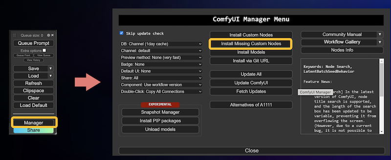

# 在comfyUI上推理

在成功部署解决方案后，您可以打开部署成功的堆栈所提供的**ComfyUI**原生页面，在工作流的调试、发布和推理，总结步骤如下：

1. 在本地（虚拟机EC2）上进行新工作流的调试，安装缺失的节点并上传所需的推理模型，并能够成功在本地（虚拟机EC2）加载并推理成功。
2. 在发布该工作流为模版。
3. 创建工作流所需endpoint 
4. 在ComfyUI推理页面，选择已发布模版，按需修改推理词、推理模型并推理图片/视频。


## 连接部署ComfyUI的虚拟机（EC2）
推荐使用VS Code，通过连接远程EC2的方式，在本地打开EC2对应的目录结构，能更方便的看到本地工作流调试时的日志文件，帮助判断。

如仅需看到本地ComfyUI调试的日志，也可通过以下步骤实现：

1. 打开部署解决方案同region的EC2控制台，选择**comfy-on-aws-dev**机器，并点击右上角**Connect**。
2. 在可选的连接方式中，选择标签页**EC2 Instance Connect**，点击**Connect**。
3. 稍作等待，即可看到新弹出的、EC2链接页面。按需输入代码，即可完成各类操作。常用命令如下：

```
tail -f /var/log/cloud-init-output.log 用于实时查看ec2启动Comfy过程初始日志
sudo journalctl -u comfy -f 用于实时查看comfy运行日志
tail -f /root/stable-diffusion-aws-extension/container/*.log 用于查看comfy运行容器所有日志
sudo journalctl -u comfy --no-pager -n 200 用于查看comfy运行日志最后200条
docker images -q | xargs docker rmi -f
```

## 工作流管理
主要包括以下过程：

- 步骤1：工作流的调试。
- 步骤2：工作流的发布。
- 步骤3: 创建工作流的推理端点。
- 步骤4：基于已发布工作流的推理。

### 工作流的调试
在本解决方案提供的**ComfyUI**原生界面中，您可以按单机版ComfyUI的使用方法来进行新的工作流的调试。有关模型的管理、定制节点的管理等可以通过连接部署ComfyUI的虚拟机（EC2）来进行。

单机版的ComfyUI使用步骤总结如下：

1. （可选）拖拽已有工作流的json文件到ComfyUI界面，得到渲染出来的工作流。
2. 调整（包括添加和删除）工作节点（custom node），并调整推理参数及使用的模型。
3. 点击**添加提示词队列（Queue Prompt）**，开启基于当前页面工作流的推理任务。
4. （可选）当步骤3遇到弹框提示报错时，需要按指示处理。比如，若显示某模型缺失，请先将该模型下载至EC2对应的文档目录；如果显示有定制节点的缺失，请点击**管理器（Manager）**，**安装缺失节点（Install Missing Custom Nodes）**来安装缺失节点。按错误提示处理完成后，重复步骤3进行测试。


5. 当工作流完成后，看到界面显示出生成结果，即表示该工作流的调试工作已经成功。


### 工作流的发布
待工作流在本地（虚拟机EC2）已经可以成功推理图片/视频后，可以快速跟随以下步骤，将调试好的工作流发布成为模版，便于后续稳定、便利的调用推理。

1. 点击右侧导航栏中的**New Workflow** 或 右侧导航工作流列表模块上方加号。
2. 在弹框中，填入待发布模版的名字，点击**确定**。

    !!! tip "贴士"
        新模版命名长度不能超过20个字符，英文与数字结合，大小写敏感。同时该命名需要是同一个region内唯一，如果与现有模版名字冲突会提示创建错误。

3. 工作流发布过程中，ComfyUI前端不可以有更新操作。在发布完成后会在前端有弹框提示发布完成。
4. 发布时会将您页面当前调试时的workflow暂存，每次切换环境时会优先加载当前环境对应暂存的workflow。

### 创建工作流的推理端点
待工作流发布完成以后，还需要创建推理端点来依据工作流进行云端推理。
1. 需要通过api的方式调用创建，可以参考[这里](../../deployment/deployment_comfyui.md)中的“部署新的Amazon SageMaker推理节点”子章节部分。
2. 待推理端点创建完成后，且为InService的状态后，已发布的工作流便处于可推理的状态。

### 基于已发布工作流的推理
在ComfyUI的推理页面，可以简单通过以下步骤完成基于模版的推理。

1. 打开ComfyUI的推理页面，在右侧导航栏选择一个已发布的模版。如果是调试环境，还需要选中右侧导航栏中“Prompt on AWS”复选框。
2. ComfyUI页面即会自动渲染该模版的工作流，按需调整参数，并点击**添加提示词队列（Queue Prompt）**，提交推理任务。
3. 当推理任务完成后，生成结果会自动展示在页面。

## 模型管理
### 模型上传
新模型需要上传到EC2，才能保证在模型调试阶段能够顺利调取。在EC2中上传模型，可以通过进入models目录下对应的模型类别子文件夹，通过直接拖拽或者wget + 模型下载地址的方式来实现。考虑到网速，推荐优先使用wget模型下载方式。

