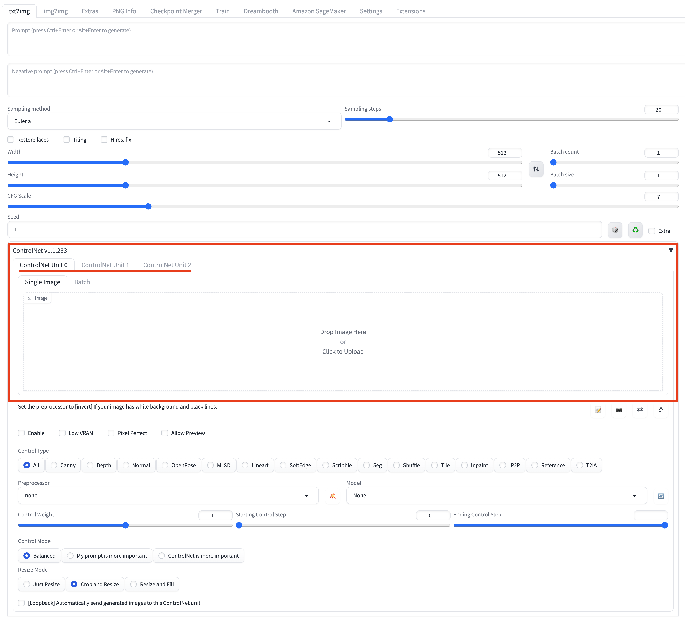
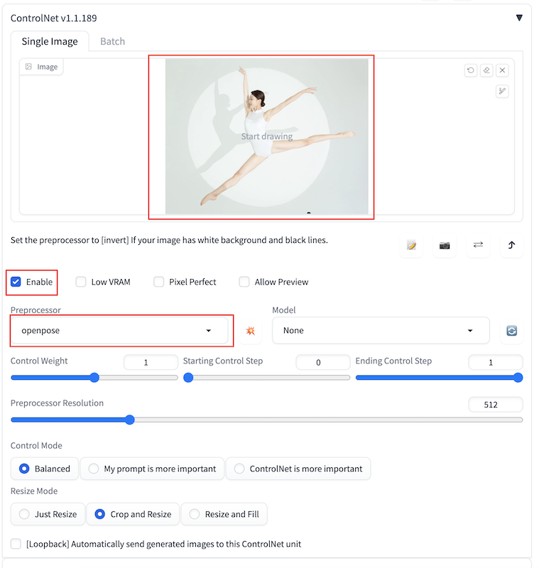

# 使用Controlnet赋能云上推理

您可以打开**controlnet**标签页，通过结合使用**txt2img**或**img2img**原生区域及解决方案新增面板**Amazon SageMaker Inference**，实现调用云上资源的推理工作。 

## Controlnet的使用方法

### 支持多个controlnet同时启用
1. 点击**Settings**按钮进入设置面板，在左侧一栏选择ControlNet, 右侧面板**Multi ControlNet: Max models amount (requires restart)**处设置ConrolNet数量（1-10）,重新启动webui,Multi ControlNet生效。

2. 重新进入**txt2img**推理界面，ControlNet面板处则出现相同个数的ControlNet Unit，如下图同时启动三个ControlNet。

### openpose的使用方法
1. 打开ControlNet面板，点击ControlNet Unit 0勾选**Enable**，选择**Preprocessor**为**openpose**，同时上传图片。
 
    
2. 同于本地ControlNet推理，您可以按需编辑**ControlNet**原生的参数，其中Model处使用的模型需要提前传到S3，才能进行正常推理。
3. 点击**Generate on Cloud**。

4. 查看推理结果。通过点击**Inference Job: Time-Type-Status-Uid**右侧的刷新按钮进行下拉列表刷新，查看最上方的、符合推理提交时间戳的Inference Job ID。

5. 后续操作。如需对推理图片保存或作进一步处理，可以点击**Save**或其他相应功能键完成。

