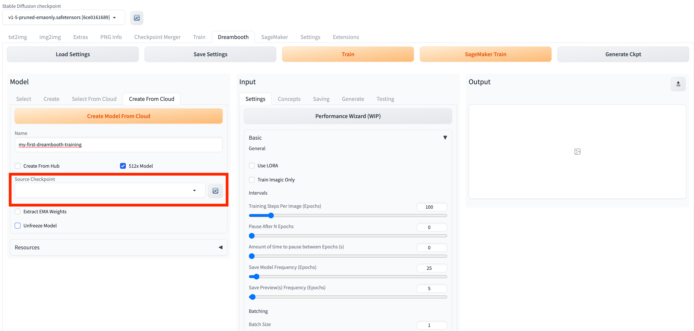

# 使用Dreambooth进行云上模型训练
您可以打开**Dreambooth**标签页，通过结合使用**Dreambooth**原生区域及解决方案新增面板‘Amazon SageMaker Inference‘，实现调用云上资源的**Dreambooth**云上模型训练工作。 

## 创建模型

1. 打开**Dreambooth**标签页，模块**Model**的标签页**Create From Cloud**

2. 在**Name**文本框输入所需创建模型名称。

    !!! Important "提示"
        请注意命名格式要求，只能包含字母数字和“-”。

3. 在**Source Checkpoint**下拉列表，选择一个checkpoint文件。
> **补充：** 此处checkpoint文件包含两个来源的文件：一是以local开头的是本地存储的checkpoint文件，另一是以cloud开头的是存储在S3上的checkpoint文件。首次使用建议选择local checkpoint文件。

4. 点击**Create Model From Cloud**按钮，开始创建模型。**Model Creation Jobs Details**区域会即时增加本次模型创建的工作状态。当状态变成**Complete**，即完成模型创建。
 

## 训练模型
1. 打开**Dreambooth**标签页，模块**Model**的标签页**Select From Cloud**。
2. 刷新**Model**列表，选择需要训练的模型。
3. 在**Input**模块设置相应的参数。
4. 点击**SageMaker Train**，启动模型训练任务。**Training Job Details**区域会即时增加本次模型训练的工作状态。当状态变成**Complete**，同时您部署解决方案时预留的邮箱将会收到邮件通知，即完成模型训练。
5. 后续工作。可以进入**txt2img**标签页的**Amazon SageMaker Inference**面板，刷新**Stable Diffusion Checkpoint**，即可看到已训练好的模型。

