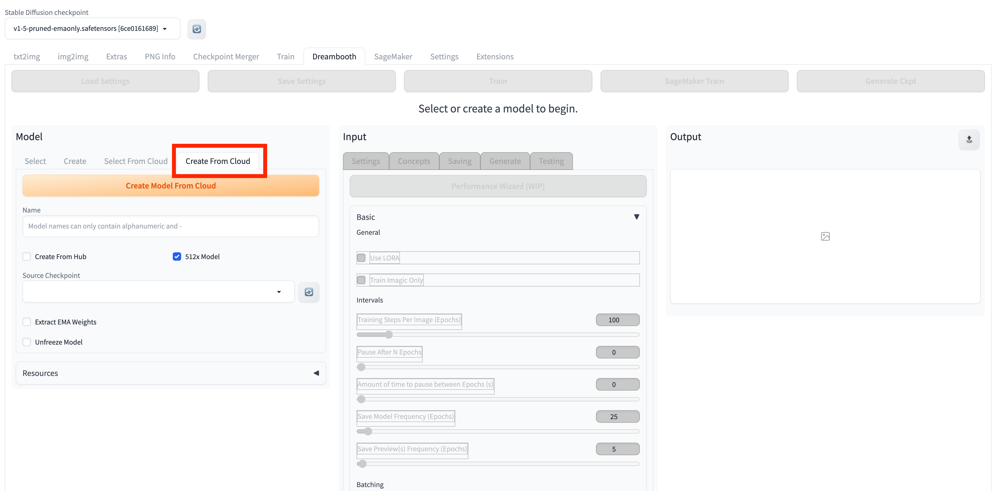
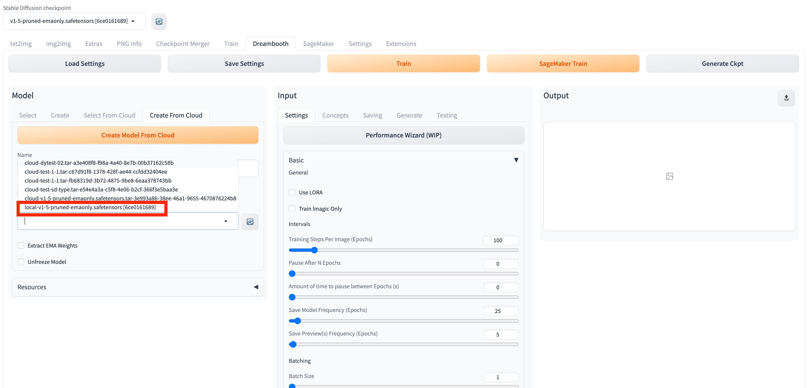
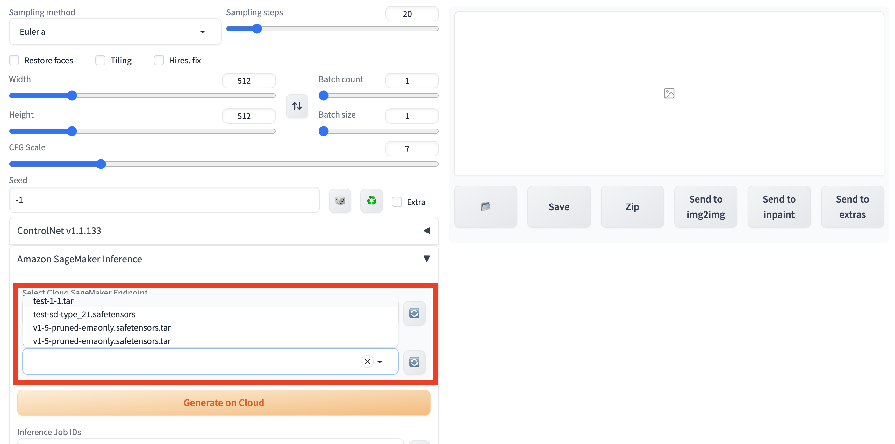

# 打开Dreambooth面板

# 创建模型

* 选择Create From Cloud面板 

* 输入模型名称，请注意格式要求，只能包含字母数字和“-”

* 选择checkpoint文件，包含两种形式，以local开头的是本地存储的checkpoint文件，以cloud开头的是存储在S3上的checkpoint文件

* 首次使用可以选择local checkpoint文件

* 点击Create Model From Cloud按钮，开始创建模型

# 选择模型
* 选择Select From Cloud面板 

* 选择模型

* 设置训练参数

* 设置训练数据

# 训练
* 点击SageMaker训练按钮

* 训练完成后可以收到邮件通知，并且在inference tab中可以加载训练完成的模型

