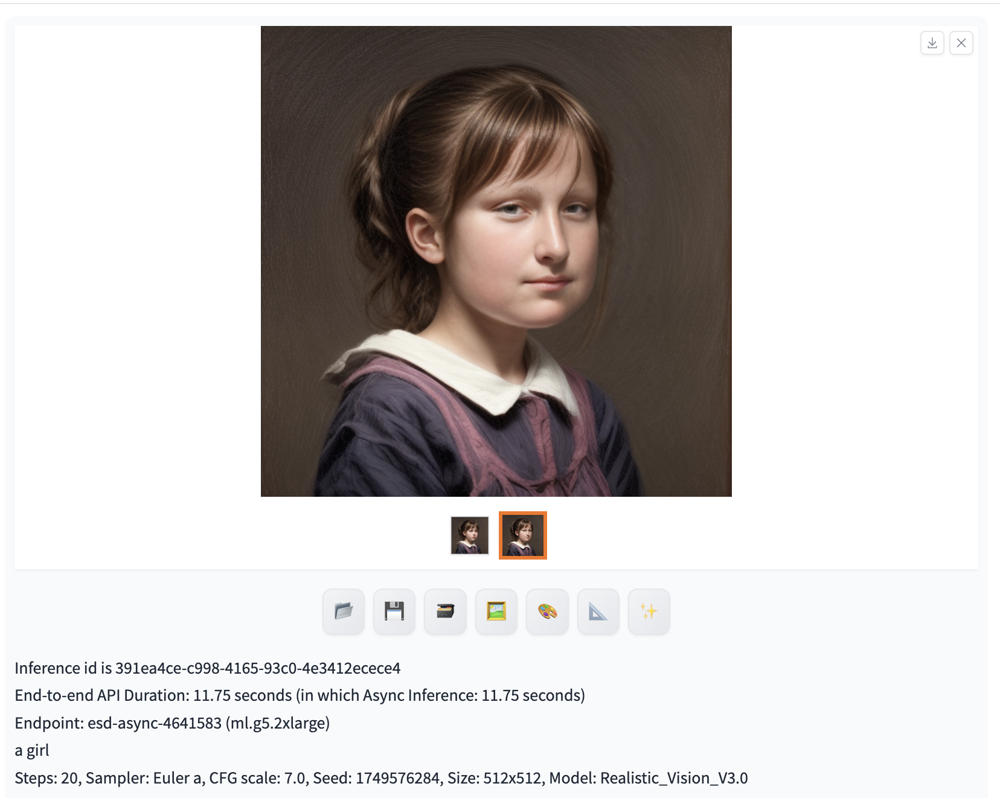
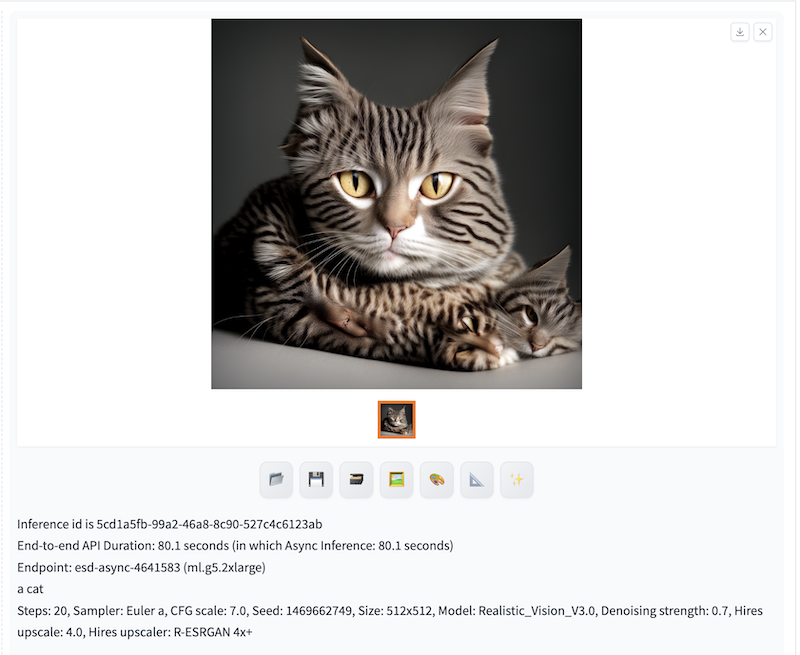

# 插件Reactor赋能云上换脸功能

您可以打开**ReActor**标签页，通过结合使用**txt2img**或**img2img**原生区域及解决方案新增面板**Amazon SageMaker Inference**，实现调用云上资源的推理工作。 

## ReActor的使用方法
### 下面介绍在**txt2img**界面如何使用该插件进行换脸
1. 跟文生图一样，首先选择云上生图模型，开启云上推理按钮 "generate on cloud"
2. 假设要生成一张蒙娜丽莎长相的女孩，在prompt 框内填写 “a girl”
3. 打开ReActor面板，将蒙娜丽莎的图片拖到 "Single Source Image" 框内

4. 点击按钮“generate on cloud”，结果如下

Reactor同时支持多人换脸,指定人脸序号即可。
Reactor支持加载人脸模型进行换脸。
更详细的使用方法参考插件文档 https://github.com/Gourieff/sd-webui-reactor

# 插件Tiled Diffusion & Tiled VAE赋能云上超分，超大图生成

您可以打开**Tiled VAE**标签页，通过结合使用**txt2img**或**img2img**原生区域及解决方案新增面板**Amazon SageMaker Inference**，实现调用云上资源的推理工作。 

## Tiled Diffusion & Tiled VAE的使用方法
通过使用这两个插件，可以在有限的显存内进行超大分辨率图片生成
### 下面介绍在**txt2img**界面如何使用该插件进行
1. 跟文生图一样，首先选择云上生图模型，开启云上推理按钮 "generate on cloud"
2. 假设要生成一张小猫的图片，在prompt 框内填写 “a cat”
3. 打开超分面板“Hires.fix”, 设置4倍超分

4. 打开Tiled VAE面板，Enable Tiled VAE，可以根据默认参数进行生图

5. 点击按钮“generate on cloud”，结果如下

Tiled Diffusion支持不同region设置不同提示词来生成超大分辨率图片，
详细使用方法参考插件文档 https://github.com/pkuliyi2015/multidiffusion-upscaler-for-automatic1111/tree/main
