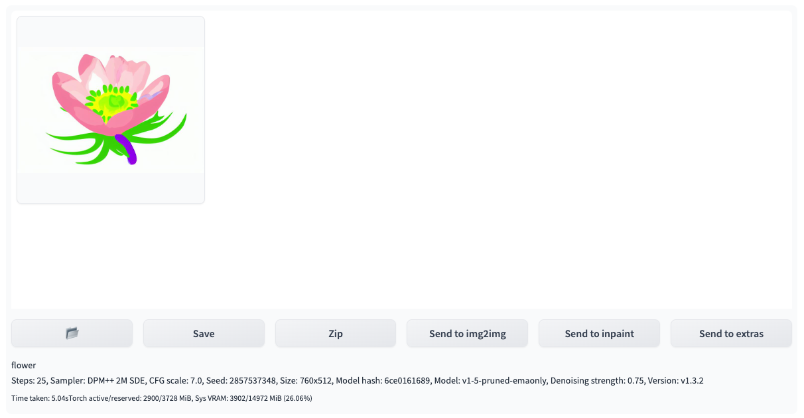
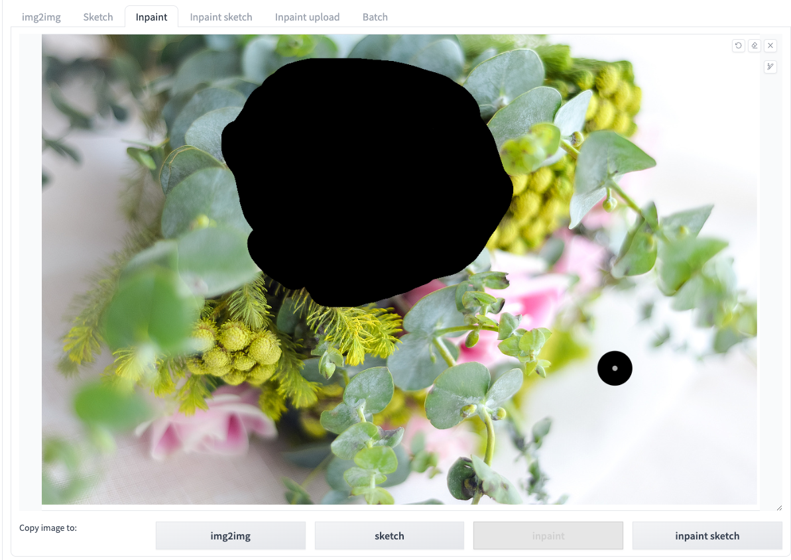
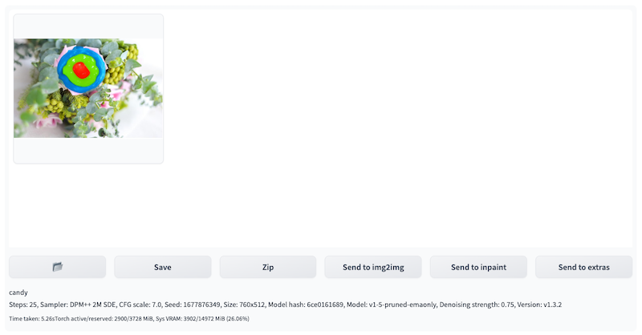
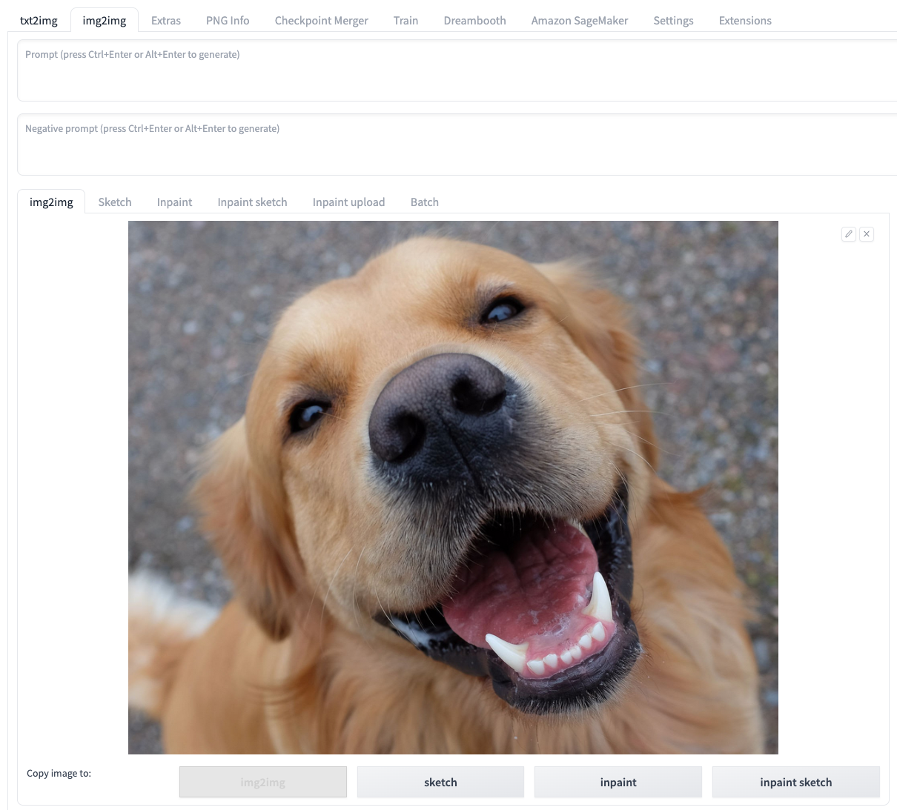
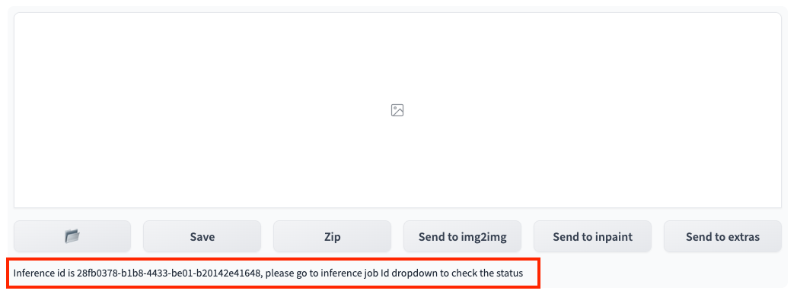

# 使用img2img进行云上推理

您可以打开**img2img**标签页，通过结合使用**img2img**原生区域及解决方案新增面板**Amazon SageMaker Inference**，实现调用云上资源的**img2img**推理工作。 

## img2img的使用方法
### img2img不同标签功能的标准流程

1. 进入**img2img**标签页，**Amazon SageMaker Inference**面板。
2. 输入推理所需参数。同于本地推理，您可以按需编辑**img2img**原生的推理参数，包括模型(stable diffusion checkpoint, VAE, extra networks:Lora,Hypernetworks, VAE等)，提示词，负提示词，取样参数，推理参数等。对于**img2img**，**sketch**，**inpaint**，**inpaint sketch**和**inpaint upload**，都可以按照原生方式进行图片上传和修饰。

    !!! Important "提示" 
        选择的模型文件需要通过云上资源管理章节介绍的方式进行推理模型上传到云上，才能使用该模型进行云上推理

3. 选择推理节点。点击**Select Cloud SageMaker Endpoint**右侧的刷新按钮，选择一个处于**InService**状态的推理节点, 则会触发右上角**Generate**按钮变为**Generate on Clound**。

    !!! Important "提示" 
        此项为必选项。如果选择处于其他状态的推理节点，或者选择为空，点击**Generate on Cloud**开启云上推理功能时会报错。

4. 参数设置完成后，点击**Generate on Cloud**。
6. 查看推理结果。通过点击**Inference Job: Time-Type-Status-Uuid**右侧的刷新按钮进行下拉列表刷新，查看最上方的、符合推理提交时间戳的**Inference Job ID**。img2img标签页右上方的**Output**区域会显示推理的结果，包括图片，提示词以及推理的参数等。在此基础上，可以点击**Save**或者**Send to extras**等，进行后续工作流。
> **补充：** 列表按照推理时间倒序排列，即最近的推理任务排在最上方。每条记录的命名格式为**推理时间->任务类型（txt2img/img2img/interrogate_clip/interrogate_deepbooru）->推理状态（succeed/in progress/fail） ->inference id**。

### img2img标签操作示例

1. 上传原始图片到**img2img**标签并输入提示词，点击**Generate on Cloud**。
2. 选择对应的**Inference Job ID**，推理结果会展示在 **Output** 区域。

### Sketch标签操作示例

1. 启动**Stable Diffusion WebUI**时在命令行带上‘--gradio-img2img-tool color-sketch’，上传白板底图到**Sketch标签**。
2. 通过画笔，绘制下面的草图并输入提示词，点击**Generate on Cloud**。

3. 选择对应的**Inference Job ID**，推理图片会展示在**Output**区域。

### Inpaint标签操作示例

1. 上传原始图片到**Inpaint**标签。
2. 通过画笔建立掩膜并输入提示词，点击**Generate on Cloud**。

3. 选择对应的**Inference Job ID**，推理图片会展示在**Output**区域。

### Inpaint Sketch标签操作示例

1. 启动**Stable Diffusion WebUI**的时候带上‘--gradio-img2img-tool color-sketch’，然后上传原始图片到**Inpaint Sketch**标签，并输入提示词。
2. 通过画笔建立掩膜，并点击**Generate on Cloud**。

3. 选择对应的**Inference Job ID**，推理图片会展示在**Output**区域。

### Inpaint Upload标签操作示例

1. 上传原始图片和mask图片到**Inpaint Upload**标签并输入提示词，点击**Generate on Cloud**。

2. 选择对应的**Inference Job ID**，推理图片会展示在**Output**区域。

### Interrogate clip/deepbooru功能的使用

1. 进入**img2img**标签页，展开**Amazon SageMaker Inference**面板。
2. Interrogate只需要在**img2img**标签页把图片上传即可。

3. 选择推理节点。点击**Select Cloud SageMaker Endpoint**右侧的刷新按钮，选择一个处于**InService**状态的推理节点。

4. 点击**Interrogate CLIP on cloud**或**Interrogate DeepBooru on cloud**。
5. 查看推理结果。通过点击**Inference Job JDs**右侧的刷新按钮进行下拉列表刷新，查看最上方的、符合推理提交时间戳的**Inference Job ID**。
img2img标签的提示词区域就能看到结果。

### 连续使用场景

1. 按**通用场景**使用流程，完成参数录入，并点击**Generate on Cloud**提交第一次推理任务。
2. 等待右侧**Output**部分出现了新的**inference id**。
3. 在新的**Inference Job ID**出现后，便可再次点击**Generate on Cloud**进行下一次推理。

## Inference Job
Inference Job下拉列表默认列出最近10条推理任务，命名格式遵循 Time-Type-Status-Uid。如果需要列出账户历史上所有推理任务，只需选中**Show All**。如果需要应用筛选器，缩小显示列表，可以勾选**Advanced Inference Job filter**，页面下方会自动增加本解决方案提供的筛选器维度，用户可以按需选择。
