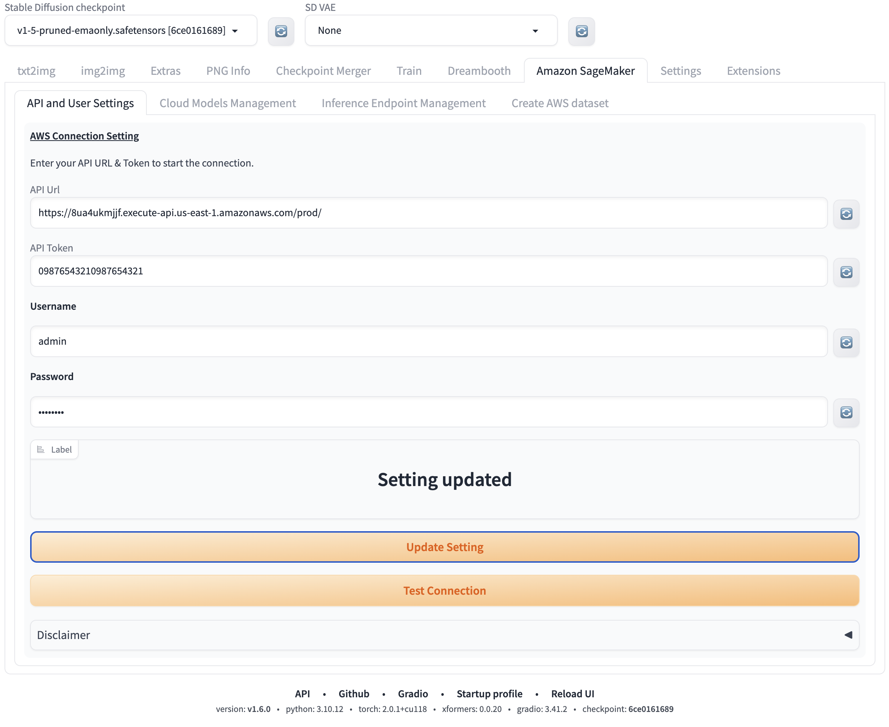
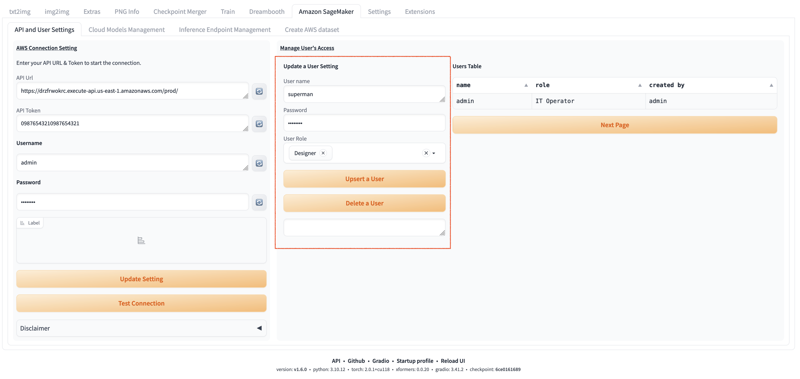
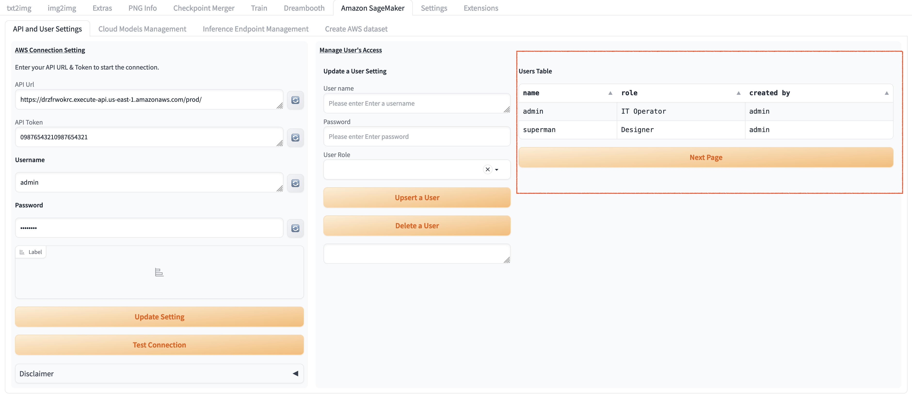

# 配置API和多用户

## 配置API
1. 当部署完成后，首次登陆webuI，此时，用户无需用户名密码登陆。点击**Amazon Sagemaker**页，填入api url和api token，按顺序点击**Update Settings**和**test connection**。

2. 完成页面配置和注册管理员账号后，需要手动重启webui使api token和管理员账号配置生效，重启完成后登录页面，需要管理员用户名和密码登陆

3. 登陆成功后，重新进入到Amazon SageMaker页，此时会看到用户列表页面。

## 多用户管理
### 创建新用户
1. 根据具体需求，创建所有新的用户、密码和角色，点击`Next Page`后， 可以看到新创建的用户。需要再次重启webui，使新用户相关的配置在webuI的server中刷新。

2. 打开另一个无痕浏览器，使用新创建的用户名、密码登陆。
3. 进入到**Amazon SageMaker**页，不同的用户展示的内容有所不同。

### 管理现有用户
1. 在表**User Table**中选择需要更新的用户，区域**Update a User Setting**将会显示该选中的用户信息。
2. 在**Password**或**User Role**处按需更新信息，并点击**Upsert a User**以保存改动。抑或点击**Delete a User**已完成删除该用户的操作。

