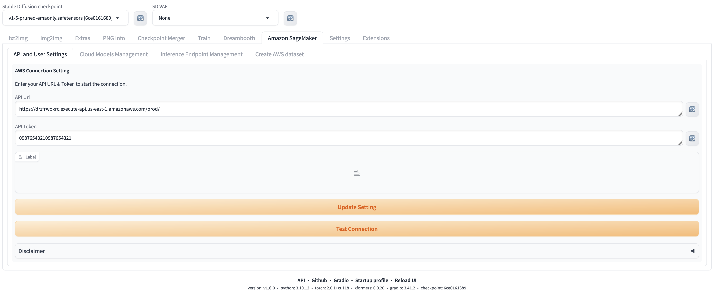

# 配置API和多用户

### 1. 当部署完成后，登陆webui，此时，用户无需用户名密码登陆。点击Amazon Sagemaker页，填入api url和api token，点击`Update Settings`

### 2. 完成页面配置和注册管理员账号后，需要手动重启webui使api token和管理员账号配置生效，重启完成后登录页面，需要管理员用户名和密码登陆

### 3. 登陆成功后，重新进入到Amazon SageMaker页，此时会看到用户列表页面。

### 4. 根据具体需求，创建所有新的用户、密码和角色，点击`Next Page`后， 可以看到新创建的用户。需要再次重启webui，使新用户相关的配置在webui的server中刷新。

### 4. webui重启成功后进入页面，使用新创建的用户名、密码登陆

### 5. 进入到Amazon SageMaker页，不同的用户展示的内容有所不同

