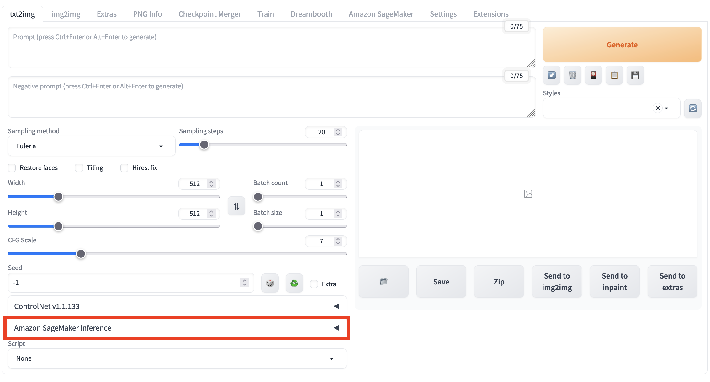

# 使用txt2img进行云上推理

您可以打开txt2img标签页，通过结合使用txt2img原生区域及解决方案新增面板‘Amazon SageMaker Inference‘，实现调用云上资源的txt2img推理工作。 

1. 进入**txt2img**标签页，展开**Amazon SageMaker Inference**面板。

2. 输入推理所需参数。同于本地推理，您可以按需编辑**txt2img**原生的推理参数，包括提示词，负提示词，取样参数，推理参数等。
3. 选择推理节点。点击**Select Cloud SageMaker Endpoint**右侧的刷新按钮，选择一个处于**InService**状态的推理节点。
    !!! Important "提示" 
        此项为必选项。如果选择处于其他状态的推理节点，或者选择为空，点击**Generate on Cloud**开启云上推理功能时会报错。

4. 点击模型下拉框右侧的刷新按钮，选择推理所需的**Stable Diffusion Checkpoint**（必选，可多选）及其他所需的**Extra Networks for Cloud Inference**（可选，并且可多模型多选叠加）。
5. 点击**Generate on Cloud**。
6. 查看推理结果。通过点击**Inference Job JDs**右侧的刷新按钮进行下拉列表刷新，查看最上方的、符合推理提交时间戳的Inference Job ID。txt2img标签页右上方的**Output**区域会显示推理的结果，包括图片，提示词以及推理的参数等。在此基础上，可以点击**Save**或者**Send to img2img**等，进行后续工作流。
> **补充：** 列表按照推理时间倒序排列，即最近的推理任务排在最上方。每条记录的命名格式为**推理时间->inference id**。

# Controlnet的使用方法

* ### openpose的使用方式
    1. 打开ControlNet面板，勾选**Enabel**，选择**Preprocessor**为**openpose**，同时上传图片。
    
        
    
    2. 在**Amazon SageMaker Inference**面板的里面选择**Stable Diffusion Checkpoint**和**ControlNet-Model**。比如
    这里是**v1-5-pruned-emaonly.safetensors**和**control_openpose-fp16.safetensors**。保留之前的提示词**a cute dog**
    ，然后点击**Generate on Cloud**。

        

    3. 这时候点击**Inference Job IDs**旁边的刷新按钮，可以看到新产生一条记录，格式为**推理时间->inference id** (整个列表也会按照推理时间进行排序)
    

    4. 当切换到对应的inference id并且推理结束后，会在右上角看到推理的结果，包括图片，提示词以及推理的参数等。在此基础上，可以点击**Save**或者**Send to img2img**等
    