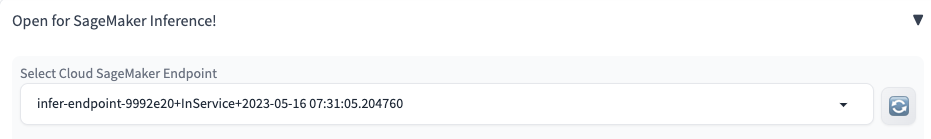
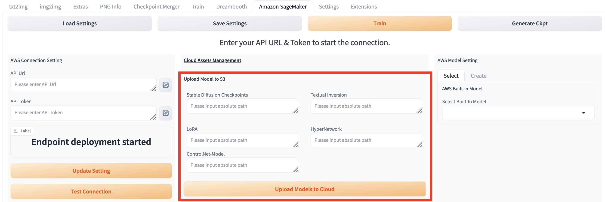

# 打开Amazon SageMaker Inference面板

# 部署推理节点

1. 选择推理实例类型和数目，然后点击deploy, 可以在右边状态窗口看到**Endpoint deployment started. Please wait...**的提示信息。

2. 点击**Select Cloud SageMaker Endpoint**旁边的刷新按钮，然后查看当前的部署任务，名字的格式是**推理节点名字+部署状态：Creating/Failed/InService+部署结束时间**

3. 等待大概10分钟时间，可以看到推理节点的状态变成**InService**

# 利用txt2img进行推理

* ## 上传推理所需模型

    1. 点击**Stable Diffusion Checkpoint**和**Extra Networks for Cloud Inference**旁边的刷新按钮，以查看哪些已经存储在s3上的模型可以用于txt2img的推理

    2. 对于需要上传的模型，在 **Upload Models to Cloud**上面输入对应模型的绝对地址，并且点击上传按钮

* ## 选取合适的推理节点

    1. 点击"xxx"旁边的刷新按钮，选择处于**InService**状态的推理节点。注意，如果选择处于其他状态的推理节点，或者没有选择推理节点，点击**Generate on Cloud**会报错。

* ## 输入推理所需参数

1. 

# Controlnet的使用方法
