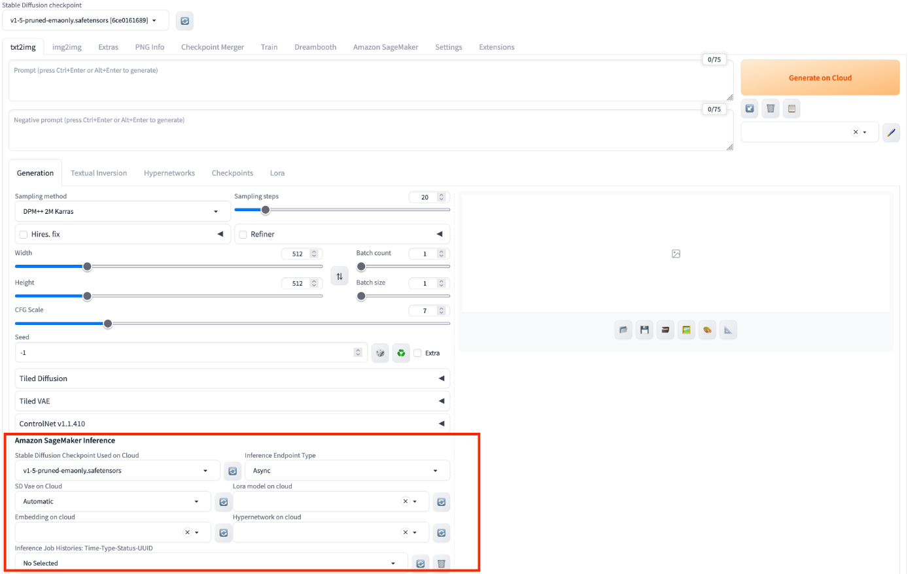
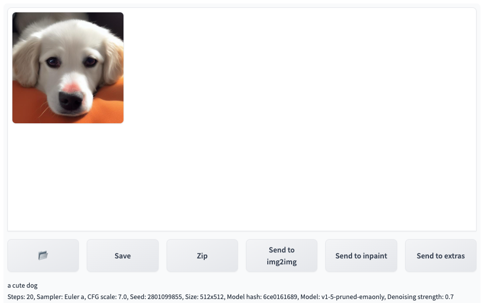

# 使用txt2img进行云上推理

您可以打开**txt2img**标签页，通过结合使用**txt2img**原生区域及解决方案新增面板**Amazon SageMaker Inference**，实现调用云上资源的**txt2img**推理工作。 

## txt2img的使用方法
### 通用场景

1. 进入**txt2img**标签页，找到**Amazon SageMaker Inference**面板。

2. 输入推理所需参数。同于本地推理，您可以按需编辑**txt2img**原生的推理参数，包括模型(stable diffusion checkpoint, extra networks:Lora,Hypernetworks, VAE等)，提示词，负提示词，取样参数，推理参数等。VAE模型切换需要点击**Settings**按钮进入设置面板，在左侧一栏选择Stable Diffusion, 右侧面板**SD VAE (choose VAE model: Automatic = use one with same filename as checkpoint; None = use VAE from checkpoint)**处右侧刷新选择要用的VAE模型完成VAE模型切换。

    !!! Important "提示" 
        选择的模型文件需要通过云上资源管理章节介绍的方式进行推理模型上传到云上，才能使用该模型进行云上推理。目前模型列表展示本地和云上的模型选项。为了进行云上推理，建议选择有sagemaker关键字为后缀的、表明已经上传到云上的模型进行后续推理。

3. 选择云上推理所需要的模型。在**Stable Diffusion Checkpoint Used on Cloud**列表选择需要云上推理的模型, 则会触发右上角**Generate**按钮变为**Generate on Clound**。

    !!! Important "提示" 
        此项为必选项。

4. 所有参数设置完成后，点击**Generate on Cloud**。
5. 查看推理结果。刷新**Inference Job**下拉列表，查看最上方的、符合推理提交时间戳的**Inference Job ID**。相关Inference Job列表选择请参考本页尾部的**Inference Job**子章节。txt2img标签页右上方的**Output**区域会显示推理的结果，包括图片，提示词以及推理的参数等。在此基础上，可以点击**Save**或者**Send to img2img**等，进行后续工作流。
> **补充：** 列表按照推理时间倒序排列，即最近的推理任务排在最上方。每条记录的命名格式为**推理时间->推理状态（succeed/in progress/fail)->inference id**。

### 连续使用场景

1. 按**通用场景**使用流程，完成参数录入，并点击**Generate on Cloud**提交第一次推理任务。
2. 等待右侧**Output**部分出现了新的**inference id**。
3. 在新的**Inference Job ID**出现后，便可再次点击**Generate on Cloud**进行下一次推理。

## Inference Job
Inference Job下拉列表默认列出最近10条推理任务，命名格式遵循 Time-Type-Status-Uid。如果需要列出账户历史上所有推理任务，只需选中**Show All**。如果需要应用筛选器，缩小显示列表，可以勾选**Advanced Inference Job filter**，页面下方会自动增加本解决方案提供的筛选器维度，用户可以按需选择。
